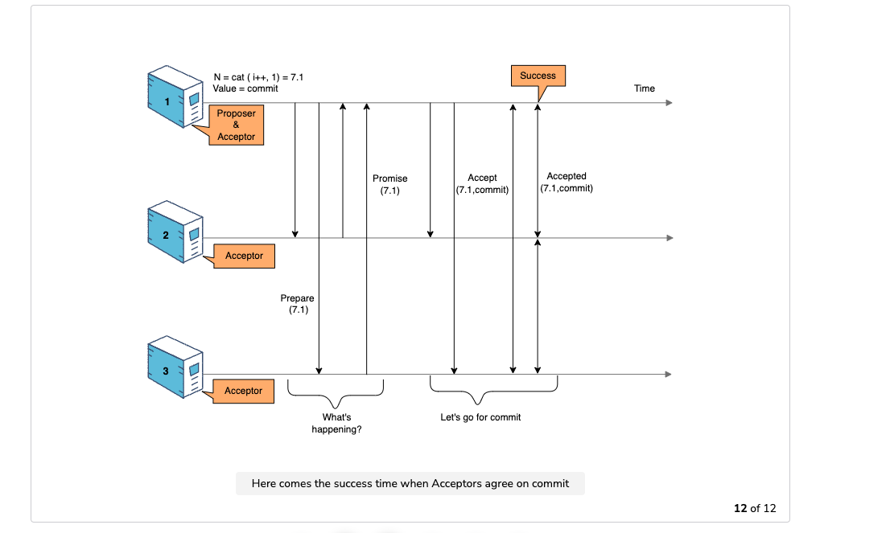

#### Consensus algorithms outline
1. Halts if more than half of the nodes are not reachable.
2. Protocols define an epoch number and guarantee that the within each epoch, leader is unique.
3. Two round of voting.
4. One round of voting to select the leader. Majority of the nodes must agree for a node to become a leader. Only leader can decide and propose values.
5. One round of voting to agree on the value. A node votes in favor of a leader only if it is not aware of any other leader with high epoch value.
6. Quorum for leader election and proposed value supporters must overlap.
7. Relies on timeouts to detect live/unreachable nodes. Problematic in networks with variable network delays. System might elect the leader all the time.
8. Generally three to five nodes in the consensus system. Three nodes, one node failure is tolerated.
#### Algorithm use-cases
1. Outsource coordination work 1. Consensus 2. Operation ordering 3. failure detection
2. Use zookeeper to store slow changing data. Configuration store.
3. Zookeeper exposes get(key), put(key) operations.
4. Don't use zookeeper for frequently changing data.
5. Examples: Use it for leader election, assigning partitions to worker nodes.
6. Zookeeper can notify clients about changes.
7. Session, heartbeats are used to detect liveliness of client. Zookeeper can be configured to delete the locks of the session automatically if the session is not active.

#### Definitions
Deep connection between linearizability, ordering, consensus. One problem can be reduced to other problems. Linearizability implies the existence of the total order broadcast system.
1. Consensus
   1. Setup: Set of nodes
   2. One or more nodes propose a value and all the live nodes should be made to agree on the value.
   3. Total order broadcast can be implemented using multiple rounds of consensus. Straightforward to think.
   4. Zookeeper, Raft and Zab implements total order broadcast. Paxos implements consensus.
2. Linearizability
   1. Setup: Set of nodes with same copy of data
   2. System should behave as if there is a single copy of the data and the operations are atomic. read, write and compare_and_set.
   3. Recency guarantee
   4. Single database node with snapshot isolation is not linearizable
   5. Is linearizable?
      1. Single leader replication database can be made linearizable.
      2. Multi master database is not linearizable.
      3. Leaderless database can be made linearizable. Read repair, quorum reads and quorum writes should be followed. Concurrent writes are not linearizable if last-write wins is followed.
   4. CAP theorem. Consistency vs latency when the network is not partitioned.
3. Ordering
   1. Causal order is less restrictive than the total order.
      1. One way to implement causal database: Each replica must process the requests in causal order. Use sequence number generators to help.
         1. Non-causal sequence number generators
            1. Timestamp
            2. Block of numbers assigned to each replica
            3. ProcessId|timestamp
         2. Causal
            1. Lamport timestamps, but useless in practice.
   2. Total order broadcast
      1. Protocol for exchanging messages such that each message is broadcast to all the nodes and each node must receive messages in the same order.
      2. Linearizability can be implemented using total order broadcast and vise versa.
      3. Order of messages in zookeeper implementation in zxid

#### Problems that can be solved using one of the above three constructs
1. Leader election
   1. Distributed lock can be used to solve leader election.
   2. Distributed lock can be implemented using total order broadcast.
   3. Apache curator implements locking/leader election on top of zookeeper.
   4. Use zxid/totalOrderMessageNumber as the fence token to break ties between multiple leaders scenario.
2. Atomic commit
   1. 2 phase commit protocol
      1. Supported by databases, messaging systems
   2. 3 phase commit protocol as well
   3. XA open transactions
   4. Exactly once message processing also called as "effectively-once" processing.
   5. Indeed, the problem of distributed transactions, known as atomic commit, and the consensus problem might be closely related. Still, they are not equivalent
      1. The consensus problem mandates that every non-faulty node must reach the same decision, while the atomic commit problem requires that all the nodes (faulty or not) must reach the same decision.
      2. The atomic commit problem imposes stricter relationships between votes or proposals and the final decision than the consensus problem.
      3. In consensus, the only requirement is that the value that is agreed must have been proposed by at least one of the nodes. In atomic commit, a decision can be positive only if all the votes were positive. The decision is also required to be positive if all votes are positive and there are no failures.
   6. A paper titled Consensus on transaction commit examines this relationship between distributed transactions and consensus and explains this approach in much greater detail, referred to as Paxos commit. This paper also demonstrates why 2-phase commit is essentially a special case of Paxos commit with zero tolerance of node failures
   7. Algorithm
      1. More specifically, the resource managers would have to send their response to the first phase to a set of acceptors, instead of sending it to the transaction manager. This creates a separate Paxos instance for every resource manager involved in the transaction. 
      2. Similarly, the acceptors could propagate the chosen values to the resource managers directly, instead of doing so indirectly via the transaction manager. 
      3. The resource managers would be responsible for checking that all the Paxos instances from the other resource managers had a positive result (corresponding to the first phase of 2PC) to commit the transaction.
3. User id claiming, unique user id
4. Membership list - A list of nodes that all the nodes agree on the live/reachable/healthy members.

#### Replicated state machine model
1. Many distributed problems like leader election, atomic commit can be solved using state machine replication model solution.
   1. Using a consensus algorithm, we can build a replicated state machine. This is a set of nodes, where each of them is receiving commands and executing them, transitioning between states.
   2. If all the nodes use the same state machine, all we need is to ensure that all the nodes receive the same inputs in the same order, and then we can guarantee that all the nodes will make the same transitions. This would mean that the distributed system would look similar to a single server from the outside.

#### Paxos algorithm

1. Three roles. Proposer, Acceptor, Listener. Three steps
   1. Propose(N) N is (count, nodeId)
   2. If quorum accepts, then accept(N, v) is sent to clients
   3. Client promises to commit if nothing wrong. No other higher numbered proposals. Sends acks.
   4. Listeners would listen to messages and commit if quorum agreement received.
2. Multiple instances of paxos are run in pipeline in practice.
3. Leader lease to improve performance in multiple runs of paxos.
4. Avoid leader switching by using exponential back off

#### Why time is not accurate
1. Quartz clocks are not accurate. Time drifts. Time of the day clocks and monotonic clocks.
2. Client syncs time from multiple NTP servers. Client takes network delay also into the account.
3. Leap seconds confusion
4. User intentionally modifying the time.
5. Clock might jump forward or backward. Quart clock frequency drift happens over the time.
6. Some regulated(MiFiD financial institutions) systems require clock to be within 100 microseconds accuracy.
   1. Accuracy is achieved using GPS receivers and precision time protocol.
7. Clock reading has confidence interval. With 99% accuracy the time belongs to [earliest, latest] interval.

#### Distributed lock implementation problems
1. Use zookeeper ephemeral node to indicate that a process X owns the lock.
2. The above approach alone isn't enough since the process X can fail
   1. No other process might not be able to acquire the lock. Perfect failure detector doesn't exist and ephemeral concept might not work. Grey failures(neither full nor no failure) might occur.
   2. Use lock leases to prevent above scenario
   3. Still the process X fails, other process might acquire lock, both processes may perform an operation.
3. Use fence tokens(zxid) to prevent the above scenario from occurring. Resource must protect itself by making sure that the token is always greater than the last seen token. Protected resource must implement linearizable storage for this to work.

#### Failure handling
1. The end-to-end argument is a design principle, which suggests that some functions such as the fault tolerance techniques described previously can be implemented completely and correctly only with the knowledge and help of the application standing at the endpoints of the communication system.
2. As expected, it is impossible to build a perfect failure detector in purely asynchronous systems. Still, we can even use imperfect failure detectors to solve difficult problems. One such example is the problem of consensus.
3. Types
   1. Gray failures 
   2. Partial failures
   3. Gray failures do not manifest cleanly as a binary indication . They are more subtle and can be observed differently by different parts of a system. Partial failures are those in which only parts of a system fail in a way that has serious consequences equivalent to a full failure of the system, sometimes due to a defect in the design.
4. These types of failures can be very common in distributed systems due to many moving parts. They can have serious consequences, so it is essential for people who build and run distributed systems to internalize these concepts and look out for them in the systems they build and operate.
5. We can use many formal verification techniques and tools to prove safety and liveness properties of systems with TLA+. It is one of the most commonly used across the software industry, Amazon is another one.
6. It is important to note that users of these formal verification methods have acknowledged publicly that these methods have helped them discover bugs in their designs but have also helped them significantly reason about the behavior of their systems in a better way.
7. For example, error detection and recovery implemented at the disk level or in the operating system won’t help if the application has a defect that leads to writing the wrong data in the first place. It means that we can only achieve complete correctness by implementing this function at the application level.
8. This function can be implemented redundantly at lower levels, but this is mostly done as a performance optimization.
9. It’s also important to note that this redundant implementation at lower levels is not always beneficial, but it depends on the use case.The literature by Saltzer et al. and Moors et al. covers this trade-off extensively.
10. However, TCP is still not sufficient to provide exactly-once guarantees at the application level.
11. The main takeaway from the above problems is that any functionality needed for exactly-once semantics (e.g., retries, acknowledgments, and deduplication), needs to be implemented at the application level in order to be correct and safe against all kinds of failures.
12. The fencing technique discussed previously extends mutual exclusion function to all the involved ends of the application.
13. Fault isolation introduces a trade-off between availability and latency since physical isolation increases network distance and latency.
14. Availability vs Latency: Most cloud providers provide multiple physically isolated datacenters and are all located close to each other in a single region to strike a good balance in this trade-off. These are commonly known as availability zones.
15. Graceful degradation is another technique to contain failure, where an application reduces the quality of its service to avoid failing completely.
16. Backpressure is a very useful concept in the field of distributed systems. It is essentially a resistance to the desired flow of data through a system. This resistance can manifest in different ways, such as increased latency of requests or failed requests.
    1. Implicit backpressure arises in a system that is overloaded by a traffic surge and becomes extremely slow.
    2. A system that rejects some requests during a traffic surge to maintain a good quality service essentially exerts explicit backpressure to its clients.
17. It is useful for a system to know its limits and exert backpressure when they are reached instead of relying on implicit backpressure. Otherwise, there can be many unexpected failure modes, which are harder to deal with when they happen.
18. Backpressure techniques
    1. The main technique to exert backpressure is load shedding. An application is aware of the maximum load it can handle and rejects any requests that cross this threshold to keep operating at the desired levels.
    2. A more specialized form of load shedding is selective client throttling, where an application assigns different quotas to each of its clients.
19. Queueing systems can be configured to shed load.
20. Think about the whole architecture of the systems and the various applications involved to determine where retries will be performed. Performing retries at multiple levels can significantly amplify the traffic coming from customers, which can overload services and cause issues.
    1. If each service performs three retries for every failed request, then a temporary issue at service D will cause every request to be retried 27 times, thus creating a lot of additional load to service D during a period it’s already experiencing issues.
    2. Retrying failed requests at the highest level is a conventional approach, which contains additional context around the business function of the request and whether it’s worth retrying.
    3. the system waits a bit more every time before performing the next retry. It gives the downstream system a better opportunity to recover from any temporary issues.
    4. Ideally, exponential backoff is also combined with some jitter, which is a small incremental delay in data transfer. So retries from various servers of service are distributed evenly, and they do not produce sudden spikes of traffic that can also cause overload issues
21. A circuit breaker essentially monitors the percentage of failed requests. When a specific threshold is crossed, this is interpreted as a permanent failure of the downstream application. As a result, the circuit breaker rejects all the requests locally without sending them to the downstream application.
22. Clients can embed timeout hints in their requests to help downstream applications. These hints inform downstream applications about when a response to a request is not useful anymore. In this way, downstream applications can discard requests waiting for a long time in message queues or in memory buffers due to resource exhaustion, thus speeding up the processing of accumulated backlogs.
