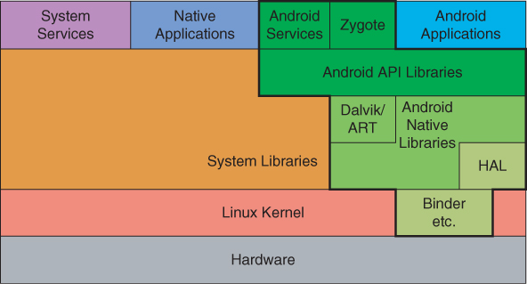
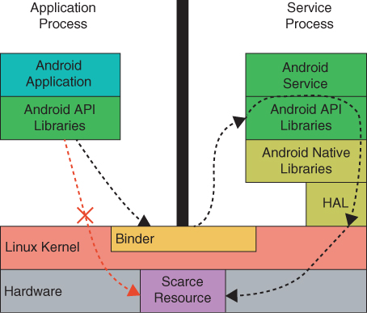

1. Every Android application runs in its own process, with its own instance of the Dalvik virtual machine. Dalvik has been written so that a device can run multiple VMs efficiently. The Dalvik VM executes files in the Dalvik Executable (.dex) format which is optimized for minimal memory footprint. The VM is register-based, and runs classes compiled by a Java language compiler that have been transformed into the .dex format by the included "dx" tool.
2. The Dalvik VM relies on the Linux kernel for underlying functionality such as threading and low-level memory management.
3. When an application component starts and the application doesn't have any other components running, the Android system starts a new Linux process for the application with a single thread of execution. By default, all components of the same application run in the same process and thread, called the main thread.
4. If an application component starts and there is already a process for that application, because another component from the application already started, then the component starts within that process and uses the same thread of execution. However, you can arrange for different components in your application to run in separate processes, and you can create additional threads for any process.
5. The system does not create a separate thread for each instance of a component. All components that run in the same process are instantiated in the UI thread, and system calls to each component are dispatched from that thread. Consequently, methods that respond to system callbacks—such as onKeyDown() to report user actions, or a lifecycle callback method—always run in the UI thread of the process.
6. Bear in mind that the Android UI toolkit is not thread-safe. So, don't manipulate your UI from a worker thread. Do all manipulation to your user interface from the UI thread. There are two rules to Android's single-thread model:
  1. Don't block the UI thread.
  2. Don't access the Android UI toolkit from outside the UI thread.
7. This is primarily true for methods that can be called remotely, such as methods in a bound service. When a call on a method implemented in an IBinder originates in the same process in which the IBinder is running, the method is executed in the caller's thread. However, when the call originates in another process, the method executes in a thread chosen from a pool of threads that the system maintains in the same process as the IBinder. It's not executed in the UI thread of the process.
8. Android offers a mechanism for IPC using RPCs, in which a method is called by an activity or other application component but executed remotely in another process, with any result returned back to the caller. This entails decomposing a method call and its data to a level the operating system can understand, transmitting it from the local process and address space to the remote process and address space, and then reassembling and reenacting the call there.
9. A task is a collection of activities that users interact with when trying to do something in your app. These activities are arranged in a stack called the back stack in the order in which each activity is opened.
10. Because the activities in the back stack are never rearranged, if your app lets users start a particular activity from more than one activity, a new instance of that activity is created and pushed onto the stack, rather than bringing any previous instance of the activity to the top. As such, one activity in your app might be instantiated multiple times, even from different tasks
11. On Android, storage isn’t used for swap space like it is on other Linux implementations since frequent writing can cause wear on this memory, and shorten the life of the storage medium.
12. With a testable app architecture, the code follows a structure that allows you to easily test different parts of it in isolation. Testable architectures have other advantages, such as better readability, maintainability, scalability, and reusability.
13. Common decoupling techniques include the following:
    1. Split an app into layers such as Presentation, Domain, and Data. You can also split an app into modules, one per feature.
    2. Avoid adding logic to entities that have large dependencies, such as activities and fragments.      3. Use these classes as entry points to the framework and move UI and business logic elsewhere, such as to a Composable, ViewModel, or domain layer.
    4. Avoid direct framework dependencies in classes containing business logic. For example, don't use Android Contexts in ViewModels.
    5. Make dependencies easy to replace. For example, use interfaces instead of concrete implementations. Use Dependency injection even if you don't use a DI framework.
14. 
15. Although a kernel is a key part of Android, building a kernel is not normally part of building an Android system. Instead, the Android build tools treat the kernel as a black box: a pre-built, third-party binary.
16.  For Android, however, Java source code is compiled into instructions for Dalvik and ART, not instructions for the Java Virtual Machine (JVM). The purpose of the Android VM is to make applications portable across Android devices. Unlike the JVM, multi-platform and OS portability was not a goal at all in the design of Android’s virtual machine.
17.  There are common capabilities and functions that are used by multiple applications. Some of these capabilities—cryptography, video and audio rendering, a web browser—are large and complex. Most system libraries are included in the Android system, as is the kernel, as third-party, black box binaries. They are essential to Android but are neither built nor maintained as part of the Android source tree. This is an important area of customization for the developer of a new device. If software already exists—and that definitely includes software written in a language other than Java—that can be used as part of the interface to a new device, it can be included as part of this layer. Including the proprietary code as a system library and then plumbing it into the Android framework with Java bindings may preserve the investment at a reasonable cost.
18.  Bionic is Android’s version of the standard C library. As part of Android’s ongoing battle for frugality, it has been pruned relentlessly and is dramatically smaller than its BSD ancestors. It is so small, in fact, that it does not meet even the ANSI standard, let alone the ubiquitous POSIX standard. Applications that run perfectly well on other platforms may not run at all on Android, because Bionic does not support the functionality they require.
19.  Instead, at run time, a linker binds the compiled application dynamically to the implementation of the C library that is present on the system on which the application is running. Because the API definitions against which the application was compiled are (with luck!) identical to those actually implemented by the host system library, everything works. Usually, this just means that the C library is compiled using the exact same header files that the library clients use when they are compiled. A given piece of code can be binary compatible across multiple, similar platforms, as long as all the platforms have C libraries that implement the exact
same API.
20.  The implication that Bionic has its roots in BSD may come as a surprise. Most operating systems based on a Linux kernel use a version of the GNU C library, glibc. Instead, Bionic is derived from the BSD UNIX, libc. There are several reasons for this but the most obvious is that libc is licensed under the BSD license and is thus free of the constraints that its LGPL licensing imposes on glibc. One of the goals in Android’s design was to eliminate any possible impediment to its acceptance. That goal absolutely implies removing any possible licensing constraints.
21.  Many existing applications, libraries, and utilities may be used on Android as long as they are recompiled against the Android platform. Obviously, some limits exist because of the extent of the pruning in Bionic.
22.  Augmenting an Android system by adding one of the standard C-library implementations is entirely feasible. This simple and very common augmentation makes it possible to run many standard Unix applications and libraries on an Android system.
23.  One special system service, init, is the first application run on system startup. It is responsible for much of the system startup process, including bringing up the other system services.
24.  Although the 30 to 40 system services that run as part of most common Linux distributions are fairly similar, the overlap with those running on an Android system is relatively small. The Android system has unfamiliar system services such as installd, rild, surfaceflinger, and vold instead of more common services such as udevd and syslogd.
25.  Binder is an Interprocess Communi-cations service and is, perhaps, the heart of Android.
26.  The Hardware Abstraction Layer (HAL) is a system library that supports binary compatibility for the Android system across multiple hardware/driver platforms. The HAL, actually a group of libraries, serves as the interface between Android and certain generic types of hardware devices. Like the C library, the HAL is, essentially, a set of header (.h) files that define an API for each of several common categories of hardware. The HAL abstracts an interface between the underlying hardware and Android almost exactly as the C library abstracts the interface to the kernel and other common functionality.
27.  

#### References
   1. https://web.archive.org/web/20081217032436/http://code.google.com/android/what-is-android.html
   1. [Memory management](https://developer.android.com/topic/performance/memory-overview)
   2. https://developer.android.com/guide/components/processes-and-threads
   3. [Common mistakes to avoid to improve performance](https://developer.android.com/topic/performance/memory)
   4. https://developer.android.com/guide/components/processes-and-threads
   5. https://developer.android.com/guide/topics/processes/process-lifecycle
   6. https://developer.android.com/guide/components/services
   7. https://developer.android.com/guide/components/activities/tasks-and-back-stack
   8. https://developer.android.com/training/testing/fundamentals
   9. https://developer.android.com/training/testing/instrumented-tests/ui-tests
   10. https://learning.oreilly.com/library/view/inside-the-android/9780134096377/ch04.xhtml#ch04
   11. 
