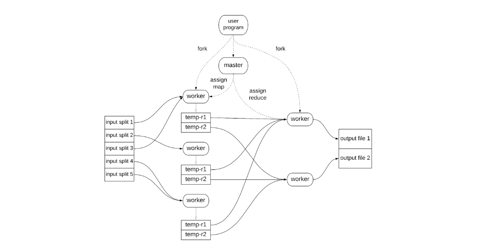
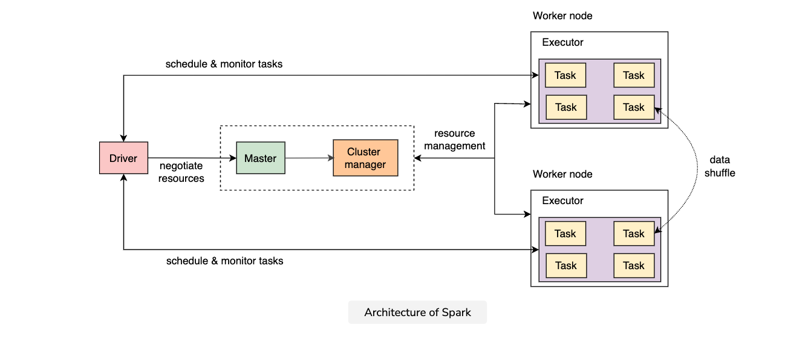
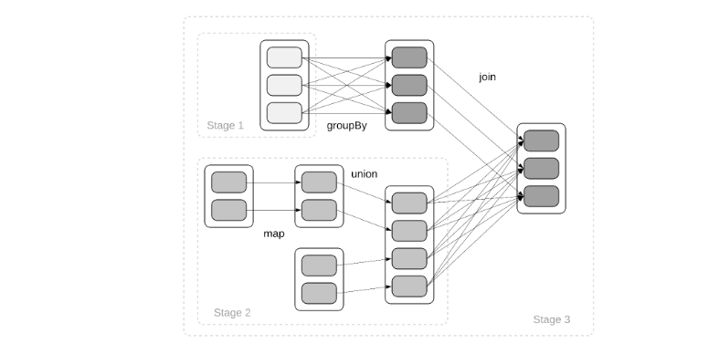

#### Batch processing
Batch processing - No user waiting for the immediate results. Crunches a lot of data. Fixed amount of data. Real time processing - users wait for the response, touches few rows. near real time processing - doesn't immediately want the data, but it's required in seconds. Continuous input stram.

Advantages of spark/mapreduce over traditional data warehouses
1. No proprietary hardware/software
2. Can be programmed in general purpose language. Other APIs/programming models than SQL can be exposed. Same infra can be used for graph processing and other programming models.
3. Runs on cheap commodity hardware. Trade a little-bit less performant system for highly coupled performant system.
4. Storage is decoupled from compute. Easy to scale.
5. Difference between hadoop and spark. Do not store data immediately to the disk. Prefer keeping data in-memory and checkpoint for fault tolerance. Provide exactly once processing semantics.

Join techniques
1. Map side joins
   1. Hash join
      1. Join small table with big table. Load small table in memory.
   2. Partitioned hash join
      1. partition the second table and load it in every partition map processes.
   3. Map side general join
2. Reduce side join
   1. Extract records by common keys
   2. Input can be arranged to occur in sequence in the same reducer.
   3. Reducer logic loads rows in memory, joins with incoming records and produces output.
   4. Reduce overhead on reducer
      1. Split it into multiple reducers randomly. Join not sure how to do it???

#### Usecases
1. Build search indices
2. Build key value stores

#### Parquet format
to reduce the size required to store the data on disk and in memory
To process the encoded data you will need to decode it, but usually the decoding procedure that is required is more lightweight then I/O costs incurred when reading data or sending it over the network.
lossless encoding techniques (no data is lost after we decode the data)


1. Dictionary Encoding.
2. Run Length Encoding (RLE).
3. Delta Encoding.

Spark implements previously mentioned encoding techniques automatically and out of the box when writing data.
Encoding on parquet is really write time optimisation that is then utilised when reading and processing data.

You need to correctly order the data for the encodings to produce good compression results.
1. Remember that the techniques work best for ordered columns of low cardinality.
2. You will want for the ordering to be persisted after the data is partitioned.
3. First sort your Spark Dataframes by the columns you will be partitioning by.
4. Then, in the same .sort() or .orderBy() call include remaining columns you would like to utilise in the increasing order of cardinality.
5. Sorting of Spark Dataframes invokes shuffle operation which is expensive. You should weigh the gain of encoding the data against the cost of shuffle carefully.

#### Map reduce

1. MapReduce is a restricted programming model to process large datasets (big data) effectively and efficiently, structured or unstructured alike, on a cluster of machines.
2. One of the model’s restrictions is that the input and output of the processing code should be in key-value pairs. It takes input data from key-value pairs and aggregates user-defined processed output as different key-value pairs. The input is a large and complex dataset, and the computations get distributed across numerous machines to finish the processing task in a reasonable amount of time.
3. We distribute these intermediate key-value pairs into the next type of workers (performing the Reduce operation), using the following hash function
4. internal implementations of this model automatically ensure the following requirements
   1. Parallelization
   2. Data distribution
   3. Dynamic load balancing
   4. Fault tolerance
5. map function ```map(input_key, input_value) ->  list(output_key, intermediate_value)```
6. Reduce ```reduce(output_key, list(intermediate_value)) -> list(output_value)```
7. In addition to the Map and Reduce functions, the user needs to provide the code for a MapReduce specification object with the names (URLs to the files in GFS) of the input and output files and the additional tuning parameters. The MapReduce library passes this specification object to the MapReduce function at invocation and is responsible for linking all the segments of the user code.
8. Mainly, the number of Reduce tasks (R) are user-defined as each task produces its separate output file.
9. Manager: It controls all the subordinate workers, assigns them tasks, and acts as a relay for intra-worker communications. It stores the identity (a unique identifier for each worker) and state (idle, in-progress, or finished) of each worker to check each worker’s progress.
10. The manager handles the number of Map tasks required, M, to perform a particular job. Typically, one Map worker will run many Map tasks in a MapReduce job.
11. The number of Reduce tasks inside the system, R, is user-defined depending on the number of output files a user wishes to produce. Typically, one reducer worker will run many Reduce tasks in a MapReduce job.
12. The number of workers assigned for a Map or Reduce task will change over the life cycle of a MapReduce job. Initially, most of the workers will perform the Map tasks. When we have sufficient Map tasks completed, workers can be moved to do the Reduce tasks in parallel.
13. MapReduce library: It also allows users to fine-tune the parameters and tweak the processing.
14. Network: In the Reduce phase, since the reducers have to do a lot of writing to the output disks, we need a considerable network bandwidth. A commodity network will suffice for our system to achieve these writing tasks.
    1.  It involves communication among the workers since a piece of each Map task goes to all the reducers (such communication patterns are also called all-to-all communication patterns).
15. After processing the input data splits, the mappers store the results of their intermediate key-value pairs in local disks (and not on GFS). The manager then reads the locations of these intermediate key-value pairs from the local disks of mappers and passes them on to reducers.
    1. We store intermediate data on local disks because it’s faster and conserves network bandwidth. We don’t necessarily need multiple copies of intermediate data since we can quickly regenerate it in case of disk failures or data loss.
16. Process
    1. The MapReduce library slices the input data in M splits of 16 MB to 64 MB (aligned with the GFS’s chunk size of 64 MB and to support locality in our system) and starts copies of the user program on multiple cluster machines.
    2. One of the program copies is declared as a manager. It’s responsible for assigning M Map tasks and R Reduce tasks to the rest of the workers based on their availability.
    3. On one split, the manager assigns a Map task to an idle mapper. The mapper parses the input split for <k1,v1> pairs and generates intermediate <k2, v2> pairs using the user-defined Map function and writes them to its local disk.
    4. The MapReduce library’s partitioning function is responsible for splitting each mapper’s output, based on the output keys, into R partitions and storing them in R different files on the mapper’s local disk. The number of partitions equals R, which is the number of Reduce tasks. The program maps those intermediate <k2,v2> pairs to their respective R regions using a hash function, and sends their locations to the manager. The manager stores all the ready locations and is responsible for forwarding them to the available reducers.
    5. The manager notifies an available reducer about a ready-to-be-processed location, fetching the stored intermediate key-value pairs from the mapper’s local disk. The reducer sorts data by intermediate keys to group the entirety of instances of a key before processing it.
       1. Split imbalance
          1. Imbalanced data partitions can cause imbalanced load distribution among Reduce tasks. To counter such a scenario, we can use a pre-pass MapReduce job to compute the split points of the data. 
          2. It involves a pre-scan of the input data and taking a sample of keys from it. We then compute a baseline distribution of this sample and use it for split points calculation. Doing so helps us pick a suitable hash function to reduce or remove the imbalance issue.
    6. The reducer accumulates the values against each unique intermediate key, say k2, from the sorted intermediate data. It passes the unique intermediate key and the associated values to the Reduce function, which applies the required function to those values, generating <k2, f(v2)> pairs as its output.
    7. Once all data splits are processed using the Map and Reduce functions, the manager returns to the user code’s next instruction by waking up the user program.
    8. The reducer writes its output to the respective output file on GFS.
17. The manager initiates the Map task on a mapper containing the replica of the concerned input data split. In case of failure, it attempts to initiate the same task on another mapper containing the replica, ideally in the same network switch, to conserve network bandwidth.
18. While creating splits for the input and intermediate data, we keep the values of M and R significantly larger than the number of workers, making each worker perform several tasks.
19. Assignment criteria
    1. Dynamic load balancing: While assigning tasks to workers, the manager considers the previous performance of each worker and assigns more tasks to those which perform well. So, instead of uniformly balancing the load, it relies on dynamic load balancing backed by the performance analysis.
    2. Fault tolerance: In case of failures, we have idle workers ready to take up the pending tasks at our disposal, complementing the lesser time complexity.
    3. To overcome this problem of stragglers, the manager, near the end of MapReduce completion, assigns the tasks (that straggler in-progress tasks are currently doing) to multiple other workers. It marks the pending tasks as completed as soon as it gets a confirmation message from the original or backup workers and ends the remaining tasks.
       1. We have to adjust this mechanism such that it doesn’t increase the computational resources by more than a few percent while ensuring a considerable decrease in the overall time completion.
20. Apart from the definition of the map and reduce functions, the user can also specify the number M of map tasks, the number R of reduce tasks. MapReduce can also specify the number of input or output files, and a partitioning function that defines how key-value pairs from the map tasks are partitioned before being processed by the reduce tasks. By default, a hash partitioner is used that selects a reduce task using the formula hash(key) mod R.
21. By default, the MapReduce library supports reading a limited set of various input data types. Each input type implementation automatically handles the data splitting into meaningful ranges for further processing by the Map tasks.
22. As we know, the data gets partitioned into key-value pairs before it is processed by the Map tasks.
23. Based on the desired functionality, the users can also define a new reader interface to add functionality for a new input type. For example, we can define a reader to read data from a database or a memory-mapped data structure.
24. The MapReduce library also supports various output types by default, and similar to the input types, it also gives the functionality to define new output types.
25. Using custom types for data is a powerful extension that enables end programmers to read and write data from many different sources and sinks.
26. The user can define a customized combiner function to merge the similar output keys’ data before sending it out to the Reduce function, noticeably saving the network bandwidth and speeding up certain MapReduce operations at the reducer.
27. Functionality wise, there is no difference between the Combiner function and the Reduce functions. Typically, we use the same code for both these functions. The only difference is their implementation location and the handling of their outputs by the MapReduce library.
28. The manager houses an internal HTTP server and provides users access to a set of status pages. These status pages present the computation progress, such as the number of completed tasks, the number of in-progress tasks, input data size, intermediate data size, output data size, processing rates, etc
    1. Each worker houses a local counter object and periodically sends the value to the manager by piggybacking it on the ping response. The manager aggregates the individual counter values from successful Map and Reduce tasks and returns the accumulated value upon MapReduce job completion.
29. These status pages also provide users with links to the standard output files generated by each task.
30. These pages also contain information about the number of failed tasks, the workers they were running on, and which Map or Reduce tasks they were processing, along with links to the standard errors.
31. The MapReduce library has an in-built facility to compute the counters of various events. It houses some counters by default, like the number of processed input and generated output key-value pairs.
32. The master node assigns reduce tasks to worker nodes providing the location to the associated files. These worker nodes then perform remote procedure calls (RPCs) to read the data from the local disks of the map workers. The data is first sorted so that all occurrences of the same key are grouped together and then passed into the reduce function.
    1. If the size is prohibitively large to fit in memory, external sorting is used.
    2. When all map and reduce tasks are completed, the master node returns the control to the user program. After successful completion, the output of the MapReduce job is available in the R output files that can either be merged or passed as input to a separate MapReduce job.
    3. The master node communicates with every worker periodically in the background in a form of a heartbeat. If no response is received for a specific time, the master node considers the worker node as failed and re-schedules all its tasks for re-execution.
    4. More specifically, completed reduce tasks do not need to be rerun since the output files are stored in an external file system. 
    5. However, map tasks are rerun regardless of whether they were completed since their output is stored on the local disk and is therefore inaccessible to the reduce tasks that need it.
    6. The network partitions between the master node and worker nodes might lead to multiple executions of a single map or reduce tasks.
    7. Duplicate map tasks executions are deduplicated at the master node, which ignores completion messages for already completed map tasks. The reduce tasks write their output to a temporary file, atomically renamed when the reduce task completes.
    8. The application writer must make sure these side effects are atomic and idempotent since the framework might trigger them more than once as part of a task re-execution.
       1. This atomic rename operation provided by the underlying file system guarantees that the output files will contain just the data produced by a single execution of each reduce task. However, if the mapor reduce functions defined by the application code have additional side effects (e.g., writing to external datastores), the framework does not provide any guarantees.
    9. Pre-aggregation and sorted partitions while shuffling are extremely useful for some applications.
33. We might have to deal with faulty datasets, causing our program to deterministically crash on some records. These are referred to as bad records. Bugs like these halt the completion of MapReduce jobs.
34. The MapReduce library provides an optional execution mode to detect records causing deterministic crashes and skips them to process the remaining records.
35. Each worker has an installed signal handler to catch segmentation failures and bus errors. Before a record gets processed by a Map or Reduce function, the MapReduce library saves the argument in a global variable.
36. If a specific argument causes an error, the signal handler sends the last gasp UDP packet to the manager containing the sequence number. If the manager receives higher than threshold error signals against a particular record, it initiates the protocol for its elimination from future executions of the corresponding Map or Reduce tasks.
37. The following refinement enables the user to perform program testing and debugging.
38. Since MapReduce is mainly a distributed system on several thousand machines centrally controlled by a manager, tracing and fixing the errors can be trickier. To overcome this challenge and facilitate users with debugging, profiling, and small-scale testing, we provide them with an alternative local execution that executes all the tasks on a single machine.
39. We should note that many MapReduce jobs are prolonged (for example, processing a crawl of the WWW), and manager failure can impact them badly. The MapReduce library does not deal with the manager’s failure and leaves it to the end users.
40. Our system ensures high throughput by engaging the maximum number of available workers and dynamic load balancing among them.
41. The input rate is higher than the shuffling and output rates because of our locality optimization for the Map tasks. 
42. The shuffling rate is greater than the writing rate as GFS replicates the output to ensure availability and reliability.
43. There is a significant startup overhead because of program propagation to multiple machines, data loading, and storing to disks. Hence, in the tasks where data reloading is necessary, this approach lags heavily.
44. 
#### Apache spark

1. While one can argue that for both of the scenarios above, we can still use the MapReduce framework where we repeatedly use Map and Reduce tasks. Though the problem is that the latency to get the result will be non-real time and fairly high because each new iteration of the MapReduce job reads input data from the replicated persistent store (that it just wrote as output in the last cycle). We need a new processing framework without the inefficiencies of the MapReduce model.
2. The key insight is that we want to keep data in the cluster’s RAM so that we don’t incur the cost of slow IO multiple times. However, the challenge is that often the volume of data is much more than the available collective RAM in the cluster.
3. A typical process does not access every part of its address space at the same time. It is the concept of a working set where only a small subset of the full data is accessed in some period of time. By keeping the working set in faster caches, and replacing part of it well before it is needed (for example, via prefetching), we make a process run fast. Similarly for data processing in the cluster, we can keep the working set in RAM.
4. there was a need for a new framework that could keep a large volume of data in memory and use it repeatedly with inherent properties of MapReduce like fault tolerance, scalability, and scheduling.
5. It should let users decide to store the results of specific computations they want to keep in the memory. Usually, a well-behaved program only touches a small subset of the whole data, known as the working dataset. We get good performance by bringing the working dataset into cluster memory and keeping it there.
6. There can be a lot of latency and throughput variances in the tasks performed by Spark. The reasons for such variance can be heterogeneous commodity servers with varying computational capacity, the load of the servers, potentially failing memories, disks, network interfaces, and other unforeseen failures during the processing.
7. Spark will keep a graph that records the sources of all the RDDs called a lineage graph.
8. 
2. Apache Spark was developed in response to some of the limitations of MapReduce…
   1. Still, every job had to read the input from the disk and write the output to the disk. As a result, there was a lower bound in the latency of job execution, which was determined by disk speeds.
   2. MapReduce not good fit for
      1. Interactive data analysis - user issuing adhoc queries
      2. Iterative computations - where a single job was executed multiple times or data were passed through multiple jobs.
      3. Other problems:
         1. No random writes
         2. Stable HDFS storage needed
         3. Intermediate results stored to disk
   3. RDD
      1. RDD is a distributed memory abstraction used to perform in-memory computations on large clusters of machines in a fault-tolerant way. More concretely, an RDD is a read-only, partitioned collection of records.
      2. RDDs can be created through operations on data in stable storage or other RDDs.
      3. Operations on RDD
         1. Transformations are lazy operations that define a new RDD. Some examples of transformations are map, filter, join, and union.
         2. actions: Actions trigger a computation to return a value to the program or write data to external storage. Some examples of actions are count, collect, reduce, and save.
      4. Creating
         1. A typical Spark application will create an RDD by reading some data from a distributed file system. It will then process the data by calculating new RDDs through transformations and storing the results in an output file.
      5. RDD operations. The framework mainly uses these operations to orchestrate the execution of Spark applications. The applications are not supposed to use these operations, they should use the transformations and actions that were presented previously.
         1. partitions()
         2. partitioner()
         3. preferredLocations(p)
         4. dependencies()
         5. iterator(p, parentIterators)
      6. RDD features
         1. In memory computation
         2. Fault-tolerance
         3. Lazy evaluation
         4. Immutability
         5. Partitioning
         6. persistence
         7. Coarse graiend operations
      7. RDDs implement an interface that keeps the following details:
         1. A list of partition objects that contains their own sets of data 
         2. An iterator that traverses the data in a partition 
         3. A list of worker nodes where the partition can be quickly accessed ensures task scheduling on the appropriate workers
   4. A Spark program is executed from a coordinator process, called the driver.
   5. Components
      1. Cluster manager: The cluster manager manages the resources of the cluster (i.e. the worker nodes) and allocates resources to clients that need to run applications.
      2. Worker node: The worker nodes are the nodes of the cluster that wait to receive applications/jobs to execute.
      3. Master process: Spark also contains a master process that requests resources in the cluster and makes them available to the driver.
         1. Spark supports both a standalone and some clustering modes using third-party cluster management systems, such as YARN, Mesos, and Kubernetes. In the standalone mode, the master process also performs the functions of the cluster manager. In some of the other clustering modes, such as Mesos and YARN, they are separate processes.
      4. The driver is responsible for:
         1. Requesting the required resources from the master. 
         2. Starting a Spark agent process on each node that runs for the entire lifecycle of the application, called the executor. 
         3. Analyzing the user’s application code into a directed acyclic graph (DAG) of stages 
         4. Partitioning the associated RDDs 
         5. Assigning the corresponding tasks to the executors available to compute them.
      5. The driver is also responsible for managing the overall execution of the application, e.g., receiving heartbeats from executors and restarting failed tasks.
      6.  The data is being read from HDFS, filtered, and then counted when the third line is processed, containing the count operation, which is an action. To achieve that, the driver maintains the relationship between the various RDDs through a lineage graph. When an action is performed, it triggers the calculation of an RDD and all its ancestors.
   6. The tasks are assigned to executors based on data locality. If a task needs to process a partition in memory on a node, it’s submitted to that node. If a task processes a partition for which the containing RDD provides preferred locations (e.g., an HDFS file), it’s submitted to these nodes.
   7. For wide dependencies that require data shuffling, nodes holding parent partitions materialize intermediate records locally that are later pulled by nodes from the next stage, similar to MapReduce.
   8. As explained in the previous lesson, the driver examines the lineage graph of the application code and builds a DAG of stages to execute.
   9. The driver launches tasks to compute missing partitions from each stage until it has computed the target RDD.
   10. The boundaries of each stage correspond to operations with wide dependencies (one-to-many) that require a data shuffle between partitions or any previously computed partitions that have been persisted. And it can short-circuit the computation of ancestor RDDs.
   11. wide dependencies are much more inefficient than narrow dependencies when recovering from failures
   12. Long lineage graphs can make a recovery very slow since many RDDs will need to be recomputed in a potential failure near the end of the graph.
   13. Spark provides a checkpointing capability to make fast recovery.
   14. Checkpointing capability is used to store RDDs from specified tasks to stable storage (e.g., a distributed file system). In this way, checkpointed RDDs can be read from stable storage during recovery, thus only having to rerun smaller portions of the graph. Users can call a persist() method to indicate which RDDs need to be stored on the disk.
   15. The checkpoint capability is very useful for interactive applications, where a specific RDD is calculated and used in multiple ways to explore a dataset without having to calculate the whole lineage each time.
   16. Spark provides graceful degradation in cases where memory is not enough so that the application does not fail but keeps running with decreased performance.
   17. For instance, Spark can recalculate any partitions on demand when they don’t fit in memory or spill them to disk.
   18. Wide dependencies cause more data to be exchanged between nodes compared to narrow dependencies, so performance is increased significantly by reducing wide dependencies, or the amount of data that needs to be shuffled. One way to do this is by pre-aggregating data, also known as map-side reduction.
   19. As explained previously, the map-side reduction is a capability provided in the MapReduce framework through combiners.
   20. When a new worker node is added to the cluster, it registers with the master node. If failover occurs, the new master will contact all previously registered worker nodes to inform them of the change in leadership. So, only the scheduling of new applications is affected during a failover; already running applications are unaffected.
   21. When submitting a job to the Spark cluster, the user can specify through a --supervise option that the driver needs to be automatically restarted by the master if it fails with a non-zero exit code.
   22. Spark has a commit protocol that aims to provide exactly-once guarantees on the job’s output under specific conditions. It means that no matter how many times worker nodes fail and tasks are rerun, there will be no duplicate or corrupt data in the final output file if a job completes. This might not be the case for every supported storage system, and it’s achieved differently depending on the available capabilities.
   23. For instance, when using HDFS, each task writes the output data to a unique, temporary file (e.g., targetDirectory/_temp/part-XXXX_attempt-YYYY). When the write is complete, the file is moved to the final location (e.g., targetDirectory/part-XXXX) using an atomic rename operation provided by HDFS. As a result, even if a task is executed multiple times due to failures, the final file will contain its output exactly once.
   24. no matter which execution was completed successfully, the output data will be the same as long as the transformations used were deterministic and idempotent. It is true for any transformations that act solely on the data provided by the previous RDDs using deterministic operations.
       
   25. If we try to perform the MapReduce algorithm on an application that reuses a dataset multiple times, we can face the following sequence of issues
       1. Need for cascading MapReduce jobs: If we perform the K-means algorithm, we will need to cascade multiple MapReduce jobs to perform the iterations of the algorithm. We cannot sequentially apply more than two operations in a single go.
       2. Inter job data persistence: MapReduce does not keep any data in memory for future operations. This means that a MapReduce job has to read data from the disk every time it’s initiated.
       3. IO-induced latency: Every time a Map task is completed, it has to write on the local disk, and then a reduce worker has to read from that local disk. When a Reduce task is completed, it has to write results in a file again, which increases the latency due to inherent slowness in IO operations.
       4. The second insight comes from the operating systems. A typical process does not access every part of its address space at the same time. It is the concept of a working set where only a small subset of the full data is accessed in some period of time. By keeping the working set in faster caches, and replacing part of it well before it is needed (for example, via prefetching), we make a process run fast. Similarly for data processing in the cluster, we can keep the working set in RAM.
       5. However, a decade later, we have memories that can contain data in excess of a few hundred GBs (servers with 128 GB to 512 GB are common in 2022). Hence, there was a need for a new framework that could keep a large volume of data in memory and use it repeatedly with inherent properties of MapReduce like fault tolerance, scalability, and scheduling.
       6. The desired framework should have the following key characteristics:
          1. Distributed memory abstraction
          2. Multiple operations
          3. Low latency
          4. Fault tolerance
          5. Explicit ability to choose the working set: It should let users decide to store the results of specific computations they want to keep in the memory. Usually, a well-behaved program only touches a small subset of the whole data, known as the working dataset. We get good performance by bringing the working dataset into cluster memory and keeping it there.
          6. Memory management: There should be a fallback strategy to manage workloads bigger than the available cluster memory, where the working set can slowly change by swapping out unused data to disks so that new data can be loaded.
       7. Building blocks of Spark include resilient distributed datasets, driver, and worker nodes.
       8. The abstraction provided by RDD resembles distributed shared memory where only a part of data is present on a node. To get good performance from this model of computation, we run processing on local nodes (instead of bringing required data to a computation on a specific node), mostly as single program multiple data paradigm (for example, running a Map function on all the data on all the cluster nodes present on the part of data held by the node).
       9. Driver
          1. A driver is like a manager that orchestrates data sharding among the workers, actual data processing, and reporting the results back to the client.
          2. It launches a cluster of workers. 
          3. It defines RDDs. 
          4. It keeps a lineage graph of RDDs. 
          5. It creates stages of execution of a program. 
          6. It creates further tasks in each stage and sends them to the worker nodes working in parallel. 
          7. It schedules the tasks. 
          8. It shares some variables with all the worker nodes called shared variables and keeps track of these variables.
       10. Worker nodes
           1. Worker nodes are the workhorse of our system, where actual processing happens on the part of RDD data they hold. Workers are connected with each other on a high-speed network.
              1. They can store partitions of distributed memory abstraction computation in their RAM/drive.
              2. The network topology inside a data center (the way workers are connected with each other) has evolved over the years. Usually asymmetric bandwidths are available in a data center (more bandwidth for communication with machines that are connected via the same top-of-the-rack switch than communication between two workers who are on different racks). Usually, scheduling algotithms can take the actual network topology into account. Cluster with over-subscribed netwroks might exhibit peculiar performance artifacts on certain operations.
       11. Programming mode
           1. RDD
           2. Parallel operations that can be performed on RDDs
           3. Spark uses the driver to perform all the tasks.
           4. Read: Spark can read data from a distributed file system like HDFS. The read function loads the data from the disks into the memories of all the worker nodes.
           5. Programmers can perform multiple operations on RDD by providing arguments like filter()
           6. Persist: If programmers want some partitions to be kept in the memory for future operations, they can call a persist() method. By default, Spark stores persistent RDDs in memory, but it can also store them in storage if we don't have enough space in memory.
           7. Save: Spark can save intermediary results on the disk.
           8. Creation of RDD
              1. From file on HDFS/GFS ```val RDD = spark.textFile("dfs://file")```. It would create an RDD in which each block of data in DFS will be a partition in the RDD
              2. From a collection ```val RDD2 = (1 to 9999).toList.par```. The user can decide the number of partitions to make out of a collection.
              3. Cache: The cache action makes Spark keep data in memory for further use after its creation. However, if there is no memory to cache the data, it recomputes it whenever used again. This process is opted to ensure that the system keeps running even if a node fails or there is a memory shortage. ```val RDD4 = RDD3.cache()```
              4. RDD2 will have the following information. 
                 1. It gives a list of partition objects, i.e., C1 or C2. 
                 2. It lists other RDDs it depends on, i.e., RDD 1. 
                 3. It has a compute() function that computes the elements of a specific partition, i.e., C1 or C2, given the iterator for its parent partitions. 
                 4. Optionally, it gives metadata specifying the technique used for partitioning the distributed memory abstraction. In this case, we could say that RDD2 is hash partitioned or range partitioned. 
                 5. Optionally, it gives a sequence of strings with some information about the nodes where a specific partition p can be quickly accessed. In an RDD made from an HDFS file, each string represents the Hadoop name of the worker from where the partition can be accessed (for the initial partitions, each partition is based on one HDFS chunk so that we can benefit from the locality of data). In this case, C1 can be accessed at Worker 1, and C2 can be accessed at Worker 2.
           9. Controlling partitions
              1. Spark automatically partitions the data in RDDs and distributes it over the cluster of memories of available nodes. However, it also provides control to the user on how to partition the data residing on a cluster of machines. So, the user can specify a certain kind of partitioning for RDDs. When the data is in the form of key values, partitioning becomes necessary to decrease data shuffling between different nodes in an RDD while performing parallel operations.
                 1. Repartition: We can apply the repartition operation on an RDD to increase or decrease the number of partitions it already has. This operation causes the shuffling of data across worker nodes.
                 2. Repartition and sort: We use repartitionAndSortWithinPartitions to repartition an RDD and also specify the order in which they will be kept. The user can provide both the number of partitions and technique used to sort data.
                 3. Coalesce: We use the coalesce operation to decrease the number of partitions in a worker node. This operation does not shuffle data across nodes because it decreases the number of partitions on a worker level.
                 4. Hash partition and range partition: When the data is in the form of key values, hash and range partitioners come in very handy. We use HashPartitioner to distribute data evenly across different nodes depending on the keys. It takes the number of partitions and a hash code to partition the dataset. When an RDD has keys that follow a certain ordering, RangePartition is used to group tuples with keys that lie in the same range in the same machine.
           10. RDDs are immutable. If an operation is applied to an RDD, a new RDD is returned instead of the modifications in the original RDD. This nature of RDDs lets the system run backup tasks in parallel to mitigate stragglers, just as in MapReduce.
           11. Immutability of RDDs: They are kept immutable to keep the lineage graphs as simple as they could be. Otherwise, Spark would have had to keep versioned RDDs and keep track of versions in the lineage graph.
           12. Since RDDs are immutable, the input RDD remains the same. Spark supports many transformations, such as map(), flatMap(), mapValues(), filter(), groupByKey(), reduceByKey(), union(), join(), cogroup(), crossProduct(), sample(), partitionBy(), and sort().
           13. Making another RDD from an RDD and then applying a transformation on it again to get another RDD makes a transformation chain or pipeline. Spark provides a graph-based representation for RDDs called a lineage graph to track the lineage of transformations
           14.  A partition in the parent RDD can be used to create one or more RDD partitions in the child RDD. Based on these facts, Spark provides narrow transformations and wide transformations.
           15. An RDD transformation that results in each partition contributing to build only one partition in the child RDD is called a narrow transformation. Two or more partitions can also lead to the formation of only one partition in the child RDD, provided all the parent RDD partitions are in different RDDs.
               1. The map() function
               2. The filter() function
               3. Join() This operation is only available at RDDs with key-value pairs. It is used to combine two RDDs' elements based on their keys. If two co-partitioned RDDs (those RDDs with the same number of partitions are made with the same technique) are joined, it will not cause any data shuffling. Therefore, the resulting transformation would be a narrow transformation. The join type is specified by an argument in the command, which in this case, is inner. Let's say we have two co-partitioned RDDs with data in the form of key/value. In the following code, an inner join is applied, returning only the pairs with common keys in both RDDs.
               4. union()
           16. Wide transformations
               1. An RDD transformation that results in each partition contributing to building multiple partitions in the child RDD is called a wide transformation.
                  1. The reduceByKey() function
                  2. join()
                     1. This operation is similar to the join operation we used in narrow transformations. However, the only difference is that two non-copartitioned RDDs, meaning that RDDs with a different number of partitions or RDDs made by different partitioning techniques, are joined. This kind of join would cause a shuffling of data that will result in multiple partitions of an RDD, contributing to make a single partition in the child partition. So, the resulting transformation would be a wide transformation.
                  3. groupByKey()
           17. When an RDD is created, its relationship with the parent data can be classified into two types depending on the type of transformation used to create it. Dependencies are important in Spark because they help define the program's execution stages in the scheduler section of Spark (for example, the Spark scheduler might be able to combine many narrow transformations into one).
           18. The transformations let Spark build up a logical plan of execution. Actions are operations that trigger the execution of that logical plan. These are the operations that return non-RDD values. Actions are performed when we want to extract information from the data. Spark supports actions such as count(), reduce(), collect(), and lookup()
           19. In addition to RDDs, Spark's second abstraction is distributed shared variables. We might want to send static data to all the workers (driver-to-worker information flow) or might want to collect some state from all the workers (workers-to-driver information flow). Spark's shared variable abstraction helps with both of these scenarios.
           20. Spark offers two types of shared variables––broadcast variables and accumulators.
           21. Normally, a variable used in a driver node’s tasks is simply referenced in a closure (function). This process can be very inefficient in the following cases
               1. If we have large variables like a machine learning model or a lookup table because they have to be deserialized on a worker node every time they are sent with a task 
               2. If a variable is used in multiple jobs
               3. Instead of only sending it once, it needs to be delivered with each job. This creates the need for broadcast variables.
               4. Broadcast variables are immutable. 
               5. They are initialized on the driver. 
               6. They are shared as read-only copies on all the worker nodes. 
               7. They are lazily replicated on all the worker nodes only once an action is called. 
               8. A use case example could be to share a huge dictionary, potentially of gigabytes in size, that contains words with some information attached to them.
           22. Accumulators are used for updating a variable in transformations and then propagating it to the driver. A possible way of doing this would be to create variables at the worker nodes and then update them in transformations and send them over to the driver. However, this can be an inefficient way of propagating them to the driver because the tasks or stages can be re-executed (tasks can be re-executed in case if a machine fails and has to recompute the partitions it had stored in it.), updating the variables more than once. This is where accumulators come in. Spark ensures that a restarted task cannot update an accumulator, and they are only updated once when a task is initially executed.
           23. Accumulators are created at the worker nodes. 
           24. They are mutable variables. However, only worker nodes can update them. 
           25. They efficiently support aggregation in parallel because they can only be added, and addition is both an associative and commutative operation, i.e., the addition order wouldn't matter. 
           26. They are also updated lazily, only once an action is called. Therefore, if they are being updated in an RDD, they are not updated unless the RDD is computed. 
           27. An accumulator can be used to add all the elements of a big array.
           28. shared variables are in Spark. They help reduce setup overhead and can be very used for debugging or optimization tasks.
           29. Cluster manager
               1. There can be multiple applications running in Spark. If a user starts its own application while some other applications are already running on a cluster of machines, they would need resources to allocate to their tasks. This is where the cluster manager comes in. The driver uses cluster manager (an external service) to allocate a cluster of machines to the application. The cluster manager manages the cluster by keeping an eye on the failed workers and replacing them with another, greatly reducing the programming complexity we had to add to Spark.
               2. The cluster managers that Spark can use include Mesos, YARN, and Spark’s standalone. The option that is available on all cluster managers is static partitioning of resources, meaning that each application gets maximum resources and holds on to them for the duration of its execution.
                  3. Following allocations can be controlled
                     1. The number of executors an application gets 
                     2. The number of cores per executor 
                     3. The executor memory
           30. The driver gets the user program, on top of which it builds the RDD lineage graph by parsing the user program. Spark creates multiple tasks to process each data partition whenever an action is invoked. Now, it needs a certain number of workers to execute its tasks. It gets these workers from the cluster manager and then sends these tasks directly to worker nodes for execution and gets results from them.
           31. Spark builds a direct acyclic graph (DAG), an execution graph that contains stages of execution of several transformations. It groups all the consecutive narrow transformations to one stage. It defines a new stage whenever a wide transformation occurs, showing a shuffle operation in the RDD lineage graph. A stage can compute transformations in parallel if they are independent. But why does the scheduler need it? To group faster transformations and help mitigate the complications in fault tolerance.
           32. A spark job is the highest level of execution in Spark. Each job corresponds to an action, which is called by the driver. A job includes an execution graph of transformations. No further transformations can be added once an action is called. Since action is something that returns non-RDD values, so it cannot have any children. Therefore, the actions form a leaf in the DAG of the job.
           33. A job can include one or several transformations. A stage can also include one or several transformations, but the difference is that the stage only contains a group of narrow transformations. A wide transformation marks the end of a stage if there are more transformations to be executed or the end of the job if an action is called. A stage can be thought of as a set of tasks that can be computed at a single worker without communicating with other workers or with the driver. However, a wide dependency that acts as a boundary line between two stages demands a shuffle operation and cannot be executed at one worker without communication with other workers or the driver.
           34. A stage comprises multiple tasks, which is the smallest unit of execution in Spark. All the tasks execute the same code but on different partitions of RDD, so the number of tasks in a stage are equal to the number of partitions in the output RDD of the stage. One task cannot be executed on more than one worker. However, a worker can allocate memory slots to multiple tasks simultaneously.
           35. To manage running tasks on multiple worker nodes, we need to schedule them. The driver has a scheduler for this purpose.
           36. Scheduler
               1. The scheduler starts working as soon as an action operation is called. It starts the execution of the job by getting the RDD lineage graph from the driver.
               2. After examining the RDD lineage graph, it builds a DAG.
               3. Spark executes the stages according to the sequence defined in DAG.
               4. The scheduler keeps a tab on whether the partitions of persistent RDDs are available in the memory or not.
               5. For missing partitions, the scheduler launches tasks to compute them at each stage. 
               6. It assigns workers tasks using delay scheduling based on optimal data locality. 
               7. The scheduler sends a task that needs to process a certain partition to the worker node, which has that partition cached in its memory. 
               8. Suppose the partition is not cached in any worker node, and the task is processing a partition for which an RDD provides preferred locations. In that case, the scheduler seeks that RDD to provide its preferred location (for example, an HDFS file assuming that each partition of an RDD is made from a block of the file in HDFS) and sends the task to that location.
           37. If the cost of computing an RDD partition is high, we can take advantage of the stages being separated at wide dependencies by checkpointing (keeping data on disks) or persisting data (Spark persistence is primarily in the RAM) between stages.
           38. There are no mechanisms to recover from any driver failures in Spark. However, we can checkpoint the driver's state to a reliable data storage to recover from driver failures by extracting and using the checkpointed data in a new driver.
           39. The scheduler helps Spark execute the tasks in stages efficiently. However, Spark has no mechanism in place for any kind of scheduler failures. Though, a copy of the RDD lineage graph can be kept for starting the process again.
           40. The problems that Spark faces include worker failures and limited memory issues. It can also have driver failures for which Spark does not provide any tolerance.
           41. A Least Recently Used (LRU) eviction policy is used at the RDD level to manage limited memory. Whenever there is insufficient memory to cache a newly computed RDD partition, Spark removes an RDD partition that belongs to the least recently used RDD. However, we cannot do this if the newly computed RDD partition belongs to the same RDD that was least recently used. In that case, Spark will keep all the partitions to avoid cycling data in and out of an RDD.
           42. Not removing a partition of an RDD whose partition has just been computed makes sense because, in Spark, an operation is usually performed simultaneously on all the partitions of an RDD. We cannot apply an operation on all of them if some of them have been removed, and the partitions of an RDD that are already in the memory are more likely to be used in future operations. Spark also gives users more control with persistence priority for RDDs. Priority decides which part of data in the memory will be moved to the disk first.
           43. Lineage graphs can always be used to recover lost partitions of an RDD, but if the lineage graph becomes too long, it becomes very time-consuming to compute or recompute partitions.
           44. The main difference between the persist() and checkpoint operations is that persist keeps the lineage of the RDD, and checkpoint forgets the lineage of the RDD. It becomes helpful to have support for checkpointing when there is a long lineage graph with wide dependencies.
           45. Finally, checkpointing RDDs is very simple because of their read-only nature. The user does not have to worry about the changes made to an RDD because there are none.
#### Flink
This is the main differentiator between Flink and Spark. Flink processes incoming data as they arrive, which provides sub-second latency that can go down to single-digit millisecond latency. Spark also provides a streaming engine called Spark Streaming. However, that is running some form of micro-batch processing, where an input data stream is split into batches, which are then processed to generate the final results with the associated latency trade-off.
1. A stream is an unbounded flow of data records.
2. Flink can also execute batch processing applications, where data is treated as a bounded stream. As a result, the mechanisms described in this section are used in this case also with slight variations.
3. A transformation is an operation that takes one or more streams as input and produces one or more output streams as a result.
   1. The ProcessFunction API is a low-level interface that allows the user to define imperatively what each transformation should do by providing the code that will process each record. 
   2. The DataStream API is a high-level interface that allows the user to define declaratively the various transformations by re-using basic operations, such as map, flatMap, filter, union etc.
4. Since streams can be unbounded, the application has to produce some intermediate, periodic results. For this purpose, Flink provides some additional constructs, such as windows, timers, and local storage for stateful operators.
5. Flink provides a set of high-level operators that specify the windows over which data from the stream will be aggregated. These windows can be time-driven (e.g., time intervals) or data-driven (e.g., number of elements). The timer API allows applications to register callbacks to be executed at specific points in time in the future.
6. A data processing application in Flink is represented as a directed acyclic graph (DAG), where nodes represent computing tasks and edges represent data subscriptions between tasks.
7. Flink also supports cyclic dataflow graphs, which can be used for use-cases such as iterative algorithms.
8. Flink is responsible for translating the logical graph corresponding to the application code to the actual physical graph executed. It includes logical data flow optimizations, such as the fusion of multiple operations to a single task (e.g., a combination of two consecutive filters). It also includes partitioning each task into multiple instances that can be executed in parallel in different compute nodes. This process is shown in the following illustration:
9. As a result, the leader Job Manager stores some critical metadata about every application in Zookeeper so that it’s accessible to newly elected leaders.
10. Like other stream processing systems, such as MillWheel and The Dataflow Model, Flink supports two main notions of time: processing time and event time.
11. Flink has a third notion of time called the ingestion time which corresponds to the time an event enters Flink.
    1. Processing time refers to the system time of the machine that is executing an operation.
       1. However, all this comes at the cost of consistency and non-determinism. The system clocks of different machines will differ, and the various nodes of the system will process data at different rates. As a consequence, different nodes might assign the same event to different windows depending on timing.
    2. Event time is the time that each event occurred on its producing device.
       1. It also introduces some additional latency since nodes might have to wait for out of order or late events.
       2. The main mechanism to track progress in event time in Flink is watermarks.
       3. A Watermark(t) record indicates that event time has reached time t in that stream, which means there should be no more elements with a timestamp t' ≤ t. Once a watermark reaches an operator, the operator can advance its internal event time clock to the value of the watermark.
       4. Watermarks are control records that flow as part of a data stream and carry a timestamp t.
       5. Watermarks are generated either directly in the data stream source or by a watermark generator at the beginning of a Flink pipeline.
       6. The operators later in the pipeline are supposed to use the watermarks for their processing (e.g., to trigger calculation of windows) and then emit them downstream to the next operators.
       7. Flink provides different ways to deal with late elements, such as discarding them or re-triggering the calculation of the associated window.
       8. So there must be an efficient way to recover from failures without repeating a lot of work. For this purpose, Flink periodically checkpoints the operators’ state and the position of the consumed stream to generate this state. In case of a failure, an application can be restarted from the latest checkpoint and continue processing from there.
       9. All this is achieved via an algorithm similar to the Chandy-Lamport algorithm for distributed snapshots, called Asynchronous Barrier Snapshotting (ABS).
       10. Asynchronous Barrier Snapshotting
           1. The Job Manager periodically injects some control records in the stream, referred to as stage barriers. These records are supposed to divide the stream into stages. At the end of a stage, the set of operator states reflects the whole execution history up to the associated barrier. Thus it can be used for a snapshot.
           2. When a source task receives a barrier, it takes a snapshot of its current state and then broadcasts the barrier to all its outputs. 
           3. When a non-source task receives a barrier from one of its inputs, it blocks that input until it has received a barrier from all the inputs. It then takes a snapshot of its current state and broadcasts the barrier to its outputs. Finally, it unblocks its inputs. This blocking guarantees that the checkpoint contains the state after processing all the elements before the barrier and no elements after the barrier.
           4. The snapshot taken while the inputs are blocked are logical , where the actual, physical snapshot is happening asynchronously in the background. One way to achieve this is through copy-on-write techniques. This is done to reduce the duration of this blocking phase to start processing data again as quickly as possible.
       11. The ABS algorithm has a two-phase commit protocol. 
           1. In the first phase, the job manager instructes all the tasks to create a checkpoint.
           2. In the second phase, the job manager informs them that all the tasks successfully created a checkpoint.
       12. Recovery
           1. Operator state
              1. The state of an operator can be stored in different ways, such as in the operator’s memory, in an embedded key-value store, or in an external datastore.
              2. If that datastore supports multi-version concurrency control (MVCC), then all the updates to the state are stored under a version that corresponds to the next checkpoint. During recovery, updates that were performed after the last checkpoint are automatically ignored since reads will return the version corresponding to the last checkpoint.
              3. If the datastore does not support MVCC, all the state changes are maintained temporarily in local storage as a write-ahead-log (WAL), which will be committed to the datastore during the second phase of the checkpoint protocol.
           2. Replaying the messages
              1. Flink can also integrate with various other systems such as Kafka, RabbitMQ, etc., to retrieve input data from (sources) or send output data to (sinks).
              2. Kafka provides an offset-based interface, which makes it very easy to replay data records in case of recovery from a failure.
              3. However, message queues do not provide this interface, so Flink uses alternative methods to provide the same guarantees.
              4. In the case of RabbitMQ, messages are acknowledged and removed from the queue only after the associated checkpoint is complete, during the second phase of the protocol
              5. Similarly, a sink needs to coordinate with the checkpoint protocol to provide exactly-once guarantee. Kafka is a system that can support this through the use of its transactional client.
              6. When the sink creates a checkpoint, the flush() operation is called part of the checkpoint. After the checkpoint completion notification is received from the Job Manager in all operators, the sink calls Kafka’s commitTransaction method.
              7. Flink provides an abstract class called TwoPhaseCommitSinkFunction that provides the basic methods that need to be implemented by a sink that wants to provide these guarantees (i.e. beginTransaction, preCommit, commit, abort).
              8. Flink provides exactly-once processing semantics even across failures depending on the types of sources and sinks used.
              9. The user can also optionally downgrade to at-least-once processing semantics, which can provide increased performance.
              10. The exactly- once guarantees apply to stream records and local state produced using the Flink APIs. If an operator performs additional side effects on systems external to Flink, then no guarantees are provided for them.
              11. Flink does not provide ordering guarantees after any form of repartitioning or broadcasting. And the responsibility of dealing with out-of-order records is left to the operator implementation.
