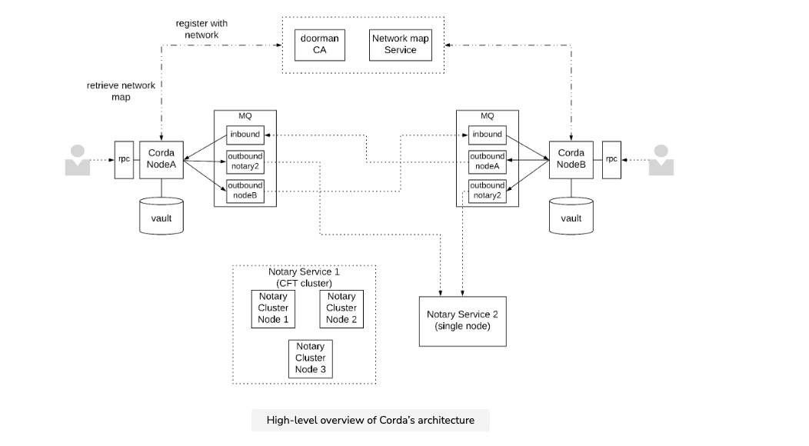

#### Blockchain and cryptocurrency
Note: Below statements might not be accurate

#### Blockchain and cryptocurrency
1. Hash function desirable properties
   1. Highly unlikely to determine original string from hash. Highly unlikely to find string with similar hash.
   2. Highly unlikely that the hash of two strings are equivalent.
2. Ledge is a set of records. Each record is stored in a block. Blocks are appended to the existing list of blocks. Block points to the previous block using hash pointer.
    1. Hash pointer -- Block is hashed using a hashing algorithm to get block identifier.
3. Several parties/machines host the ledger database. 
4. If a machine adds block to the ledger, then the machine/owner gets a cut for completing the transaction.
5. Fixed amount of currency in the system. What determines the amount of currency in the system? Currency can be divided indefinitely.
6. Client constructs the block for the transaction.
   1. User asks client to carry out money transfer from his account to another person's account.
   2. Client gets the private key of the user.
   3. Client builds a block on top of another block in which the client received the money.
   4. Construct the current block
      1. Issuing user to receiving user --> amount, base block pointer
      2. remaining money --> Issuing User
      3. Sign the transaction with private key of the issuing user. How do others verify the signature??
      4. Also sign the transaction using public key of the receiving user. 
      5. Add random string to the block.
      6. Hash the above data and user it as block hash pointer.
      7. The machine must generate hash of the block to be in the range a|0{5}. This acts as a proof of work.
   5. Publishes the block using peer to peer protocols. The longest chain is the winner. Only the client building on the longest chain earn the transaction cut.
   6. Majority are good actors. Not fully Byzantine fault-tolerant.
7. Tampering is difficult. Tampering would change the hash value of the block, clients can recognize that the block is tampered. In order to tamper, the client has to modify all the blocks pointing to the block tampered.

#### Corda
1. Transactions are finalized by trusted notary as opposed to waiting for the block to be 6 blocks behind im blockchain. Nodes participate in transactions only if it's involved in the transaction. Nodes don't keep all the transactions in the network, nodes only keep the relevant transactions.
2. Private decentralized ledger. This is different from blockchain. There is no blockchain. Only ledgers of several parties involved. Helps with the problem of reconciliation of the ledgers across companies.
2. Corda paper https://www.corda.net/content/corda-platform-whitepaper.pdf
3. Corda is a platform that allows multiple parties that do not fully trust each other to maintain a distributed ledger with shared facts amongst each other.
4. A distinctive characteristic of this system is this lack of trust between the nodes that are part of the system, which also gives it a decentralization aspect. This distrust is managed through various cryptographic primitives.
5. Each node in Corda is a JVM runtime environment with a unique identity on the network. A Corda network comprises many such nodes that want to transact with each other to maintain and evolve a set of shared facts. Corda network is permissioned, which means nodes need to acquire an X.509 certificate from the network operator to be part of the network.
6. The component that issues X.509 certificates is referred to as the doorman. In this context, the doorman operates as a certificate authority for the nodes that are part of the network.
7. This X.509 certificate creates an association between the public key of the node and a human-readable X.500 name (e.g., O=MegaCorp, L=London, C=GB).
8. The network also contains a network map service, which provides some form of service discovery to the nodes part of the network. The nodes can query this service to discover other nodes that are part of the network in order to transact with them.
9. Interestingly, the nodes do not fully trust the network operator for the distribution of this information. So each entry of this map that contains the identifying data of a node (i.e., IP address, port, X.500 name, public key, X.509 certificate, etc.) is also signed by the corresponding node. In order to avoid censorship by the network operator, the nodes can even exchange the files that contain this information with each other out-of-band and install them locally.
10. States represent the shared facts between Corda nodes. States are immutable objects which can contain arbitrary data depending on the use case.
11. Instead, the current state is marked as historic and is replaced by a new state, which creates a chain of states that gives us a full view of the evolution of a shared fact over time. A Corda transaction does this evolution.
12. Corda transaction specifies the states marked as historic (also known as the input states of the transaction) and the new states that supersede them (also known as the output states of the transaction).
13. Of course, there are particular rules to specify the kind of states each state can be replaced by. Smart contracts specify these rules, and each state also contains a reference to the contract that governs its evolution.
14. The smart contract is a pure function that takes a transaction as an input and determines whether this transaction is considered valid based on the contract’s rules.
15. Transactions can also contain commands, which indicate the transaction’s intent regarding how the data of the states are used. Each command is also associated with a list of public keys that need to sign the transaction to be valid.
16. For a Spend command, the contract will verify that the sum of all input states equals the sum of all output states so that no money is lost or created out of thin air. It will most likely check that the Spend command contains all the owners of the input states as signers, which need to attest to this transfer of money.
17. Double spend problem: **A notary is a Corda service responsible for attesting that a specific state is not spent more than once.**
18.  every state is associated with a specific notary and every transaction that wants to spend this state needs to acquire a signature from this notary that proves that the state was not spent already by another transaction. This process is known as transaction finalization in Corda.
19. The notarisation services are not necessarily provided by a single node; it can also be a notary cluster of multiple nodes in order to provide better fault tolerance and availability. In that case, these nodes will form a consensus group.
20. Corda allows the consensus algorithm used by the notary service to be pluggable depending on the requirements in terms of privacy, scalability, performance, etc. For instance: Raft, Byzantine fault tolerance.
21. This means that finalized transactions are not reversible in Corda unless someone violates the protocol.
22. Implications of permissions on Corda nodes and notaries
    1. In the first case, it forms the foundation for authentication of communication between nodes. 
    2. In the second case, it makes it easier to detect when a notary service deviates from a protocol (e.g., violating finality), identify the associated real-world entity, and take the necessary actions.
23.  Corda is in contrast to some other distributed ledger systems where nodes are anonymous and can thus collude in order to revert historic transactions, such as Bitcoin.
24. As mentioned previously, in some cases, even a limited amount of protocol violation can be tolerated, i.e., when using a byzantine consensus protocol.
25. Problems
    1. The size of the ledger of all Corda applications deployed in a single network can become large. The various nodes of the network communicate in a peer-to-peer fashion only with the nodes they need to transact. Still the notary service seems to be something that needs to be used by all the nodes and could potentially become a scalability and performance bottleneck.
    2. Each network can contain multiple notary clusters so that different applications can use different clusters (vertical partitioning). Even the same application can distribute its states between multiple notary clusters for better performance and scalability (vertical partitioning).
    3. The only requirement for all input states of a transaction is to belong to the same notary. This is so that the operation of checking whether a state is spent and marking it as spent can be done atomically in a simple and efficient way without the use of distributed transaction protocols.
    4. It is a particular transaction type provided by Corda, which allows one to change the notary associated with a state by essentially spending the state and creating a new one associated with the new notary.
26. Cordapps
    1. Corda applications are called CorDapps and contain several components, of which the most important ones are the states, their contracts, and the flows. 
    2. The flows define the workflows between nodes used to update the ledger or simply exchange some messages.
    3. Corda provides a framework that allows the application to define the interaction between nodes as a set of blocking calls that send and receive messages. The framework is responsible for transforming this into an asynchronous, event-driven execution.
    4. Corda also provides a custom serialization framework that determines how application messages are serialized when sent across the wire and how they are deserialized when received.
    5. Messaging between nodes is performed with the use of message queues, using the Apache ActiveMQ Artemis message broker. Specifically, each node maintains an inbound queue for messages received by other nodes and outbound queues for messages sent to other nodes. A bridge process is responsible for forwarding messages from the node’s outbound queues to the corresponding inbound queues of the other nodes.
    6. Even though all of these moving parts can crash and restart in the middle of some operation, the platform guarantees that every node will process each message exactly-once.
       1. The guarantee of every node to process each message exactly once is achieved by resending messages until they are acknowledged and having nodes keeping track of messages processed already and discarding duplicates.
    2. Nodes also need to acknowledge a message, store its identifier and perform any related side-effects in an atomic way. It is achieved by doing all of this in a single database transaction. All the states from the ledger that are relevant to a node are stored in its database. This part of the database is called the vault.
27. Corda provides a lot of different mechanisms to preserve backwards compatibility in different areas, so let’s explore some of them.
    1. Corda provides API & ABI backwards compatibility for all the public APIs available to CorDapps. It means that any CorDapp should run in future versions of the platform without any change or re-compilation.
    2. Serialization framework and methods like RPC can allow for schema evolution.
    3. Corda solves the multiple versioning problem with the use of the network minimum platform version.
    4. Any platform feature that is not backwards compatible and requires a minimum version of the platform can check this parameter and be enabled only when the network is over a specific platform version. In this way, the nodes of a network can start using a feature only after they can be certain all other nodes will also be able to use it.
    5. However, this process applies only to features that have network-wide implications, e.g., ones that determine how data are stored on the ledger.
    6. Corda provides multiple versioning levers for more fine-grained control. CorDapps provide two version numbers for this purpose: minimumPlatformVersion and targetPlatformVersion.

