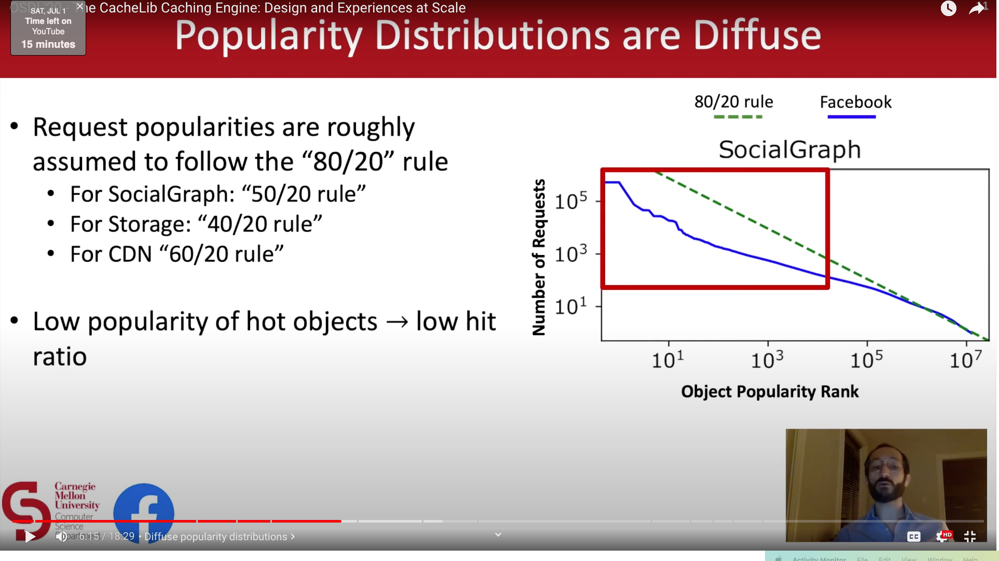

#### Caching

Use cache to speed up reads of not so frequently updated data.

1. Read strategies
   1. Read through. Example Varnish. Cache takes care of reads from the storage system. Requires same data model for cache and storage. Doesn't tolerate cache failures.
   2. Cache aside. Example Redis. App takes care of reads from the storage system.
2. Write strategies
    1. Write through. Varnish. Cache takes care of write to the storage system.
    2. Write around. Redis. App writes to the storage system.
    3. Write back. Redis writing data asynchronously to redis database.
3. Combine above two strategies for final solution. ***Consistency*** is a problem in caching.

#### Cache problems
1. Avalanche
   1. Large number of keys expire at the same time. Increases load on the storage system.
   2. Mitigation
      1. Staggered expiration. Add small random value to TTL.
2. Stampede
   1. Sudden increase in the number of requests to the storage system due to 
      1. Cache miss of popular keys.
      2. Spike in traffic.
      3. Restart of cache.
      4. Cache node failure and moving the traffic to a different node.
   2. Mitigation
      1. Consistent hashing to evenly distribute load to remaining non failed nodes.
      2. Circuit breakers to control load coming to cache servers.
      3. Rate limiting to control load coming to cache servers.
3. Cache miss attack/Cache penetration
   1. Solutions
      1. Store the 404 Not found response as well in the cache. Set TTL for cached 404 responses.
      2. Bloom filters to check for the existence of the key.
4. Hot keys
   1. Popular tweets of celebrity.
   2. Single cache node experiences resource overload due to the hot keys.
   3. Solutions
      1. Prefix hot key with random number and it would distribute traffic across multiple nodes. The hot key data will be replicated in multiple nodes.
      2. Store hot key values in application memory.
5. Large key problem
   1. Key value size is huge.
   2. Network bandwidth, memory and latency issues.
   3. Solution
      1. Change business requirements
      2. Divide and store small parts separately.
      3. Set long TTL for large keys
      4. Store compressed large key values
6. Cache inconsistency problems
   1. Within the cache system.
   2. Inconsistency with the storage system.
   3. Eventual consistency is used in cache systems.
   4. Multiple failures of same node under consistent hashing can lead to inconsistencies.
      1. Node A fails, key K rehashed to Node B, node B caches key K
      2. Node A comes back online, caches K with latest data.
      3. Node A fails, key K rehashed to Node B, node B already contains stale data of K.
      4. Solution: No automatic rehash.
7. Cache with single node per shard
   1. Use disk to backup the data
   2. Write-back disk backup vs write-through disk backup. There is a middle way as well that ack's the writes only if the writes are stored to disk.
8. Replication strategies
   1. Synchronous replication.
   2. Async replication. Redis uses async replication.
   3. Semi-sync quorum based replication.
9. Order of writes to cache
   1. Write to database first and then to cache. This is better than writing to cache first.
10. Concurrent write to the cache or write conflicts.
    1. Cache can end up having old value.
    2. Solution: Use compare with version number and swap only if version numbers match to update the cache entries. Version numbers can be maintained per item, per database, per shard. Memory vs retry frequency trade-off.
11. Monitor
    1. Cache hit ratio
    2. Key size
    3. Cache evictions
    4. Latency
    5. Invalidation rate

#### Cache eviction strategies
1. Least recently used
2. Least frequently used
3. First in First out
4. Random replacement

### Redis
Implement rate limiter with Redis by using key with expiration time to 1 minute(or rate limit window span) to count requests.

##### why is redis fast
1. In memory database. Single thread, IO multiplexing
2. Uses Simple Dynamic string for storing strings.
3. Uses LinkedList and ZipList for lists.
4. Uses hashtable for Hash
5. Uses skip list data structure for sorted set
6. Sorted Set data structure is [implemented](https://scalegrid.io/blog/introduction-to-redis-data-structures-sorted-sets/#:~:text=Sorted%20sets%20are%20implemented%20as,list%20maps%20scores%20to%20objects.) using Hash and SkipList.

#### Memcached
1. No support for sharding and replication
2. Only one data structure HashMap<String, String>
3. Client needs to serialize objects to string.
4. Memcached uses the slab allocation method for reducing fragmentation. However, when we update the existing entries’ size or store many small objects, there may be a wastage of memory. Nonetheless, there are configuration workarounds to resolve such issues.
5. Memcached can efficiently use multicore systems with multithreading technology.
6. Memcached can be the right choice for file sizes above 100 K.

#### Redis
1. Redis cluster(sentinel), each node acts as both primary and replica. Asynchronous  replication.
2. Cluster manager manages the cluster nodes and does automatic fail-over.
3. Redis supports different data structures(set, sorted set, key value store, list, queue). Supports strings, sorted sets, hash maps, bitmaps, and hyper logs.
   1. The main advantage is that Redis can modify data in place without wasting network bandwidth by downloading and uploading. It saves network bandwidth, but it also saves time and effort by avoiding the serialization and deserialization of data.
4. Redis supports pub/sub or asynchronous message processing.
5. Clients talk to cluster manager to perform an operation.
6. Pipelining is the process of combining multiple requests from the client side without waiting for a response from the server. As a result, it reduces the number of RTT spans for multiple requests.
   1. Pipelining the commands from the client side has no impact on how the server processes these requests.
   2. Pipelining reduces the RTT, OS/User context switching. 
7. Redis can store small data items efficiently.
8. Redis runs as a single process using one core
9. Transaction support, Lua scripting support and geospatial support.
10. Memcached is preferred for smaller, simpler read-heavy systems, whereas Redis is useful for systems that are complex and are both read- and write-heavy.

#### [CacheLib by facebook](https://www.youtube.com/watch?v=JIM08lWPvNs)

1. Different specialized cache implementations for different use cases at facebook.
2. Problems with existing systems. The new implementation is a hybrid of specialized, generalized.
   1. Popularises are assumed to follow 80/20 rule.
      1. Low popularity of hot objects leads to high memory usage
   2. Variable object sizes
      1. Small objects, overhead per object is 40-50B. 1TB of 100B objects --> 256 GB overhead.
   3. Production stability
      1. Burst traffic
         1. Di-nural pattern
         2. Load balancer problem
      2. Code updates/restarts
3. Unified cache: Solve common challenges at once with a unified system, but flexible for different use cases. 
   1. Cache applications can depend/implement on the cacheLib. 
   2. Unified various cache applications at facebook. 
   3. Decoupled cache systems from DRAM.
   4. Easy for applications to capitalize on new advances in technology.
   5. Same generalization and specialization can be seen in tectonic file system design.
   6. Hybrid DRAM-flash caches.
   7. Approximate objects over billions of small objects
   8. High single machine throughput.
   9. Broad feature-set
   10. Uniform thread-safe API
   11. Smart pointers zero copy access to data
   12. DRAM uses chained hash table
       1. 31B per object overhead
   13. Admission policy layer decides whether an object is worthy of moving to flash based on likeliness of accessing again. This tries to reduce the total number of writes to flash as flash has limited write cycles. write amplification of flash is reduced by writing large-objects sequentially.
   14. Flash cache partitioned into small object cache(< 1KB size) and large object cache(> 1KB size)
       1. Large object cache
          1. Millions of objects
          2. In memory index
          3. 10.5B DRAM overhead per object
       2. Small object cache
          1. Billions of objects
          2. No in-memory index
          3. Objects are directly hashed to 4K pages
          4. < 1B DRAM overhead per object
   15. Hybrid cache, warm restart(persistent cache across restarts), negative caching(Cache empty results with no overhead), native arrays and maps, no serialization overhead for applications.
   16. Achieved better throughput, same hit ratio as that of memcached. Outperformed nginx for http server caching. Much better throughput for small objects.
   17. CacheLib exports optimizations, doesn't serve the needs of all the applications though.