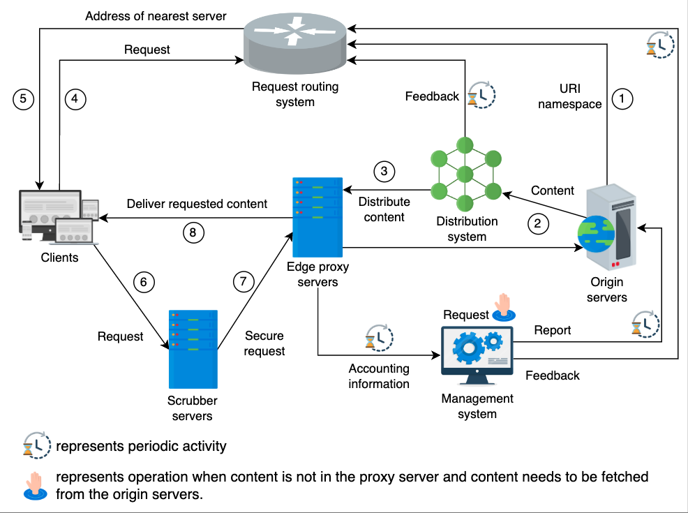

#### System design
#### Latency numbers
* L1 cache -> 1ns
* RAM -> 1/10 micro-sec
* SSD -> 1/10 ms
* CA-NL-CA -> 1/10 seconds
* US east to Africa RTT --> 225ms
* DNS lookup 20-120ms

#### [Grokking the modern system design](https://www.educative.io/courses/grokking-modern-system-design-interview-for-engineers-managers/YQVW0zY1Opp)
* The number of servers for most of the designs are in order of single digit thousands ~1k
* Incoming network bandwidth in the order of 10Mbps and outgoing network bandwidth ~10Gbps
* Text in order of KBs and images in order of 250KBs, short videos in the order of 5MBs, 5 minutes videos ~30MB
* The numbers mentioned above and the numbers mentioned below in each system are rough ballpark numbers. Might severely differ from actual numbers.

#### Back of enveloper estimation process:
1. Identify DAU 
2. No of Requests by each user. Size of each write request. 
3. From size of each request, number of requests and DAU --> compute storage required per day. 
4. Identify read:write ration --> number of read requests per second. 
5. QPS of the server --> DAU/QPS = number of servers. 
6. Bandwidth total_storage_per_day/(number of seconds in a day) = in bandwidth, calculate out bandwidth by using number of read requests,size of each read request.

#### Websocket advantages 
1. Two-way communication(server can push changes to client) and full duplex(simultaneous) connection 
2. No overhead of HTTP request response headers 
3. Long-lasting connections

#### Designs
1. RateLimiter
   1. On a standalone service or in an existing service.
   2. Hard limit, soft limit(allows 20% more requests), dynamic limit(allows if the resources are available).
   3. Counter types
      1. Global counter for all nodes
      2. Counter at node level. Node rate limit can be configured. Or the nodes can share the counter values through gossipping(amazon rate limiter implementation.)
   4. Algorithms
       1. Token bucket
       2. Leaky bucket
       3. Fixed window or hopping window
       4. Tumbling window (divide the interval into parts and nuke the last part when new part comes in)
       5. Sliding window with log of messages (Keep all messages timestamps and keep the oldest timestamp to be within the window.)
          1. Sample leetcode problem https://leetcode.com/problems/logger-rate-limiter/description/
       6. Sliding window without log of messages. Keep track of count of messages per fixed windows. Estimate the current sliding window number of elements using extrapolation. If the number of elements in the current sliding window is less than the rate then allow the request otherwise reject the request.
   5. Scalability
       1. Keep the counters in Redis.
       2. Check the counter and increment the counter offline in a background job.
   6. Reliability
       1. What if the redis cache containing counter goes down. Most of the applications it's fine. For strict rate limit, store the events and recompute the count from stores events.
2. Heavy hitter's problem - counting and displaying the number of likes on hot social media posts/videos.
   1. Maintain several counters per post i.e sharded counters. 
      1. Increment one shard value on write. Select shard using round-robin, random, metric/load based selection.
      2. For read, accumulate values from all the shards. Cache the accumulated result if needed.
      3. Decide on the number of shards based on the popularity of the content.
      4. Increase and decrease the number of shards per counter dynamically based on the expected load.
   2. Sharded counters would reduce write contention.
   3. (Not convinced fully) Sharded counters can/may be used for computing top hashtags as well. Maintain counters and consider all the hashtags with counter greater than a fixed value.
3. CDN
   
   1. Problem
      1. Real time applications latency below 200ms. VOIP 150ms latency.
      2. Latency if data is served directly from datacenter. Data intensive applications -- network bandwidth/congestion/MTU problems. Scarcity of data center resources
   2. get(origin to proxy), get(proxy to client), search, update, delete are the main operations.
   3. Edge Proxy servers(server between client and origin) placed on the edge(i.e initial hops through which user connects to internet.)
      1. Replication of proxies to increase throughput. Master slave architecture can be used.
      2. Stores info in RAM or SSD
   4. Push or Pull. Data transmitted once to CDNs. CDNs serve several users. Streaming protocols RTMP, HLS, RTSP used to serve streaming content to end users. They are mostly based on UDP and aims to increase latency over reliability.
      1. Push for static content and pull for high traffic, dynamic(frequently) changing content.
      2. Low storage consumption is one of the main benefits of the pull CDN.
   5. Akamai, StackPath, Cloudflare, Rackspace, Amazon CloudFront, and Google Cloud CDN.
   6. Availability, Scalability and reliability are important. Protection from DDos and other attacks are needed.
      1. DNS resolves to proxy server and load balancers distribute the traffic to proxies.
   7. Distribution systems, accounting systems, routing systems, request validation(or scrub) servers are the other auxiliary services.
   8. Some CDNs ask proxy servers to execute scripts to produce different resolution images, content etc. Dynamic content production based on location, time, third party API data like weather. Proxy servers can update content in fellow proxy servers.
   9. Search for items in fellow proxy servers if the content is not found locally. Cache eviction strategies are employed. Deletion op is also exposed.
   10. To reduce the communication between the origin server and proxy servers and storage requirements at proxy servers, Compress the content, ***Edge side include markup language*** to transfer only changed content(assemble content at the CDN edge server), DASH protocol to request appropriate content based on network condition.
   11. Proxies arranged in tree structure to reduce data distribution load on origin server. Typically two levels of proxy servers. Use other servers in next layer in case of parent failures.
   12. Find nearest proxy to fetch data i.e Request routing.  The nearest proxy server doesn’t necessarily mean the one that’s geographically the closest. It could be, but it’s not only the geography that matters. Other factors like network distance, bandwidth, and traffic load already on that route also matter.
       1. DNS redirection: DNS system replies with another URL, IP address to distribute load to proxy servers. Keep short TTL to choose different servers for different requests. Akamai uses DNS redirection.
       2. Any-cast: Assign same IP to all proxies in multiple geographic locations. Let BGP figure out the nearest server.
       3. Client multiplexing: client selects one out of many proxy server addresses in config/server.
       4. HTTP Redirection directly by origin server
   13. Content consistency with origin servers
       1. Proxy server --> origin polling. Time to refresh interval.
       2. TTL.
       3. Lease(Adaptive lease) of update notifications is TTL alternative. The lease denotes the time interval for which the origin server agrees to notify the proxy server if there’s any change in the data. The proxy server must send a message requesting a lease renewal after the expiration of the lease.
          1. The lease method helps to reduce the number of messages exchanged between the proxy and origin server.
          2. The lease duration can be optimized dynamically according to the observed load on the proxy servers. This technique is referred to as an adaptive lease.
   14. Maintain connections from proxy servers to datacenter to avoid three-way handshakes everytime. Internet exchange points(IXP's).
   15. Deployment: on-prem, off-prem. Public CDN servers. Private/specialized CDN
   16. Companies like Netflix, Meta have their own CDN systems. Some hardware in ISPs and some hardware in edge PoPs(company datacenters which are distributed throughout the world close to the users or on the edge network).
       1. Reasons can be cost, security, serviceability to all places, optimization for the specific use cases.
       2. Netflix built Open Connect Appliance (OCA) proxy servers.
   17. Place proxy servers in datacenters close to IXPs(on-prem). and place proxy servers in ISPs(off-prem).
   18. Use S3 as source for CDN image file loads. 
   19. Cost, Performance, Ease of making changes and Security of the content are the reasons for Netflix building own CDN. Netflix achieved 95% hit ratio.
4. 64 bit Unique ID generator
   1. Problem: Generate IDs for distributed systems use. Uniqueness, Scalability, Availability, 64 bit numeric(enough for many years).
   2. Solutions
      1. Random UUID generation
         1. Probability of having duplicates.
         2. UUI string is 128 bit long. Indexing is time taking. But we can modify the UUID gen algo to generate in 64 bit range.
      2. Auto-increment in database
         1. Each database increments counter by m(shard number) for each new request. 
         2. Fail over is difficult.
      3. Partition the ID range. Each server assigns from a single range. Special server handles the assignment of partitions to servers.
         1. Problem: Satisfies the requirements stated above, but the IDs are not sorted according to time.
         2. IDs that also preserve the order of events. Hard to achieve
   3. Unique ID with causality. We want a unique ID to do double duty—provide unique identification and also help with the causality of events. Timestamps(physical and logical) as part of the ID. Add other values to increase no of IDs generated per second.
      1. Unix timestamps. Fact: European MiFID requires clocks to be within 100 microseconds of UTC to detect anomalies during high-volume/high-speed market trades.
         1. Append server id to unix timestamp to solve single point of failure problem
         2. Concurrent events will have the same timestamp. IDs are no longer unique
      2. Twitter snowflake
         
         1. We can use some bits out of our targeted 64 bits for storing time and the remaining for other information.
            1. Sign bit. Any programming environment using these identifiers interprets them as positive integers.
            2. Time stamp. 41 bits. Epoch start time can be d/m/2023. 1k identifiers per second, takes 70 years for depletion.
            3. Worker number. 10 bits: Server id that generated the number.
            4. Sequence number. 12 bits. Increment for every request and reset for overflow.
         2. Problems
            1. Clock drifts
            2. IDs wasted for idle time.
      3. True time API for clock drift mitigation
      4. Vector clocks or lamport timestamps
   

5. Distributed search functionality for youtube.
   1. DAU 3 million. 1k RPS per server. Network bandwidth in 1Mbps, out 60Mbps. No of servers 3k. Storage 1.8GB/day without video actual content.
   2. Indexer prepares the inverted index. Use map reduce to prepare the index. Compute index once and replicate for fault tolerance.
   3. We keep the index in the RAM to support the low latency of the search.
   4. Searcher searches using the index. LB sends user traffic to searchers.
   5. Partition the index by document. Document partitioning instead of term partitioning. See [sharding](./sharding.html) notes.
   6. Indexer and Searchers deployed in separate nodes.
   7. Load data searcher's data from Indexer output.
6. Yelp system design
   1. DAU is 60 million. 8k RPS per server. Network bandwidth in 51 kbps, out 300 Gbps. No of servers 7.5k. 500M places. Storage 835 GB.
   2. Quad trees to store the places. Connect child nodes of sibling segments to perform range search easily.
   3. Use segment to places map in key value store to quickly rebuild quad trees.
   4. Replicate quad trees.
   5. Place information database partition the data by placeID.
7. Google maps
   1. DAU 300 million. 50 requests per user per day. 8k RPS per server. Network bandwidth in 29 Mbps, out 300 Gbps. No of servers 4k. Storage 20 Peta Bytes.
   2. Vertices and edge info is sourced from various sources like google street view type cars, govt agencies etc..
   3. Storage doesn't change drastically as most of the roads are already mapped out.
   4. Divide the map into segments. Compute the shortest paths for each segment using Dijkstra, A* algorithms.
      1. Store each segment pre-computed results in a separate partition/node.
      2. Form a graph based only with segment boundaries to find inter-segment paths. Search only the k segments within haversine distance to the destination from source.
   5. Probably google design
      1. Update data from map data sources in graph database.
      2. Segment servers run on top of graph database. Each segment server handles a set of segments. Segment server caches the precomputed shorted paths within the segment.
      3. Store segment ID to segment server mapping, segment ID to boundary (lat, lang), segment ID to neighbor segments in key value store.
      4. Graph processor finds the segments for source, destination, uses info in key value store, contacts segment servers to find best route.
      5. Use distributed search service to convert location strings to lat, lang.
      6. Store the ETA of the edges/roads in Relational database.
      7. Feed the live traffic info back to the graph and other databases.
8. Quora system
   1. DAU 32 million. 20 requests per user per day. 8k RPS per server. Network bandwidth in 8 Gbps, out 170 Gbps. No of servers 38k. 1 Question per user per day, 2 answers per day per user. Storage 86TB per day.
   2. Original Quora design
      1. MySQL database with vertical sharding. Keep table's requiring joins in a single partition. MySQL does the heavy lifting for storage requirements.
      2. Redis and memcached to speed up serving content.
      3. RocksDB key value store. Entire system deployed on AWS. Use kafka for event processing. Moved away from HBase as p99 latency is high.
      4. Long polling to get updates instead of web sockets.
      5. Blob store to store images, videos. CDN for frequently accessed data.
      6. Questions, Answers, user metadata, comments, up-votes/down-votes in MySQL. Hbase for extracted ML features, counters, scores etc.
      7. Compute servers for ML recommendations, ranking. High in RAM and CPU power. Serves real-time recommendations and batch-processing rankings.
      8. HBase is open source clone of BigTable. Good for serving large number of small files with low latency and high throughput.
      9. ML features are stored in HBase.
      10. Build search index on HBase.
      11. ML engine works on top of HBase. And info extracted will be used by compute servers. Compute servers send some info to ML engine through HBase.
9. Youtube
   1. DAU 500 million. 500 hours of video upload every minute. 30MB size for 5-minute video. 180 GB storage per minute. 94 PetaBytes per year. 1:300 upload:view. 200Gbps upload bandwidth with 50 MB raw one-minute video size.  12 Tbps outgoing bandwidth. 8k RPS. ~62k servers.
   2. Original youtube design
      1. Separate encoder chip servers to encode and transcode videos. 
      2. Store user metadata and video metadata in Relational database with sharding and replication.
      3. Temp Database to hold videos while they are being encoded and uploaded.
      4. Store and serve thumbnails from BigTable. Encoder chip servers generate thumbnails.
         1. BigTable good for serving large number of small files with low latency. Big table is built on GFS.
         2. BigTable has multiple cache hierarchies.
         3. NigTable over MySQL due to volume of data and scale of the APIs.
      5. Store encoded and trans-coded videos to blob storage.
      6. Send popular content to CDN and co-location centers.
      7. Web and app servers. app servers serve business logic.
      8. Decouple user metadata and video metadata. Strong consistency for user metadata and eventual for video metadata.
      9. Cache the data in Memcached, LRU policy for eviction.
      10. Identify duplicate videos to reduce the storage cost. Challenging to identify duplicates.
      11. Wrappers on top of MySQL for sharding and simplification of database client logic with sharding.
      12. Special HTTP server framework ESF to handle scale.
      13. Cache chunks of video in IXPs, PoPs and ISPs. Send data to ISPs in off-peak hours.
      14. Serve popular content from CDN and non popular content from the co-location center. Dynamically determine popular content.
      15. Adaptive bitrate algorithm to send content as per the changing network condition, device buffer space etc..
      16. Lossless compression(Google snappy) while uploading content to youtube.
      17. Chunked encoding of the video is helpful for adaptive bitrate.
      18. Generate segment encodings on server and publish popular video chunks to CDN.
10. Uber design
    1. Consistency, Availability, Scalability are requirements
    2. 20 M DAU riders, 3 M DAU drivers. 20 M daily trips. 3 GB storage per day. 1 TB per year. 185kbps in, 114 Mbps out. 8k RPS per server. 2500 servers.
    3. Original Uber design
       1. Drivers location received every 4 seconds
       2. Location manager stores the driver last location is Redis cache, Quad tree and MySQL database.
       3. Location manager communicates the location updates to trip manager. Trip manager maintains the trip route and details.
       4. Quad tree updated once in 10 to 15 seconds as updating every 4 seconds is time consuming.
       5. Quad tree info is used to find nearby drivers.
       6. Driver location in hash is used to update driver and consumer's apps and recommend route updates.
       7. Find driver, request vehicle, trip manager and ETA service are the other services.
       8. MySQL database for the ongoing trip info, driver locations, driver info, user info. Migrated to spanner recently.
       9. MySQL used for maintaining consistency of information.
       10. Cassandra to store drivers locations and trip info of the trip that's ended. Live trip info is stored in mySQL for consistency.
       11. Store location history on device when the driver's device is offline.
       12. CDN to store user and driver profile information.
11. Google docs design
    1. Consistency, availability and scalability are needed.
    2. 80 Million DAU. 20 edits simultaneously, 100KB document size, one document per user per day, 32 TB per day, 3Gbps in, 14 Gbps out. 8k RPS, 10k servers.
    3. CDN to store frequently accessed media in the documents.
    4. Original G-docs design
       1. API gateway --> API servers. API servers used for computationally intensive operations like import and export of documents to different formats.
       2. Queue edit operations in ordered queue like SQS. Batch the edit operations if there are no conflicts and store the edits in time series database. Use time-series database to view history.
       3. Notifications, emails, view count and comment events --> publish to pub sub
       4. Autocomplete service parses the document, stores the words in NoSQL database, caches frequent words in redis.
       5. Websockets to receive edits and send updates to all the users.
       6. View counters are aggregated from PubSub events and stored to NoSQL. ViewCounts are not consistent.
       7. Operational transformation and [CRDTs](https://starting-fresh.medium.com/akka-java-tutorials-part-1-akka-distributed-data-e1de6bbe6286) are solution for resolving conflicting edits. Not sure about full requirements of those algorithms.
12. Search type ahead
    1. Ideally 200ms response time. User types a key every 160ms on average. Fast typing, no suggestion required.
    2. 3.5B queries per day, 15 chars per query. 21TB per year. 9 Mbps in, 1.4 Gbps out. 8k RPS per server. Total 76 servers.
    3. Trie to store the strings. Club the nodes till the node with at-least two children to save space and time.
       1. Store and Serve the trie from RAM for fast response times.
       2. Partition and replicate the trie by key-range or hash partitioning to distribute the load among multiple servers. Maintain the partition mappings in zookeeper.
       3. Store the frequencies of the phrases in the leaf node.
       4. Store the precomputed top k phrases for each/popular inner nodes on inner nodes.
       5. Frequencies can overflow, normalize the frequencies to mitigate overflow problem.
       6. Do not update tries for each incoming request
          1. Compute the phrase frequencies using Map-Reduce every 15 minutes
          2. Store the computed frequencies in Cassandra store.
          3. Build trie from the data stored in Cassandra database once in every 15 minutes.
          4. Build a new trie in the background and switch to the new trie once the new trie is built.
          5. Optionally the trie built can be stored in MongoDB database.
          6. Use sampling to select some queries out of all search queries to reduce resource usage in building the trie.
    4. Websocket protocol to transfer data
13. Web crawler
    1. 5B documents. 10 PB storage. 60seconds to per document. 3k threads to crawl in a day. 277Mbps out, 960Gbps in.
    2. Websites usually host a robot.txt file, which communicates domain-specified throttles/limitations to the crawler.
    3. Robot exclusions file of sites guide the search engines
    4. Priority of URLS according to importance. Crawl frequency varies across sites. News sites crawl more frequently.
    5. Check duplicate URLs and content while crawling, store the content in Blob store for indexing.
    6. Self throttle the crawler to not overload the sites.
    7. Intentional/Unintentional Crawl trap makes the crawler crawl same sites indefinitely. Identify and store the crawl traps.
    8. Specialised DNS server to quickly resolve IP addresses.
    9. Parallelize crawling. Multiple workers. Each worker crawls set of URLs. Workers get URLs from scheduler.
    10. Extract and store the URLs back in the scheduler service. Scheduler users in memory priority queue as well as the database.
    11. Re-crawl the sites according to priority and crawl frequency.
14. Whatsapp messenger
    1. Availability, Consistency(of order of messages), Scalability. Availability can be compromised for the sake of consistency.
    2. 100 B messages per day. Message expires in 30 days on the server. min 300 TB per month. 900 Mbps in, 900 Mbps out.
    3. Original whatsapp
       1. 10 M connections on a single server. Server is highly optimized for the workload to achieve the 10 M connections scale. We can often optimize a general-purpose server for special tasks by careful performance engineering of the full software stack.
       2. 200 chat servers.
       3. Websocket servers connect to users through web sockets. Websocket manager stores the user to web socket server mapping in Redis cache.
       4. Messages are stored in Amnesia database if the user is offline. Messages are deleted from the database after 30 days.
       5. Images and documents are stored in blob store. Popular images will be pushed to CDN.
       6. Groups metadata stored in MySQL database. Group messages sent to kafka topics. Kafka consumer sends messages to group users.
       7. Websocket servers geographically distributed to reduce latency.
15. Twitter
    1. Original twitter design
       1. Sharded counters, place shard close to the users.
       2. Uses variety of databases MySQL, PostGreSQL, RocksDB on top of Manhattan(in house key value store), BigQuery(google data warehouse), Google PubSub, Kafka, BigQuery, in-house cache Pelikan, Flock graph database, in house blob store.
       3. Store the ads data in MySQL. Tweets in Manhattan. User follower relationships in FlockDB. Zipkin for distributed tracing. Splunk for log analysis.
       4. Client side load balancing i.e kubernetes decentralised load balancing.
          1. Select two servers randomly, compare the load and select the one with low load. Better load distribution than random selection.
          2. Connection pool, maintain connections to set of servers instead of all servers to reduce connection overhead. Use continuous ring strategy to select servers out of all servers.
16. Timeline
    1. Push approach avoids querying for latest posts of all the users that the user follows. When a user posts a post, post gets added to the followers timeline. Use stream processing to maintain the timeline cache. Materialized view maintenance
17. Distributed job scheduler
    1. More of creativity of requirements than the actual system design of the scheduler. Some other system designs are similar. 
18. Message queue
    1. Advantages
       1. Improve performance: Non-essential tasks are removed from critical path
       2. Fault tolerance: Failure of consumer doesn't impact producer.
       3. Decoupling
    2. Use-case(s): Sending emails, Post processing data(generate different bitrate videos offline), recommender systems

#### Chat system design
1. 