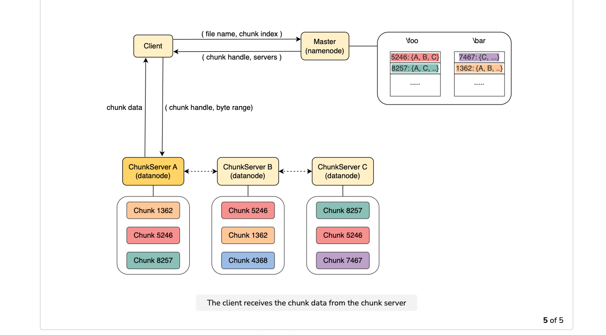
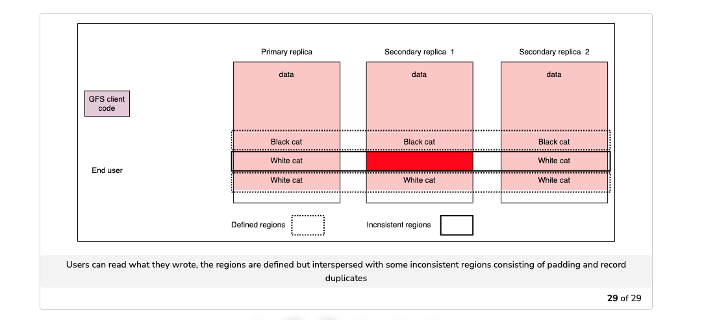
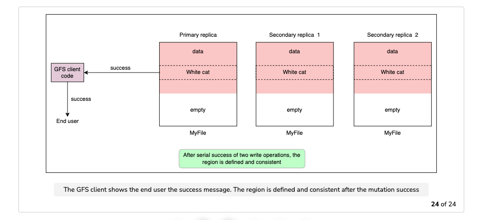
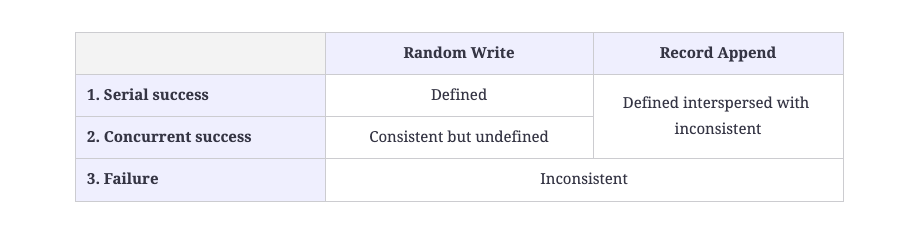
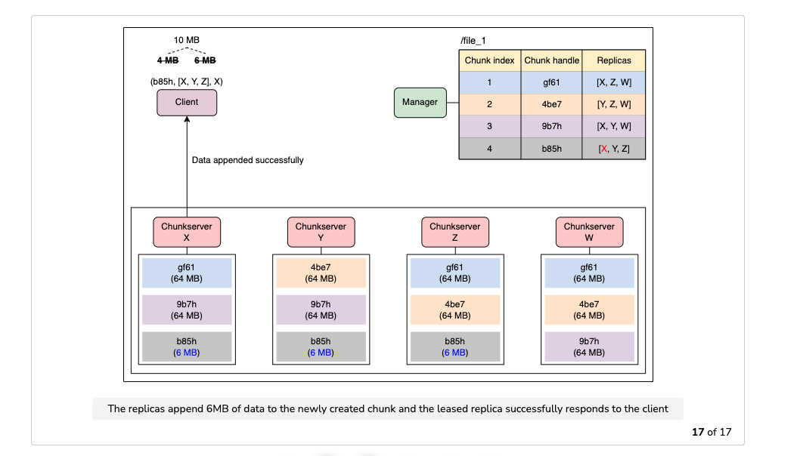
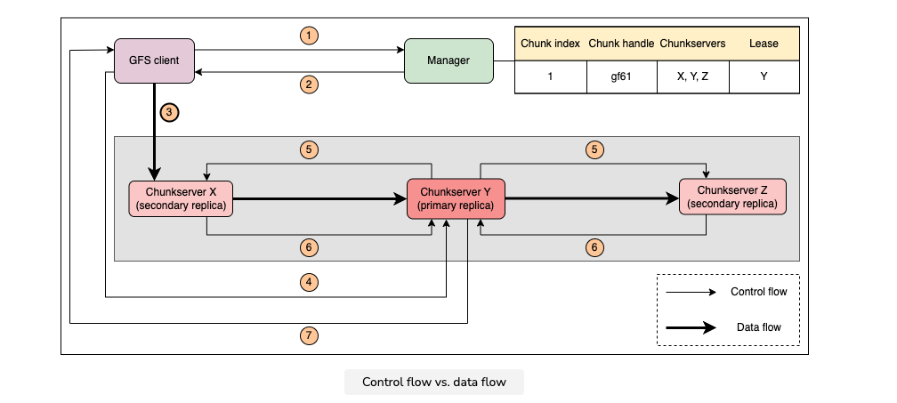

### Distributed filesystems
design goals
1. Fault tolerant
2. Scale for huge volume of data
3. The system should be optimized for use-cases that involve batch operations, such as applications that perform processing and analysis of huge datasets.
   1. This implies that throughput is more important than latency, and most of the files are expected to be mutated by appending data rather than overwriting existing data.
#### GFS

1. Master node, chunk servers and clients
2. The HDFS architecture is similar, but the master node is called Namenode, and the chunkserver nodes are called Datanodes.
3. Each file is divided into fixed-size chunks, identified by an immutable and globally unique 64-bit chunk handle assigned by the master during chunk creation.
4. Chunk servers store chunks on local disks as regular files. The system employs both partitioning and replication:
5.  The master node is not involved in the transfer of file data to ensure good performance and scalability.
6. The system considers the network topology of a data center, which usually consists of multiple racks of servers. This has several implications, e.g., bandwidth into or out of a rack may be less than the aggregate bandwidth of all the machines within the rack, and a failure of a single shared resource in a rack (a network switch or power circuit) can essentially bring all the machines of the rack down.
7. When GFS creates a new chunk and places its initially empty replicas, a master tries to use chunk servers with below-average disk space utilization. It also tries to use chunk servers with low numbers of recent creations since that can reliably predict imminent heavy write traffic. In this way, the master attempts to balance disk and network bandwidth utilization across the cluster.
8. When deciding where to place the replicas, the master also follows a chunk replica placement policy that is configurable. By default, it will attempt to store two replicas at two different nodes that reside in the same rack while storing the third replica at a node that resides in a separate rack. This process is a trade-off between high network bandwidth and data reliability.
9. Clients abstract away the logic For example, the applications can operate based on byte offsets of files. The client library can translate these byte offsets to the associated chunk index and communicates with the master to retrieve the chunk handle for the provided chunk index and the location of associated chunk servers. Finally, It contacts the appropriate chunkserver (most likely the closest one) to retrieve the data.
10. Create
    1. The master node maintains the metadata about the filesystem. As a result, an operation that creates a file needs only to contact the master node, which creates the file locally.
    2. The master node uses locking while creating new files to handle the concurrent requests safely. More specifically, a read lock is acquired on the directory name, and a write lock is acquired on the file name.
11.  Clients cache the metadata for chunk locations locally, so they only have to contact the master for new chunks or when the cache has expired.
12. clients do not cache the actual chunk data since they are expected to stream through huge files and have working sets that are too large to benefit from caching.
13. During the migration of chunks due to failures, clients organically request fresh data from the master when they realise the old chunk servers cannot serve the data for the specified chunk anymore.
14. All metadata is stored in the master’s memory. The namespaces and the mappings are also kept persistent by logging mutating operations (e.g. file creation, renaming etc.) to an operation log that is stored on the master’s local disk and replicated on remote machines.
15. All metadata is stored in the master’s memory. The namespaces and the mappings are also kept persistent by logging mutating operations (e.g. file creation, renaming etc.) to an operation log that is stored on the master’s local disk and replicated on remote machines.
16. The new master deserializes the metadata and mutation logs from Chunk servers to restore the system to a functioning state
17. File namespace mutations are atomic and linearizable. This is achieved by executing this operation in a single node, the master node. The operation log defines a total global order for these operations. The master node also uses read-write locks on the associated namespace nodes to perform proper serialization on any concurrent writes.
18. For example, the applications can operate based on byte offsets of files. The client library can translate these byte offsets to the associated chunk index and communicate with the master to retrieve the chunk handle for the provided chunk index as well as the location of associated chunk servers. Finally, it contacts the appropriate chunk server (most likely the closest one) to retrieve the data.
19. GFS supports multiple concurrent writers for a single file.
20. Write contains the following steps
    1. Identifying chunk servers
    2. Pushing data to all replicas using chain replication.
    3. Writing (meta)data to all replicas
    4. Acknowledge the write to the client
21. Delete operations are also executed initially at the master node only. The master node makes use of the same locking scheme as when creating a file. Instead of completely removing the file, the master node moves it into a hidden namespace where it can still be accessed (and undeleted) until it’s been permanently deleted. After a specific period of time, if the file still remains in this namespace, it is permanently removed, and all the associated references to chunks, etc. The actual content of the chunks is removed by the chunk servers lazily later on through a process of garbage collection.
22. Think about the scenario where the primary replica crashes in the middle of performing a write. After the lease expires, a secondary replica can request the lease and start imposing a new serial number that might disagree with the writes of other replicas in the past. As a result, a write might be persisted only in some replicas or it might be persisted in different orders in different replicas.
23. GFS provides a custom consistency model for write operations which we will discuss in the next lesson.
24. The state of a file region after a mutation depends on the type of mutation, whether it succeeds or fails and whether there are concurrent mutations.
25. A file region is consistent if all clients will always see the same data, regardless of the replica they read from.
26. A record append causes data to be appended atomically at least once even, in the presence of concurrent mutations but at an offset of GFS’s choosing, which is returned to the client.
27. Working with the consistency model exposed by GFS
    1. Appending is far more efficient and more resilient to application failures than random writes. 
    2. Each record prepared by a writer can contain extra information like checksums so that its validity can be verified. A reader can then identify and discard extra padding and record fragments using these checksums
28. Both GFS and HDFS provide applications with the information where a region of a file is stored. This enables the applications to schedule processing jobs to run in nodes that store the associated data, minimizing network congestion and improving the system’s overall throughput. This principle is also known as moving computation to the data.
29. [MIT article](https://timilearning.com/posts/mit-6.824/lecture-3-gfs/)
    1. Also note that it was tailored for a workload that largely consisted of sequential access to huge files (read or append). It was not built to optimize for low-latency requests; rather, it was meant for batch workloads which often read a file sequentially, as in MapReduce jobs.
    2. A file stored in GFS is broken into chunks. A chunk is identified by an immutable and globally unique chunk handle.
    3. Mater: It is also responsible for garbage collection of orphaned chunks (when a file is deleted), and the migration of chunks between chunk servers for rebalancing load.
    4. The master communicates with each chunkserver via Heartbeat operations to pass instructions to it and collects its state.
    5. The chunkservers do not perform any form of caching but instead rely on the Linux buffer cache which keeps frequently accessed data in memory.
    6. An interesting design choice made in this system is the decoupling of the data flow from the control flow. The GFS client only communicates with the master for metadata operations, but all data-bearing communications (reads and writes) go directly to the chunkservers. I'll explain how that works next
    7. By caching the information from the master, further reads to the same chunk do not require any more client-master interactions until the cached information expires or the file is reopened.
    8. In GFS, chunks are analogous to blocks, except that chunks are of a much larger size (64 MB). Having a large chunk size offers several advantages in this system
    9. A block size is the unit of work for the file system, which means reading or writing any files is done in multiples of that block size.
    10. The client will not need to interact with the master as much, since reads and writes on the same chunk will require only one initial request to the master to get the chunk location information, and more data will fit on a single chunk.
    11. With large chunk sizes, a client is more likely to perform many operations on a given chunk, and so we can reduce network overhead by keeping a persistent TCP connection to the chunkserver over an extended period of time
    12. Third, it can reduce the size of the metadata stored on the master, since it's keeping track of fewer chunks.
    13. Lazy space allocation means that the physical allocation of space is delayed as long as possible, until data at the size of the chunk size is accumulated.
    14. I think what this means is that the decision to allocate a new chunk is based solely on the data available, as opposed to using another partitioning scheme to allocate data to chunks.
    15. This does not mean the chunks will always be filled up. A chunk which contains the file region for the end of a file will typically only be partially filled up.
    16.  instead, the master asks each chunkserver about its chunks at master startup and when a chunkserver joins the cluster.
    17. By having the chunkserver as the ultimate source of truth of each chunk's location, GFS eliminates some of the challenges of keeping the master and chunkservers in sync regularly.
    18. The master keeps an operation log, where it stores the namespace and file-to-chunk mappings on local disk. It replicates this operation log on several machines, and GFS does not make changes to the metadata visible to clients until they have been persisted on all replicas.
    19. After startup, the master can restore its file system state by replaying the operation log. It keeps this log small to minimize the startup time by periodically checkpointing it.
    20. The consistency guarantee for GFS is relaxed. It does not guarantee that all the replicas of a chunk are byte-wise identical. What it does guarantee is that every piece of data stored will be written at least once on each replica. This means that a replica may contain duplicates, and it is up to the application to deal with such anomalies.
    21. However, having a single master eventually became less than ideal for Google's use case. As the number of files stored increased by thousands, it became harder to fit all the metadata for those files on the master. In addition, the number of clients also increased, leading to too much CPU load on the master.
    22. Another challenge with GFS at Google was that the weak consistency model meant applications had to be designed to cope with those limitations. These limitations led to the creation of Colossus as a successor to GFS.
    23. If a record append succeeds on some replicas and fails on others, those successful appends are not rolled back. This means that if the client retries the operation, the successful replicas may have duplicates for that record.
    24. Retrying the record append at a new file offset could mean that the offset chosen for the initial failed append operation is now blank in the file regions of the failed replicas; that is, if the region has not been modified before the retry. This blank region is known as a padding, and the existence of padding and duplicates in replicas are what make them inconsistent.
    25. Applications that use GFS are left with the responsiblilty of dealing with these inconsistent file regions. These applications can include a unique ID with each record to filter out duplicates, and use checksums to detect and discard extra padding.
    26. There is also the possibility of a client reading from a stale replica. Each chunk replica is given a version number that gets increased for each successful mutation. If the chunkserver hosting a chunk replica is down during a mutation, the chunk replica will become stale and will have an older version number. Stale replicas are not given to clients when they ask the master for the location of a chunk, and they are not involved in mutations either.
    27. Despite this, because a client caches the location of a chunk, it may read from a stale replica before the information is refreshed. The impact of this is low because most operations to a chunk are append-only. This means that a stale replica usually returns a premature end of chunk, rather than outdated data for a value.
    28. A record append is successful only when the data has been written at the same offset on all the replicas of a chunk.
    29. Lessons
        1. The decoupling of data flow from control flow. 
        2. Using large chunk sizes to reduce overhead. 
        3. The sequencing of writes through a primary replica.
30. The focus should be on high throughput rather than low latency for applications requiring large datasets processing.
31. The network-attached storage (NAS) system consists of a file-level storage server with multiple clients connected to it over a network running the network file system (NFS) protocol.
32. Setting up and managing a NAS system is easy but expensive to scale. This system can also suffer from throughput issues while accessing large files from a single server.
33. The storage area network (SAN) system consists of a cluster of commodity storage devices connected to each other, providing block-level data storage to the clients over the network. SAN systems are easy to scale by adding more storage devices. However, these systems are difficult to manage because of the complexity of the second network — the Fiber Channel (FC). To set up the Fiber Channel, we need dedicated host bus adapters (HBAs) to be deployed on each host server, switches, and specialized cabling. It is difficult to monitor where failure has occurred in this complex system. Data inconsistency issues among replicas may appear in this case. Rebalancing the load on the storage devices might also be difficult to handle with this architecture.
34. SAN deployments are special-purpose networks apart from the usual Ethernet networks. This duplicate network, while good for segregating storage traffic, is expensive in terms of dollar cost.
35. Additionally, Google’s applications, for which the system was being built, most often append data to the files instead of overwriting the existing data. So, the system should be optimized for append operations. For example, a logging application appends log files with new log entries. Instead of overwriting existing copies of the crawled data within a file, a web crawler appends new web crawl data to a crawl file. All MapReduce outputs write a file from beginning to end by appending key/value pairs to the file(s).
36. GFS does not need to comply with POSIX standards because of the unique characteristics of the use cases/applications that it targets to serve. A file system must implement a strong consistency model in order to be POSIX compatible. In POSIX, random write is one of the fundamental operations. In GFS, there are more append operations and very few random writes. That’s why GFS doesn’t comply with POSIX and provides a relaxed consistency model that is optimized for append operations. Data consistency in a distributed setting is hard, and GFS carefully opts for a custom-consistency model for better scalability and performance.
37. GFS was designed for larger sequential writes (record append) than random writes. The data, once written by these applications, is rarely modified. Knowing this, GFS handles random write and record append separately to optimize the system performance for the later operation.
38. Concurrent append with a custom consistency model is a novelty of GFS (it is not present in standard Unix-like file systems). Additionally, it is an example of a design pattern: to make the common case fast, as mentioned in this book. Append operations are fast on most kinds of disks, especially for traditional rotating disks where continuous writes don’t have to incur seek latency on each write. By making a common operation (appends) faster, GFS makes a large proportion of the overall operations fast.
39. With the architecture designed above, the read requests for multiple files and multiple chunks are distributed among multiple chunkservers, which together serve large amounts of data at the same time, improving the overall throughput of the system.
40. For streaming reads, the manager also sends the metadata for some chunks contiguous to the one that is actually requested. This helps clients read the data faster as the client already has the metadata for the next chunk.
41. Performance concerns arise from small random reads. Applications that prioritize performance frequently batch and sort their small reads in order to progress continuously through the file as opposed to back and forth (and possibly pre-fetching metadata information ahead of the time the user needs the data).
42. Write operation: Since it is the manager who decides which replica will take the lease, therefore, replicas don't need any election algorithms to choose a primary between them.
43. My take on design requirements
    1. No high concurrency for the same file append, bite ranges expected --> writes are sent to a single node for certain period of time, if data overflows in chunk, then writing to additional chunk is considered. Possible data overflow is not handled beforehand. Under high concurrency the writes might be retried? High concurrency lead to high latency. Latency is not the design goal of the system.
    2. High throughput for the system --> data is spread across the nodes, multiple nodes process several independent files.
    3. fault-tolerant. Not highly available as it might take time to recover from failures. 
44. Three scenarios for append
    1. No overflow
    2. If the last chunk already has 64 MB of data, then the chunkserver responds to the client that it is already full. The client then asks the manager to create a new chunk. The manager generates a new chunk ID, allocates the chunkservers where this chunk's data would be placed, and responds to the client with the new chunk's metadata. The client will then write the data to the new chunk. An example is shown in the following illustration.
       1. One approach is for the chunkserves to inform the manager about the full chunk in the last heartbeat message to save the client a round-trip to the manager later on. On the other hand, delaying such a declaration to the manager might reduce the immediate load on the manager.
       2. It is possible that the last chunk is not full, but doesn't have the capacity to accommodate all data bytes in the append request. In this case, the chunkserver holding the last chunk will respond to the client with a message that the available space in that chunk is less than the size of the write. The chunkserver likely adds information about how much available space it has on the last chunk, based on which the client will split the writing data into two. The first part of the split will be written to the end of the last chunk, and for the second part, the client asks the manager to generate a new chunk. The remaining data will be written at the start of the newly created chunk.
       3. The chunkservers, after receiving the append request on a chunk that they don't know about, confirm the chunk with the manager via a heartbeat message and add it to their list of chunks
       4. Decoupling the control and data flow helps efficiently use the network. We’ve seen in the workflow of a write operation that the control flows between the client and the manager, from the client to the primary replica, and from the primary replica to the secondary replicas. On the other hand, data flows linearly from the client to the chunkservers. Each machine forwards data to the nearest machine on the network that has not yet received it. It does this to maximize the usage of each machine's network bandwidth.
    3. Overflows
       1. Client
          1. Splits
          2. Writes first
          3. Create chunk for second via manager
          4. Send append to chunk-server primary
          5. Chunk-server confirms about new chunk with master. -- Lazy, don't actually create chunks until needed.
45. The linear data flow through a chain of chunkservers over a TCP connection avoids going through network bottlenecks and high-latency links while minimizing the latency to push all data.
46. So, the file system implements a service called garbage collection. This service deletes the chunks but responds to the client immediately after marking the deleted file in the namespace tree maintained at the manager node.
47. The manager is unable to find the chunk handles in the metadata, and replies the same to the chunkservers; the chunkservers then delete those chunks
    1. Implicit deletion. Might be bad as it combines two notions of inconsistency and explicit deletion.
    2. The garbage collection service regularly scans the namespace on the manager node to find out the files that have been marked deleted and deletes the metadata for such files. The chunkservers share the chunk handles for the chunks that they hold with the manager through heartbeat messages regularly. If the manager doesn't find a chunk handle in the metadata, it informs the chunkserver about it, and the chunkservers delete such chunks.
48. Snapshot
    1. Once the manager has created a separate chunk for the "/dir_des/file_1", it replies to the client with a chunk handle, replicas, as well as a lease for writing data to "dir_src/fil_1"
49. Consistency model
    1. Let’s assume that we have a file that consists of multiple chunks, as shown in the illustration below. We’ll call the part of the file where the mutation is applied a file region.
    2. Since the file system allows multiple writers to write on the same region, the file region may mix data from multiple writes.
    3. Once the file is mutated, the file region can be in one of the following states
       1. Consistent - All the replicas contain the same data for the region
       2. Inconsistent - not consistent
       3. Defined - Application should be able to read the data it has written. Not some wrangled/mixed data of two writes.
       4. Undefined - Not defined
    4. By definition, a defined region is a stronger condition than a consistent one. If a region is defined, it means that it is also consistent. Due to local contrapositive, if a region is inconsistent, then it is undefined as well. A consistent region doesn't imply that it is defined; it can be undefined as well.
    5. The specific state of a file region depends on the type of mutation (write/append). It also depends on how the system carries out the mutations (serial/concurrent) on that region, and whether the mutations result–in success or failure. Success ensures that the data is consistent among all replicas, while failure (except the ack failure where the mutation is actually done on all replicas but the reply from any of the replicas is lost) makes the file region inconsistent among replicas. A successful mutation includes retries by the client in case of failure on any replicas. The defined or undefined regions come out as a result of serial or concurrent executions of mutations.
    6.  It is important to note that, in case of a failure on any of the replicas, the successful execution of an operation involves a limited number of retries by the GFS client. Retrying the operation will apply the mutation on all replicas, including those that had already applied the write on them. Since a write operation on a region overwrites what was already written, the retry won’t cause any inconsistency among replicas.
    7. The concurrent success of random write operations on a region results in a consistent but potentially undefined region. This is because one write operation can interrupt the other, resulting in mingled fragments from multiple writes. An example is shown in the section above, states of a file region after data mutation, where we described an undefined region.
    8. The failure of serial or concurrent random write operations results in inconsistent data among multiple replicas.
       
       
       
       
        
    9. In this lesson, we’ve covered how GFS guarantees data consistency. GFS doesn't provide a strong consistency model to achieve good performance and scalability for client operations. It provides the clients with a relaxed consistency model. The guarantees are provided in terms of defined, undefined, consistent, and inconsistent regions based on the type of operation performed on a file region. These guarantees show that GFS is more suitable for append operations. So, GFS is a good solution for applications that append data to files, like logging systems, web crawlers, MapReduce, etc.
    10. Dealing with inconsistency
        1. Undefined regions
           1. Serialize client writes at a specific offset.
           2. always write the same length records so that one write operation completely overwrites the previous write
        2. Padding and duplicates
           1. Therefore, it is the client’s responsibility. The GFS client code is extended to identify and discard extra padding and record duplicates. We can identify undefined regions and record duplicates in the manner described below:
              1. To determine if the region is defined, records are written with the checksum of the writes.
              2. To find out duplicates, applications can put in monotonically increasing numbers.
        3. Stale data
           1. GFS detects stale replicas using chunk version numbers and deletes such replicas as soon as possible.
           2. The stale replicas are not used to serve any user requests and are removed in regular garbage collection.
        4. The manager includes in its response the version number of a chunk when a client requests a read or write operation on that chunk. While performing the operation on the chunkserver, the version number is verified, and the operation is performed only if the version numbers match.
        5. The timeframe for which the metadata information is cached, is bounded by the timeout parameter and the next time the file is opened. The metadata is removed from the cache once the time frame reaches its limit. This doesn’t
        6. totally solve the problem. Readers can still read the stale data during a small window
        7. Moreover, GFS is built on the assumption that most of its files are append-only, so the returned data would be the premature end of the file (this will happen when client-cached metadata is stale). In append-only files, data is appended at the end of the file, and the previous data in the file remains the same, so if a client reads the old version of the file, it will contain the correct data, but some data from the end will be missing. On the other hand, in files where random writes are allowed, an old file version will contain some data that has been changed and is not valid now.
        8. We don’t want the GFS system to take care of removing padding and record duplicates because that will slow it down.
        9. Therefore, it is the client’s responsibility. The GFS client code is extended to identify and discard extra padding and record duplicates. We can identify undefined regions and record duplicates in the manner described below:
        10. The manager node stores the checksums for each chunk in its memory and also stores them persistently by logging them. The chunks with corrupted data are considered garbage and are collected by the garbage collector. The new replicas are assigned for the chunks that became corrupted, and the data is copied from a valid replica.
        11. The communication between the manager and the chunkserver is done via a heartbeat message.
        12. For chunks that are not being actively read, the manager periodically checks checksums for those chunks.
    11. Metadata recovery: To recover from long-lasting failures or permanent failures at the manager node, the checkpoints and the operation log are replicated on remote machines, and also maintain the shadow manager. Such shadow managers are only used by clients when they cannot reach the original (primary) manager. Shadow managers can facilitate those client queries that don't need any change in the metadata, i.e., the read requests.
    12.  Additionally, the shadow manager might be a bit behind the primary. A shadow manager periodically reads the primary manager's operation log from remote persistent storage and applies the changes to the metadata. During this window, clients will get stale metadata if they use any shadow manager. The primary manager synchronously replicates its checkpoint data and operation log on the remote storage.
    13. When a new server is designated as a primary manager, we can update the record in the DNS. Clients can find current primary and shadow managers using the DNS.
    14. In synchronous replication, we respond to a client's request only when we are done logging the metadata changes to the operation log placed on the manager's hard disk and on all the replicas. The client can see the changes thereafter.
    15. For metadata, the GFS provides a strong consistency model so that the system works normally in case of a single manager's failure. We might rightfully think that the synchronous replication of each log record will affect the system's throughput and add latency. It is a tradeoff in performance that we must pay to achieve strong consistency in the face of failures.
    16. To reduce the impact of flushing and replication of each individual log record on the overall system's throughput, the GFS batches several log records together. While batching benefits the throughput side, all of the clients in that batch will get the error if the manager node fails before it has a chance to push the batch out. All of the requests in the batch need to be retried by the client(s) if a failure or timeout happens. This is an example of a tradeoff between throughput and latency. Because IO operations are slow, batching many requests together reduces the trips we take to remote storage, and increases the throughput of storing/synching metadata.
    17. GFS provides horizontal scalability by adding more chunkservers as needed. Though such scalability is not infinite, primarily due to a single manager in the system.
    18. The monitoring infrastructure outside GFS detects the manager's failure and quickly starts a new instance of the manager on a different machine. The failed manager, if recovered, can be used as a primary manager after applying all the mutations it missed, or it can simply be discarded. However, there will only be one primary manager at a time.
    19. There are also shadow managers that serve only the read operations, thus increasing the availability. Shadow managers may lag the primary manager by fractions of a second. In this case, the clients may read the stale data. GFS uses the shadow servers for the applications that don't mind receiving slightly stale data as well as files that are not mutated often.
    20. Both the chunkserver and the manager restore their state and start in seconds if there were a temporary failure like a shutdown. In case of permanent chunkserver failures, the chunk replicas on that server are cloned from valid replicas placed on other chunkservers so that the number of replicas doesn’t go beyond a specific limit, which can cause the data to be unavailable.
    21. When the number of available replicas for a chunk falls below a predetermined threshold, the manager re-replicates that chunk. Priority is given to chunks that have lost two replicas over chunks that have lost only one replica. In this way, GFS makes sure that it doesn't lose all of the replicas of a chunk.
    22. GFS is designed to work inside a datacenter. If the whole datacenter goes offline (due to extreme events such as flooding, fires, an earthquake etc.), GFS will go down with it (possibly losing all data). We need more advanced techniques to replicate across geographically dispersed data centers. We need to be careful that the protocols involved are not very chatty because each round trip from the remote datacenter will add ~100 ms latency.
    23. the manager is the single point of contact, and it could have been a bottleneck. The GFS architecture reduces the manager’s involvement in many common operations. For example, the large chunk size is the reason for lessening communication between the client and the manager. The chunk lease mechanism is another design decision that helps to reduce the overhead on the manager to manage/order multiple mutation requests on multiple replicas
    24. Lazy deletion also helps reduce the manager workload on delete operations and lets the manager perform other priority tasks first. Also, the client caches a few chunk’s metadata that helps reduce the number of metadata requests at the manager.
    25. By avoiding the need to take locks during the writing and providing fast append operations, GFS can service many clients concurrently.
    26. If thousands of clients start reading and writing to the same chunk, the chunkservers responsible can become overloaded. More advanced architecture is required to cater to such hotspots. Though applications can avoid such cases by intelligently distributing their reading and writing to different parts of the file or different files.
    27.  The best strategy here will likely be to use GFS's append operation as much as possible and to avoid random writes.
    28. To avoid (or reduce) undefined and padding-filled regions in a large file, an application might use a single reader which scans the whole file from start to end and copies the data into a new temporary file. Because of the absence of any concurrent writers, the new file will not have undefined regions. After the successful copy, the original file can be deleted.
    29. Design learning
        1. Make common cases fast
        2. End to end arguments which says that the core of the system should be kept simpler, and the ends ( in our case, GFS-client code) should optimize for specific cases.
    30. An application might put hints while writing the records that help later readers approximate the application-level byte index.
    
#### Colossus
1. Even if GFS had the mechanism to recover the manager, it might still be unavailable for a minute. This downtime is not a significant problem for batch-oriented applications that require high throughput and can bear a latency of a few seconds. However, for applications like video serving, downtime is unacceptable.
2. In addition to manager failure, chunkserver failures also add to the latency. This is because if the number of replicas for a chunk falls below a certain number, the manager prioritizes making a copy of that chunk first from a valid replica (it may take a few seconds). It then passes the control back to the client to continue writing on the chunk. Batch operations that last between a few minutes to several hours may not register a lag of a few seconds. This may be a serious problem for streaming or real-time operations. For user-facing applications, a downtime of even a few seconds is not acceptable.
3.  Interactive applications like video gaming, online meetings (including Google Meet), video serving, and others require a response in real-time. We know that the GFS metadata service, because of a single point of failure, can go down for a minute, so we have to come up with a file system that is highly available.
4.  As a result, Colossus introduced a distributed metadata model that is more scalable and highly available. The disaggregation of a metadata store and increased availability are the major differences between GFS and Colossus and is shown in the following illustration.
5.  The Colossus client library is the most complex part of the Colossus file system. It plays the same role as the GFS client in the Google File System. It enables applications or services to interact with Colossus. There is a lot of functionality in the client library that helps applications fine-tune performances according to their requirements and make trade-offs for different workloads. For example, clients can choose to use either full data replication or Reed-Solomon encoding-based storage (efficient in storage use but at the expense of encoding and decoding processing).
6. A control plane consists of front-end metadata servers called curators that are horizontally scalable. Curators carry out the control operations such as file creation operations from the clients. There can be hundreds of manager nodes, each managing 100 million files. We can reduce the latency by moving to a distributed-manager file system.
7.  Resource sharing among different workloads helps utilize resources efficiently and lower the costs for clients. Since there are different requirements from workloads, we can prioritize them. For example, the low-latency workloads at the peak time can be executed first and batch-analytics workloads can be executed during the idle time.
8. Colossus scaled over the largest GFS clusters a hundred times by storing file metadata in Bigtable.
9. Colossus uses Bigtable to store the file system's metadata. (It may raise a concern that Colossus and Bigtable are both dependent on each other because Bigtable uses Colossus to store SSTables. This has been addressed in quiz question three.) Since Bigtable is scalable, available, and durable, we can store an increasing volume of metadata which we can access at low latency and we are sure that metadata once written is not lost. The details on the Bigtable design can be found in the Bigtable chapter.
10. Colossus maximizes storage efficiency by sharing resources among different workloads. The storage consists of different spinning disks and flash drives of different sizes and types. Flash drives are fast, so Colossus puts hot data on flash drives for fast retrieval and low latency.
11. GFS is not good for storing small files, while Colossus’s design makes it suitable for small files as well.
12. GFS was designed for batch-oriented workload; thus, it provides high throughput, but latency could be large in GFS. Colossus design supports high read/write throughput with minimal latency.

#### Tectonic
1. Facebook had a specialized storage (Haystack) to store hot data while another system (f4) to move less frequently accessed data to it. To meet the evolving needs of hot data in Haystack, a high number of storage nodes/disks were commissioned to meet the IOPS requirements. There are a limited number of IOPS available per disk, so the required overall count of disks was always increasing. However, these disks were not fully utilized in terms of storage and had a lot of excess capacity.
2. On the other hand, the f4 system was bottlenecked on storage capacity, while the IOPS needs were nominal. One might wish that Haystack could utilize the excess IOPS of the f4 system and that f4 could utilize the excess storage capacity of Haystack. However, since these are independent systems, there was no provision for such resource sharing, and costly resources were being stranded.
3. The disks’ storage capacities grew steadily over time while the IOPS per disk essentially stayed the same. This means that the IOPS per terabyte has declined over time. This trend concerns applications that are IOPS-bound (like a blob store).
4. There are numerous different tenants and hundreds of use cases/applications per tenant, for a variety of storage needs. Blob storage and data warehousing are two major storage applications with different workload characteristics and storage needs.
5.  In system design, we often start with a specialized system that is optimized for a specific use case. Over time it might be possible to consolidate many such specialized systems into one general system, until we get some new use case that a general system is not able to meet. The design activity acts like a pendulum between specialized and general systems over here.
6. As a second example application, data warehousing not only needs an enormous amount of data capacity but also the ability to crunch this data to extract business intelligence. Facebook was using multiple clusters of HDFS in a federated fashion. A single HDFS cluster can scale from many Terabytes to a few Petabytes. However, this is not enough for the warehousing application, and multiple HDFS clusters were in use where data was divided between HDFS clusters. Clients were required to keep track of their data to know the HDFS clusters on which the data resides. Going forward, warehouse application data needs are approaching upto multiple Exabytes, and the federated strategy is not only operationally complex but also hard to scale.
7. The two examples above highlight the problems that arise in specialized storage systems. Facebook’s answer to these challenges was a new, general storage system, Tectonic, that could provide a common storage layer where resources are well utilized. However, applications are still performance-isolated from each other and could meet Facebook’s needs.
8. ZippyDB is a general-purpose, consistent, and geographically distributed key-value store created by Facebook on top of RocksDB. ZippyDB is an end-to-end managed service that provides usual key-value operations (get, put, del, etc.) because of the underlying RocksDB storage engine, ZippyDB enables the system to perform a large amount of write operations efficiently while providing good performance for the read workload.
9. RocksDB is primarily an efficient storage engine that can be embedded in other applications as a library. It frees the programmers from the messy details of efficient storage and lets them concentrate on their specific problems. RocksDB is optimized for write-heavy workload by using log-structured storage. The read performance is good because of the use of Bloom filters.
10. ZippyDB divides time into small epochs. For each epoch, ZippyDB assigns a known primary replica for a shard. This primary replica is the Paxos leader for writing. All the writes come to the primary, which is then synchronously written to the majority quorum and asynchronously to some remote replicas. Such a mechanism provides strongly consistent write operations. Clients might opt for a looser consistency model if they need to.
11. Additional replicas can be generated to manage read load. Such replicas are called followers, and they don’t participate in write operations. They just observe the current state of a shard and replicate it locally. We can use this strategy to bring in updates inside a data center, and then others can sync up locally from the followers without generating any traffic to original shard Paxos groups. Although followers can be behind the primary replica, these replicas can handle low-latency readings.
12. Some of the shard replicas (possibly a remote one) that were left out from the synchronous replication are managed via asynchronous replication.
13. A subset of replicas within a shard is synchronously replicated between nodes. These replicas are a part of the Paxos quorum group. Most of the Paxos replica logs provide persistence of data in write operations and also write the data to RocksDB on the primary node. Once the write operation is completed, the client gets notified about the write operation, and it provides highly durable writes.
14. In ZippyDB, shards are the units on a tier containing data regarding a use case. On the server side, the shard is the basic unit of management, and each shard contains multiple replicas of data placed geographically for fault tolerance. Depending on the configuration, we can either use Paxos or async replication.
15. ZippyDB divides time into small epochs. For each epoch, ZippyDB assigns a known primary replica for a shard. This primary replica is the Paxos leader for writing. All the writes come to the primary, which is then synchronously written to the majority quorum and asynchronously to some remote replicas. Such a mechanism provides strongly consistent write operations. Clients might opt for a looser consistency model if they need to.
16. For reads, clients have three options. For consistent reading, they can go to the current primary of the shard. Clients can also go to some secondary replicas for reading if they can tolerate somewhat stale information. Such replicas eventually become consistent. ZippyDB actually provides stronger guarantees that a secondary replica will have a bounded staleness. Once that bound is reached for a secondary, it stops serving reads. Clients can also get read-your-writes consistency by using a special tag that was returned in the previous write. Now, when the client sends the read request with that tag/token to the secondary, it should get the updated data. If that secondary has not received those updates, the secondary will not return any data.
17. The data shuttle is the replication layer connected with the replication pipeline to improve data dependency. A single data shuttle instance manages the replication of all the shards present on that server. The abstraction of the data shuttle and replication is powered by Paxos.
18. These roles are assigned on a per-shard basis, and it is dynamic since it constantly changes because the machine goes online and offline. We can lease a primary in case of a single writer and can also configure n number of secondaries for more durable writes and more performant reads.
19. Shard management not only manages the shard but also manages replication and performs load balancing. This system provides the optimal shard placement and management in addition to managing roles. It not only tells the data shuttle that it owns the shard but also tells the role of the shard. If a server goes offline, it has to move all the primary roles to another server. An automated load balancing technique ensures that workload is even on the entire tier.
20. The store is built on top of RocksDB. It is a compact representation of write requests streaming into the data shuttle so that we can provide a read facility as well. It is plugged into the data shuttle, and the data shuttle orders the number of the write request and pushes the data to the store, so the reader will read the same way the data was written. The data shuttle can plug in multiple stores using the store API.
21. All the information regarding role assignment, shard placement, and many more are stored so that it can be accessed publicly.
22. It talks to the shard management services and pushes all the replication configurations to the data shuttle.
23. The Tectonic client code needs to map its user’s read/write requests to appropriate Tectonic API calls by interacting with the Metadata and Chunk Stores. As an example, when a user asks to read from a file, the Client Library utilizes the metadata service to find the corresponding data chunks on disks (by series of mapping from name layer to file layer to block layer to the chunks. We’ll learn about this series of mappings a bit later in this lesson). Client code can cache some of this information and then goes to the specific storage node to read the data. All such intelligence makes the Client Library fairly complex.
24. Blocks in Tectonic are encoded using either Reed-Solomon (RS) encoding, which divides the block int X data chunks andY code/parity chunks, or are replicated, in which N identical chunks each hold a full copy of the block.
25. Compared to some other distributed file systems (such as GFS), Tectonic only allows a single writer to a file at a time. Tectonic uses locking on files to give exclusive writing permissions to one client. Doing so simplifies writing and replication by using hedged writes (meaning sending the request to a preferred node, if that one fails, we fall back to others).
26. The Metadata Store is a fine-grained partitioning system that uses hash-partitioning and ZippyDB servers for metadata storage to store shard replicas for scalability, load balancing, and operational simplicity.
27.  The Metadata Store has the following logical layers, which are implemented as stateless microservices on top of ZippyDB:
    1. Name layer: This layer profiles the user-readable directory names to subdirectories and files, and file names to file objects.
    2. File layer: This layer profiles the number of blocks of file objects.
    3. Block layer: This layer profiles disk locations (list) for each block. It also stores the reverse-index of disk-to-block for maintenance purposes. Blocks are either RS encoded (for space efficiency) or replicated as they are.
28. ZippyDB organizes keys into shards to guarantee that all key-value pairs with the same sharding ID are put into the same shard.
29. Sealing of data in metadata for sometime so that the client can cache the metadata information. This mechanism reduces load on the metadata server.
30. The system relies on atomic read-modify-write but guarantees consistent read-after-write for data and metadata operations in the same directory involving a single object.
31. To detect the pending moves, the moved directory keeps the back pointer of its parent directory, ensuring that only one move operation can be performed on a directory at a time. In case of a file moving in the cross directory, we copy the files on the destination directory and delete them from the source directory.
32. Cross-shard transactions are usually not supported by key-value stores, which limit specific metadata operations in the filesystem. More sophisticated constructs (such as two-phase locking) might be required to achieve such functionality, which will come at the cost of some added latency.
33. The cluster’s storage nodes are used to store files in individual chunks and use core IO APIs for basic IO operations such as get, put, append, and delete on chunks. In addition, it also has the API for scanning and listing chunks. Local resource sharing is done relatively by the storage nodes among system tenants. Reed-Solomon (RS(n,k)wher k are the data units and n are the coded data units after applying the encoding) encoding or replications are done on the blocks for durability.
34. There was a need for such services which maintain the consistency between different layers of metadata, manage to rebalance data across different storage nodes, repair lost data for durability, and handle the rack drains, and store system usage statistics. These services work on a single shard at a time.
35. Tectonic also needs to distinguish latency-sensitive requests to avoid blocking them behind large requests.
36. Tectonic simplifies operations because it is a single system to develop, optimize, and manage for diverse storage needs. It is resource-efficient because it allows resource sharing among all cluster tenants. For instance, Haystack was the storage system specialized for new blobs; it bottlenecked on hard disk IO per second (IOPS) but had spare disk capacity. f4, which stored older blobs, bottlenecked on disk capacity but had spare IO capacity. Tectonic requires fewer disks to support the same workloads through consolidation and resource sharing
37. Unlike ADLS, Tectonic hash-partitions each metadata layer rather than using range partitioning. Hash partitioning effectively avoids hotspots in the metadata layer. Combined with Tectonic’s highly scalable chunk storage layer, disaggregated metadata allows Tectonic to scale to exabytes of storage and billions of files.
38. According to tectonic paper
    1. Tenant --> TrafficGroup --> TrafficClass(Gold, Silver, Bronze) --> application
    2. Ephemeral resources
       1. Tenant's quota divided to traffic groups.
       2. Surplus quota in a group is given to descending groups in same tenant. Surplus in tenant is given to other tenants in descending traffic group order.
    3. A TrafficGroup’s TrafficClass indicates its latency requirements and decides which requests should get spare resources. The TrafficClasses are Gold, Silver, and Bronze, corresponding to latency-sensitive, normal, and background applications.
39. Tectonic simplifies the Client Library’s orchestration by allowing a single writer per file. Single-writer semantics avoids the complexity of serializing writes to a file from multiple writers. The Client Library can instead write directly to storage nodes in parallel, allowing it to replicate chunks in parallel and to hedge writes (§5). Tenants needing multiple-writer semantics can build serialization semantics on top of Tectonic.
40. Input and output files are usually stored in a distributed file system, such as HDFS or GFS. MapReduce can take advantage of this to perform several optimizations, such as scheduling map tasks to worker nodes that contain a replica of the corresponding input to minimize network traffic or aligning the size of input splits to the block size of the file system.
41. The MapReduce framework guarantees that the intermediate key-value pairs are processed in increasing key order within a given partition. This ordering guarantee makes it easy to produce a sorted output file per partition, which is helpful for use cases that need to support efficient random access lookups by key or need sorted data in general.
42. For this reason, the framework allows the application code also to provide a combine function. This method has the same type as the reduce function and is run as part of the map task in order to pre-aggregate the data locally.
43. some use-cases would benefit from some form of pre-aggregation at the map level to reduce the amount of data transferred between map and reduce tasks.

#### common distributed systems requirements terms
1. Performance
   1. Desired performance levels
      1. Latency
      2. Throughput
         1. Concurrency or update the same item by several users simultaneously.
            1. Several users trying to book a single cab at a busy area/time.
            2. Ecommerce app sale events in which multiple people purchase a discounted limited items at the same time.
         2. Supporting operations on several independent items simultaneously.
      3. Stored data volume
      4. Individual request size
   2. Scalability - have reasonable/easy ways to increase throughput up to a desired maximum, volume of data without hurting the latency
2. Consistent
   1. Strong consistency, linearizability, eventual consistency
3. Maintainable
   1. Effort required to run the system continuously or to keep the lights on. 
4. Availability
   1. Reliability/fault-tolerance. Reliability/fault-tolerance - Continue to work correctly with desired performance levels under the failures
      1. partition tolerant
      2. Node hardware failures
      3. software failures
         1. Internal server error due to bugs in the implementation.
      4. operational errors/mistakes
   2. Available 24/7 even in maintenance schedule, software/hardware upgrades, public holidays etc..
      
