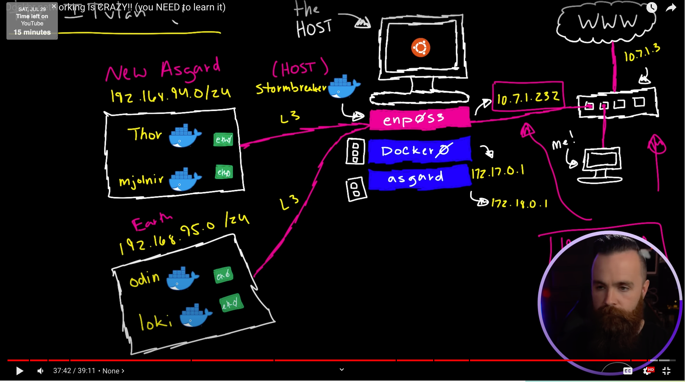

#### Docker
1. https://learnxinyminutes.com/docs/docker/
2. Unlike virtual machines, containers do not have high overhead and hence enable more efficient usage of the underlying system and resources.
3. an open-source project that automates the deployment of software applications inside containers by providing an additional layer of abstraction and automation of OS-level virtualization on Linux.
4. VMs are great at providing full process isolation for applications: there are very few ways a problem in the host operating system can affect the software running in the guest operating system, and vice-versa. But this isolation comes at great cost — the computational overhead spent virtualizing hardware for a guest OS to use is substantial.
5. Containers take a different approach: by leveraging the low-level mechanics of the host operating system, containers provide most of the isolation of virtual machines at a fraction of the computing power.
6. Containers offer a logical packaging mechanism in which applications can be abstracted from the environment in which they actually run. 
7. About VMs
   1. the cause for virtual machine duplication and thus wastes the server memory. And this chaos results in the limitation of virtual machine one could launch in the servers.
8. Docker Volumes are the best way to store the persistent data that your apps consume and create. 
9. Docker Networking allows you to connect Docker containers together. Connected Docker containers could be on the same host or multiple hosts.
10. Simply put, Docker networking is the native container SDN solution you have at your disposal when working with Docker. In a nutshell, there are four modes available for Docker networking: bridge mode, host mode, container mode, or no networking.
11. https://www.oreilly.com/content/what-is-docker-networking/
12. For example, Facebook reports thatdepending on how beefy the machine isit sees on average some 10 to 40 containers per host running. 
13. https://docs.docker.com/network/
14. By default, containers inherit the DNS settings of the host, as defined in the /etc/resolv.conf configuration file. Containers that attach to the default bridge network receive a copy of this file. 
15. Containers that attach to a custom network use Docker’s embedded DNS server. The embedded DNS server forwards external DNS lookups to the DNS servers configured on the host.
16. https://linuxhint.com/docker_compose_vs_docker_swarm/ Docker swarm vs docker compose
17. Docker internals https://www.youtube.com/watch?v=sK5i-N34im8 https://www.youtube.com/watch?v=KawKGsLR1V8
18. https://www.youtube.com/watch?v=bKFMS5C4CG0 networking details
19. Networking. Default is default bridge.
    
    1. Host -- docker uses host network ip address and ports are shared among containers. This is what we expect generally. Not default.
    2. default bridge -- containers connected virtual ethernet switch/bridge. Network is not visible outside. Docker transforms and sends host port traffic to simulated network ip and port.
    3. Bridge -- same as bridge but not created by default
    4. MACVLAN. Docker containers are also the hosts on the host LAN network. Docker containers are directly exposed to the outside world. Both approaches are similar. One is standard and another one is non standard.
       1. Docker containers get ip addresses of the host LAN network ip addresses. Docker container virtual network interface with a separate MAC address attaches to the host physical NIC. Switch doesn't accept multiple MAC addresses for a host. Promiscuous mode needs to be enabled on host and switch.
       2. 802.1q -- vlan, For each docker container, a sub-interface is created on host machine. Sub-interfaces have separate MAC addresses, but uses the same base interface. Promiscuous problem present. Traffic from sub-interface is sent to the docker container interface.
    5. IP-VLAN
       1. L2 -- Same as MACVLAN, the docker interfaces share the same MAC address of the host interface, yet docker container have ip address on the host LAN. Switch should allow multiple ip addresses for a single MAC address.
       2. L3 -- No more switching, ARP. Host acts as router. Docker subnetworks created with docker containers. Docker subnets connect to Router(host). Host LAN router route table should have entries to reach the docker subnets.
    6. Overlay network
       1. Multiple docker containers on multiple hosts talk to each other through overlay network
       2. Very similar to AWS network simulation for customers.
       3. Kubernetes, docker swarm uses overlay networks.
20. Each command in the docker file a layer to the docker image. The 1/5 number represents one layer out of 5 layers in the docker command output.
21. Union file system
    1. Space is saved by not duplicating the same content again and again.
    2. Copy on write file system.
    3. Slow to write to the system. Use volume mounts for application writes.
22. Build tree of images in organization. Reduce footprint of total images. Think about patching 50k images in an organization for security issue.
    1. Operations team builds base images
    2. Middleware team installs envs like ruby, python and others
    3. Application team adds application binaries to the images
23. Keep the version of the operating system in the namespace of the container so that the systems don't break when latest image is pulled.
24. If the application code uses non-standard glibc calls, application might become non-portable.
25. ```Docker exec -i``` creates a new bash process and puts it in the container namespace.
26. Just processes namespace is separated, kernel workflow is exactly same as before. The processes just use isolated disk space etc
27. Copy on writes vs (bind mounts or volume mounts)
