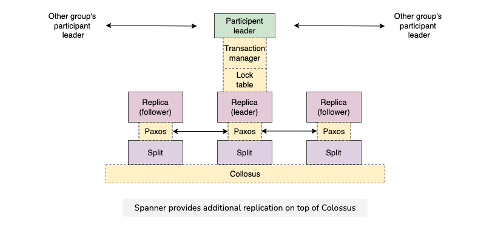
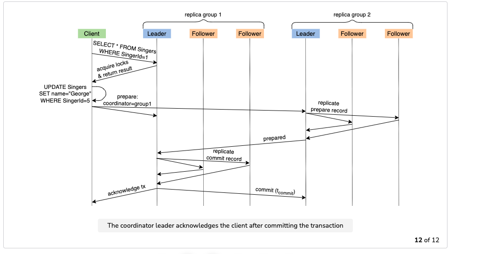

#### Google cloud databases
1. BigTable
   1. Key value store.
   2. Key size can be 64KB.
   3. Good for high throughput reads and writes. SSTable data structure.
   4. Servers in a cluster is one replica. Region contains multiple datacenters/zones/availability zone. Each zone in a region can contain only one cluster. Regions can span over continents.
      1. The nodes are organized into a Bigtable cluster, which belongs to a Bigtable instance, a container for the cluster.
      2. If you enable replication by adding additional clusters, you can also send different types of traffic to different clusters. Then if one cluster becomes unavailable, you can fail over to another cluster.
      3. If you have an instance with more than one cluster, you are using replication. This means you can't assign a table to an individual cluster or create unique garbage collection policies for each cluster in an instance.
      4. A cluster represents the Bigtable service in a specific location. Each cluster belongs to a single Bigtable instance, and an instance can have clusters in up to 8 regions.
      5. Each cluster is located in a single zone. An instance can have clusters in up to 8 regions where Bigtable is available. 
      6. If you create clusters in 8 regions that have 3 zones each, the maximum number of clusters that the instance can have is 24.
      7. Bigtable instances that have only 1 cluster do not use replication. If you add a second cluster to an instance, Bigtable automatically starts replicating your data by keeping separate copies of the data in each of the clusters' zones and synchronizing updates between the copies.
   5. Eventual consistency. Async replication??? and Read-your-writes consistency.
   6. Master-master replication model. Data written to any zone are available in another zone across the world.
      1. Every cluster in a Bigtable instance is a primary cluster that accepts both reads and writes.
   7. Last write wins conflict resolution strategy.
   8. Data stored in files in Google colossus file system. 
      1. SSTables, compaction similar to cassandra.
      2. All the writes are logged to distributed shared log file.
      3. Compute is separated from storage. Re-balancing of partitions just changes the pointers.
      4. Compute can be scaled for the load.
      5. When a new zone is added, it takes single digit minutes for replication.
      6. Further the zones are, higher the replication latency.
      7. Compression of the data larger than 1MB is recommended. Google doesn't compress the data over 1MB.
      8. Uses compression to reduce the space and money. Try to store similar data items together to achieve better compression. It enables run-length encoding.
   9. Partition is called a tablet. Key range partitioning used. Dynamic partitions based on load/storage. Data doesn't move, the pointers would change.
      1. Tablet is located using a three level index. root tablet --> metadata tablets --> user data tablets
      2. Index info is stored in chubby.
      3. Master??? looks at the chubby file tree for the table, assigns tablets to the tablet servers.
      4. Tablet can hold 100-200MB of data.
   10. Frontend servers, nodes(tablet servers), Colossus file system are the components.
       1. Old architecture described in paper: Client data does not move through the master; clients communicate directly with tablet servers for reads/writes.
   11. A table can contain up-to hundred column families. Each column family can contain unlimited number of columns. Column names can be dynamic, column names can be different for each row.
       1. Levels. Column family -> column name -> data
       2. Column names are also stored in the databases for each row. Use column names also as a datapoint.
       3. ???? Column family are the basic unit of access control. They have the associated type information for various utilities that can dump data in various formats Column families must be created before storing data under column key in that family.
       4. ???? Column families can be marked with certain attributes which may be considered by the system during performing compactions. One of the advantage of this attributes can be that users no longer will have to write garbage collection by themselves since this attributes will take care of that.
   12. Can be configured to maintain multiple version of the data of a row and a column family column. Versions are ordered by timestamp or user supplied id. Can be searched using id/timestamp.
       1. Garbage collection of the data happens as per the retention policy.
       2. Different column families can be configured to contain different number of versions.
   13. App profiles
       1. Application routing policies
           1. Same data, multiple applications can be configured to serve from multiple zones to not impact each other.
           2. Read-your-writes policy sends the read after write traffic to a single zone.
           3. Can be configured to forward the request to the closest zone.
       2. When an application connects to a Bigtable instance, it can specify an app profile, and Bigtable uses that app profile for requests that the application sends over that connection. An app profile defines the routing policy that Bigtable uses and controls whether single-row transactions are allowed.
   14. Encryption support, IAM integrated to control access to the resources.
   15. HBase is the open source duel of this service.
       1. A region server can be collocated at the same machine as an HDFS datanode to enable data locality and minimize network traffic.
   16. Secondary indexes??? Single row record can expand, since the compaction is happening anyway in the background.
   17. Read-modify-write atomicity provided??? how??? auto-increment provided??? how??? Single node transactions provided, no I think???
       1. Bigtable does not support transactions that atomically update more than one row.
          1. Read-modify-write operations, including increments and appends. A read-modify-write operation reads an existing value; increments or appends to the existing value; and writes the updated value to the table. 
          2. Check-and-mutate operations, also known as conditional mutations or conditional writes. In a check-and-mutate operation, Bigtable checks a row to see if it meets a specified condition. If the condition is met, Bigtable writes new values to the row.
   18. Use-cases
       1. Fraud detection: feature store, Batch and stream processing: Store the results
       2. Time-series data, such as CPU and memory usage over time for multiple servers. 
       3. Marketing data, such as purchase histories and customer preferences. 
       4. Financial data, such as transaction histories, stock prices, and currency exchange rates. 
       5. Internet of Things data, such as usage reports from energy meters and home appliances. 
       6. Graph data, such as information about how users are connected to one another.
   19. BigTable paper
       1. Applications that need to avoid collisions must generate unique timestamps themselves.
   20. The scan cache and the block cache can be disabled by setting the appropriate flags in the Bigtable configuration. However, disabling the cache can degrade the performance of Bigtable.
   21. The scan cache is implemented in the tablet server code and is shared by all clients that are accessing the same tablet. The block cache is implemented in the GFS client library and is private to each client.
   22. Column family advantage: Clients can group multiple column families together into a locality group. A separate SSTable is generated for each locality group in each tablet. Segregating column families that are not typically accessed together into separate locality groups enables more efficient reads.
   23. HBase, BigTable use caching, compression, assigning nodes close to storage nodes to improve performance of loads from GFS/colossus/HDFS
   24. BigTable uses GFS file as Write ahead log(WAL), uses local memory.
   25. General cases WAL will be disabled for mutation(Row-level mutations)/write performance purpose. Underlying caveat if you do so is, dont wont be recoverable
   26. General cases WAL will be disabled for mutation(Row-level mutations)/write performance purpose. Underlying caveat if you do so is, dont wont be recoverable... means data loss. Also if you are using SOLR, which will work on WAL and hence SOLR documents wont be updated. if dont have the case you can go ahead with disabling WAL
   27. SSTable is an example of immutability and copy on write reduce lock contention and improve performance. Low lock overhead.
   28. the immutability of SSTables enables us to split tablets quickly. Instead of generating a new set of SSTables for each child tablet, we let the child tablets share the SSTables of the parent tablet.
   29. HBase splitting the tablets/regions is given here https://hbase.apache.org/book.html#regionserver_splitting_implementation
   29. we append mutations to a single commit log per tablet server, co-mingling mutations for different tablets in the same physical log file.
       1. Server dies --> instead of letting new servers filter from log files, map reduce type job sorts the commit log by table, key, logSrquenceId and assign contiguous blocks to the new server with low disk reads.
   30. HBASe documentation
       1. First, make sure you have enough data. If you have hundreds of millions or billions of rows, then HBase is a good candidate. If you only have a few thousand/million rows, then using a traditional RDBMS might be a better choice due to the fact that all of your data might wind up on a single node (or two) and the rest of the cluster may be sitting idle.
       2. Second, make sure you can live without all the extra features that an RDBMS provides (e.g., typed columns, secondary indexes, transactions, advanced query languages, etc.) An application built against an RDBMS cannot be "ported" to HBase by simply changing a JDBC driver, for example. Consider moving from an RDBMS to HBase as a complete redesign as opposed to a port.
       3. Column families physically co-locate a set of columns and their values, often for performance reasons. Each column family has a set of storage properties, such as whether its values should be cached in memory, how its data is compressed or its row keys are encoded, and others. Each row in a table has the same column families, though a given row might not store anything in a given column family.
       4. WAL
          1. The default. Each edit is sync’d to HDFS before we return success to the client. See durability [section](https://hbase.apache.org/book.html#wal.durability)
          2. See this [link](https://hbase.apache.org/book.html#regionserver_splitting_implementation) for splitting the WAL.
          3. Re-balancing of regions just updates the pointers, the data is not moved between the region servers since the data is stored in HDFS.
          4. WAL interface implementations are given [here](https://hbase.apache.org/book.html#wal.providers)
       5. [Data locality](http://www.larsgeorge.com/2010/05/hbase-file-locality-in-hdfs.html)
          1. Especially with larger data being stored in HBase, how does the system take care of placing the data close to where it is needed? This is referred to data locality and in case of HBase using the Hadoop file system (HDFS) there may be doubts how that is working.
          2. https://hbase.apache.org/book.html#regions.arch.locality
          3. HBase eventually achieves locality for a region after a flush or a compaction. In a RegionServer failover situation a RegionServer may be assigned regions with non-local StoreFiles (because none of the replicas are local), however as new data is written in the region, or the table is compacted and StoreFiles are re-written, they will become "local" to the RegionServer.
          4. HDFS writes the new file blocks to the (current data node/region server) if possible.
       6. Replication: 
          1. HBase, architecturally, always had the strong consistency guarantee from the start. All reads and writes are routed through a single region server, which guarantees that all writes happen in an order, and all reads are seeing the most recent committed data.
          2. Timeline consistency option: If client1 reads with STRONG consistency, it will only talk with the replica_id=0, and thus is guaranteed to observe the latest value of x=3. In case of a client issuing TIMELINE consistency reads, the RPC will go to all replicas (after primary timeout) and the result from the first response will be returned back.
          3. As of version 0.92 HBase supports master/master and cyclic replication as well as replication to multiple slaves.
       
       

### Spanner
1. Spanner is Google’s scalable, multi-version, globallydistributed, and synchronously-replicated database.
2. Use cases
   1. 
3. Each spanserver maintains several tablet instances ranging from one hundred to one thousand. Like the tablet abstraction of Bigtable implements a bag of mappings, so does a Spanner's tablet, as shown below:
4. Strict serializable(i.e linearizable and serializable) aka strong one-copy serializable aka external consistency.
   1. A read-write transaction executes a set of reads and write operations atomically at a single logical point in time.
   2. Achieves it using 2PL and paxos two phase commit.
5. Relational data model.
   1. Primary keys, columns, rows
   2. Parent child relationship can be defined. Parent primary key must be a prefix of the child primary key.
      1. Related rows are collocated.
      2. A table “C” can be declared as a child table of “A”, using the INTERLEAVE keyword.
      3. Spanner guarantees that the row of a parent table and the associated rows of the child table will never be assigned to a different split.
6. Tables are range partitioned. 
   1. Each partition is called a split. Rows in a split are ordered by primary key.
   2. Dynamic partitioning. Load based.
7. Replication
   1. Zone is a unit of replication.
   2. Each spanserver can manage multiple splits, and each split is replicated across multiple zones for availability, durability, and performance.
   3. Each split is stored in a distributed file system, called Colossus, the successor of GFS, which already provides byte-level replication. However, Spanner adds another replication level to provide the additional benefits of data availability and geographic locality.
   4. All the replicas of a split form a Paxos group.
      1. Long lived leaders. The default lease time is 10 seconds.
   5. One of the replicas is voted as the leader and is responsible for receiving incoming write requests and replicating them to the replicas of the group via a Paxos round.
   6. The rest of the replicas are followers and can serve some kinds of read requests.
   7. Pessimistic concurrency control using two phase locking.
      1. Replication group contains lock table. Lock table is a map of key ranges to lock states. In practice, these locks are also replicated in the replicas of the group to cover against the failures of the leader.
8. Spanner deployment is called a universe
   1. Universe contains set of zones.
      1. Universemaster displays status information about all the zones for troubleshooting.
   2. Zone is a unit of replication, physical isolation and administrative deployment.
      1. Zone-master and spanservers
      2. Master assigns data to spanservers.
      3. spanservers read/write requests from clients and store the data.
      4. Location proxies locate the spanservers that serve the data.
   3. placement driver --> automated movement of data across the zones for load balancing reasons.
9. Time gets propagated from TimeMasters to time slaves. Time masters are connected to GPS and atomic clocks. < 7ms is the typical clock skew. TrueTime API exposes the clock interval.
10. Snapshot isolation implementation
    1. A = (e1, l1), B = (e2, l2), A happened before B if l1 < e2. Otherwise, nothing can be said about ordering.
    2. Waits for the time to pass to make sure that no other transaction conflicts???
11. Modified two phase commit with paxos for coordinator fault tolerance is used for distributed transactions/atomic commit.
    
    1. One of the replicas is voted as the leader and is responsible for receiving incoming write requests and replicating them to the replicas of the group via a Paxos round.
    2. The rest of the replicas are followers and can serve some kinds of read requests.
    3. long-lived leaders with time-based leader leases, which are renewed by default every 10 seconds
    4. pessimistic concurrency control to ensure proper isolation between concurrent transactions, specifically two-phase locking. In practice, these locks are also replicated in the replicas of the group to cover against the failures of the leader.
    5. The leaders of each group are called ***participant leaders***, and the follower replicas of each one of those groups are referred to as participant followers.
    6. One of these groups is chosen as the coordinator for the two-phase commit protocol. The replicas of this group are referred to as ***coordinator leader and followers***, respectively.
    7. So, if one of the leader nodes crashes, then another replica from that replica group will eventually detect that, take over and help the protocol make progress.
    8. Multiple transactions/paxos may run at the same time.
    9. Spanner detects transaction deadlocks and resolves the deadlocks.
    10. Index-range locks to solve phantom reads/writes??? Probably locking happens on a single split.
    11. Spanner needs a way to know if a replica is up-to-date to satisfy a read operation. For this reason, each replica tracks a value called safe time
    12. Full read transactions don't need to hold locks, read from replica based on timestamp and read lead otherwise.
    13. A strong read is a read at a current timestamp and is guaranteed to see all the data committed up until the start of the read.
    14. A stale read is a read at a timestamp in the past. It can be provided by the application or calculated by Spanner based on a specified upper bound on staleness. A stale read is expected to have lower latency at the cost of stale data since it’s less likely the replica will need to wait before serving the request.
    15. Partitioned DML queries. distributed atomicity not guaranteed.
    16. While Paxos applies writes in order of their receipt, Spanner's implementation of Paxos is pipelined to increase the database's throughput when WAN latencies are present.
    17. Alternative to using quorum for read operation
        1. An alternative option that works as optimization is to make use of the so-called manager/leader leases. Through this method, a node can guarantee its position as a leader for a predetermined amount of time by running a Paxos instance and signing a lease until that time has elapsed. As a result, this node can now perform read operations locally. However, this can affect availability if the leader dies and all the participants have to wait for the lease to end. However, we can use services like Chubby to cater to this.
        2. It is important to remember that this method will only be secure if the clock skew is constrained to a certain upper bound when putting it into action.
    18. The old leader can also save the lock states in the underlying Paxos log. That means the new participant can easily rebuild the lock table state and effectively resume where the older leader left off.
    19. Each transaction manager's state persists in the underlying Paxos cluster and is replicated.
    20. Since Paxos and the lock table collectively ensure transactionality, the involvement of the transaction manager can be skipped if a transaction only involves a single Paxos group.
    21. Transaction waits for the worst possible start time to pass(currentTime.earlist > trans_start_time) for external consistency. https://youtu.be/LaLT6EC7Trc?t=1562
        
12. Spanner features
    1. Point in time snapshot read
    2. Strong consistency. Strong consistent reads go to master since spanner uses paxos. Multiple versions of the data are maintained.
    3. Bounded staleness reads. Bounded consistent reads go to slave. Use strong consistent read if expected item not found to get better latency.
    4. Secondary Indexes.
    5. Hotspot relieving, prefix hotspot keys to reduce load, bounded staleness read to reduce load on the master.
13. Consistent and available since most of the time network doesn't get partitioned. CAP theorem is true, but network partitioning cases are really low.
14. Use time to improve read speed. Most of the reads get served from local replica by comparing last synced timestamp.
15. Spanner appears to have broken CAP, PACELEC theorems since the environment is controlled. Clock error and network partitioning errors are controlled.
16. References: Good youtube video https://www.youtube.com/watch?v=QPpSzxs_8bc
17. provides an additional layer of abstraction over the bag of key-value mappings in the form of a directory or bucket—a group of adjacent keys that all begin with the same prefix. Applications that support buckets manage the data locality by carefully selecting keys.
18. Most other applications will probably replicate their data across 3 to 5 datacenters in one geographic region, but with relatively independent failure modes. That is, most applications will choose lower latency over higher availability, as long as they can survive 1 or 2 datacenter failures.
    1. From google paper " we have also consistently received complaints from users that Bigtable can be difficult to use for some kinds of applications: those that have complex, evolving schemas, or those that want strong consistency in the presence of wide-area replication."
19. Megastore, because of its semirelational data model and support for synchronous replication, despite its relatively poor write throughput. As a consequence, Spanner has evolved from a Bigtable-like versioned key-value store into a temporal multi-version database.
20. Spanner paper
    1. Data is stored in schematized semi-relational tables; data is versioned, and each version is automatically timestamped with its commit time; old versions of data are subject to configurable garbage-collection policies; and applications can read data at old timestamps.
    2. These features are enabled by the fact that Spanner assigns globally-meaningful commit timestamps to transactions, even though transactions may be distributed. The timestamps reflect serialization order. In addition, the serialization order satisfies external consistency (or equivalently, linearizability [20]): if a transaction T1 commits before another transaction T2 starts, then T1’s commit timestamp is smaller than T2’s. Spanner is the first system to provide such guarantees at global scale.
    3. If the uncertainty is large, Spanner slows down to wait out that uncertainty.
    4. Google’s cluster-management software provides an implementation of the TrueTime API. This implementation keeps uncertainty small (generally less than 10ms) by using multiple modern clock references (GPS and atomic clocks).
    5. Zones are also the unit of physical isolation: there may be one or more zones in a datacenter, for example, if different applications’ data must be partitioned across different sets of servers in the same datacenter. This is not true for external cloud offering.
    6. The placement driver periodically communicates with the spanservers to find data that needs to be moved, either to meet updated replication constraints or to balance load.
    7. tablet’s state is stored in set of B-tree-like files and a write-ahead log, all on a distributed file system called Colossus
    8. To support replication, each spanserver implements a single Paxos state machine on top of each tablet.
    9.  Our Paxos implementation supports long-lived leaders with time-based leader leases, whose length defaults to 10seconds. The current Spanner implementation logs every Paxos write twice: once in the tablet’s log, and once the Paxos log.
    10.  Our implementation of Paxos is pipelined, so as to improve Spanner’s throughput in the presence of WAN latencies; but writes are applied by Paxos in order (a fact on which we will depend in Section 4).
    11.  The set of replicas is collectively a Paxos group
    12.  Writes must initiate the Paxos protocol at the leader; reads access state directly from the underlying tablet at any replica that is sufficiently up-to-date
    13. At every replica that is a leader, each spanserver implements a lock table to implement concurrency control. The lock table contains the state for two-phase locking: it maps ranges of keys to lock states.
    14.  In both Bigtable and Spanner, we designed for long-lived transactions (for example, for report generation, which might take on the order of minutes), which perform poorly under optimistic concurrency control in the presence of conflicts.
    15. At every replica that is a leader, each spanserver also implements a transaction manager to support distributed transactions.
    16. . The state of each transaction manager is stored in the underlying Paxos group
    17. One of the participant groups is chosen as the coordinator: the participant leader of that group will be referred to as the coordinator leader, and the slaves of that group as coordinator slaves.
    18. directory, which is a set of contiguous keys that share a common prefix.
    19.  Supporting directories allows applications to control the locality of their data by choosing keys carefully.
    20. A directory is the unit of data placement. All data in a directory has the same replication configuration. When data is moved between Paxos groups, it is moved directory by directory,
    21.  Spanner might move a directory to shed load from a Paxos group; to put directories that are frequently accessed together into the same group or to move a directory into a group that is
         closer to its accessors.
    22. Directories can be moved while client operations are ongoing. One could expect that a 50MB directory can be moved in a few seconds.
    23. The fact that a Paxos group may contain multiple directories implies that a Spanner tablet is different from a Bigtable tablet: the former is not necessarily a single lexicographically contiguous partition of the row space. Instead, a Spanner tablet is a container that may encapsulate multiple partitions of the row space.
    24.  We made this decision so that it would be possible to colocate multiple directories that are frequently accessed together.
    25. Movedir is the background task used to move directories between Paxos groups [14]. 
    26. Movedir is also used to add or remove replicas to Paxos groups.
    27. Movedir is also used
        to add or remove replicas to Paxos groups
    28. Movedir is not implemented as a single transaction, so as to avoid blocking ongoing reads and writes on a bulky data move. Instead, movedir registers the fact that it is starting to move data and moves the data in the background. When it has moved all but a nominal amount of the data, it uses a transaction to atomically move that nominal amount and update the metadata for the two Paxos groups
    29. A directory is also the smallest unit whose geographicreplication properties (or placement, for short) can be specified by an application.
    30.  The design of our placement-specification language separates responsibilities for managing replication configurations.
    31. Spanner will shard a directory into multiple fragments if it grows too large. Fragments may be served from different Paxos groups (and therefore different servers). Movedir actually moves fragments, and not whole directories, between groups.
    32. At least 300 applications within Google use Megastore (despite its relatively low performance) because its data model is simpler to manage than Bigtable’s, and because of its support for synchronous replication across datacenters.
    33. Examples of well-known Google applications that use Megastore are Gmail, Picasa, Calendar, Android Market, and AppEngine.
    34. Some authors have claimed that general two-phase commit is too expensive to support, because of the performance or availability problems that it brings [9, 10, 19]. We believe it is better to have application programmers deal with performance problems due to overuse of transactions as bottlenecks arise, rather than always coding around the lack of transactions. Running two-phase commit over Paxos mitigates the availability problems
    35.  every Spanner database must be partitioned by clients into one or more hierarchies of tables. Client applications declare the hierarchies in database schemas via the INTERLEAVE IN declarations. The table at the top of a hierarchy is a directory table. Each row in a directory table with key K, together with all of the rows in descendant tables that start with K in lexicographic order, forms a directory. ON DELETE CASCADE says that deleting a row in the directory table deletes any associated child rows.
    36. Albums(2,1) represents the row from the Albums table for user id 2, album id 1. This interleaving of tables to form directories is significant because it allows clients to describe the locality relationships that exist between multiple tables, which is necessary for good performance in a sharded, distributed database. Without it, Spanner would not know the most important locality relationships.
    37.  The TT.now() method returns a TTinterval that is guaranteed to contain the absolute time during which TT.now() was invoked.
    38. TrueTime is implemented by a set of time master machines per datacenter and a timeslave daemon per machine.
    39. Armageddon masters advertise a slowly increasing time uncertainty that is derived from conservatively applied worst-case clock drift. GPS masters advertise uncertainty that is typically close to zero.
    40. All masters’ time references are regularly compared against each other. Each master also cross-checks the rate at which its reference advances time against its own local clock, and evicts itself if there is substantial divergence.
    41. Every daemon polls a variety of masters [29] to reduce vulnerability to errors from any one master.
    42. Daemons apply a variant of Marzullo’s algorithm [27] to detect and reject liars, and synchronize the local machine clocks to the nonliars.
    43. To protect against broken local clocks, machines that exhibit frequency excursions larger than the worstcase bound derived from component specifications and operating environment are evicted.
    44. Between synchronizations, a daemon advertises a slowly increasing time uncertainty.  is derived from conservatively applied worst-case local clock drift.
    45.  In our production environment,  is typically a sawtooth function of time, varying from about 1 to 7 ms over each poll interval.
    46.  The Spanner implementation supports readwrite transactions, read-only transactions (predeclared snapshot-isolation transactions), and snapshot reads.
    47. Standalone writes are implemented as read-write transactions; non-snapshot standalone reads are implemented as read-only transactions.
    48. A read-only transaction must be predeclared as not having any writes; it is not simply a read-write transaction without any writes.
    49. Reads in a read-only transaction execute at a system-chosen timestamp without locking, so that incoming writes are not blocked.
    50. The execution of the reads in a read-only transaction can proceed on any replica that is sufficiently up-to-date.
    51. A snapshot read is a read in the past that executes without locking. A client can either specify a timestamp for a snapshot read, or provide an upper bound on the desired timestamp’s staleness and let Spanner choose a timestamp.  In either case, the execution of a snapshot read
        proceeds at any replica that is sufficiently up-to-date.
    52. For both read-only transactions and snapshot reads, commit is inevitable once a timestamp has been chosen, unless the data at that timestamp has been garbagecollected. As a result, clients can avoid buffering results inside a retry loop. When a server fails, clients can internally continue the query on a different server by repeating the timestamp and the current read position.
    53.  The F1 team also needed secondary indexes on their data (since Spanner does not yet provide automatic support for secondary indexes), and was able to implement their own consistent global indexes using Spanner transactions
    54.  The vast majority of directories (and therefore customers) consist of only 1 fragment, which means that reads and writes to those customers’ data are guaranteed to occur on only a single server. The directories with more than 100 fragments are all tables that contain F1 secondary indexes:
    55. Megastore does not achieve high performance. It is layered on top of Bigtable, which imposes high communication costs. It also does not support long-lived leaders: multiple replicas may initiate writes.
    56. All writes from different replicas necessarily conflict in the Paxos protocol, even if they do not logically conflict: throughput collapses on a Paxos group at several writes per second. Spanner provides higher performance, general-purpose transactions, and external consistency.
    57. Integrating concurrency control with replication reduces the cost of commit wait in Spanner, for example.
    58. The notion of layering transactions on top of a replicated store dates at least as far back as Gifford’s dissertation.
    59. Gray and Lamport [18] describe a non-blocking commit protocol based on Paxos. Their protocol incurs more messaging costs than twophase commit, which would aggravate the cost of commit over widely distributed groups.
    60. There has been a spate of recent work on reducing or eliminating locking overheads. Calvin [40] eliminates concurrency control: it pre-assigns timestamps and then executes the transactions in timestamp order.
    61.  As a community, we should no longer depend on loosely synchronized clocks and weak time APIs in designing distributed algorithms.
    62. This section describes how TrueTime is used to guarantee the correctness properties around concurrency control, and how those properties are used to implement features such as externally consistent transactions, lockfree read-only transactions, and non-blocking reads in the past. These features enable, for example, the guarantee that a whole-database audit read at a timestamp t will see exactly the effects of every transaction that has committed as of t.
    63. For a given transaction, Spanner assigns it the timestamp that Paxos assigns to the Paxos write that represents the transaction commit.
    64. Spanner depends on the following monotonicity invariant: within each Paxos group, Spanner assigns timestamps to Paxos writes in monotonically increasing order, even across leaders. A single leader replica can trivially assign timestamps in monotonically increasing order. This invariant is enforced across leaders by making use of the disjointness invariant: a leader must only assign timestamps within the interval of its leader lease. Note that whenever a timestamp s is assigned, smax is advanced to s to preserve disjointness.
    65. Spanner also enforces the following externalconsistency invariant: if the start of a transaction T2 occurs after the commit of a transaction T1, then the commit timestamp of T2 must be greater than the commit timestamp of T1.
    66. TrueTime enables Spanner to support atomic schema changes. It would be infeasible to use a standard transaction, because the number of participants (the number of groups in a database) could be in the millions.
    67. Bigtable supports atomic schema changes in one datacenter, but its schema changes block all operations.
    68. Like Bigtable, writes that occur in a transaction are buffered at the client until commit.
    69. First, it is explicitly assigned a timestamp in the future, which is registered in the prepare phase. As a result, schema changes across thousands of servers can complete with minimal disruption to other concurrent activity. Second, reads and writes, which implicitly depend on the schema, synchronize with any registered schema-change timestamp at time t
    70. tablet’s state is stored in set of B-tree-like files and a write-ahead log, all on a distributed file system called Colossus
21. When you make a write request to Spanner, the data is first written to a log file. The log file is a sequence of write operations. The log file is then merged with a set of memtables. The memtables are in-memory data structures that store the most recent writes. The merge process merges the data from the log file with the data from the memtables and writes the merged data to Ressi.
22. For example, if you have a table of users the columns for name, email, and age, Ressi would store the name column in one file, the email column in another file, and the age column in a third file. This makes it easy for Spanner to find the rows that contain a specific name, email, or age.
23. HBase can cache the data after it is loaded. This means that the data does not need to be loaded from HDFS every time it is accessed, which can further improve the performance of loading. HBase uses a technique called Memcached to cache the data.
24. HBase uses a memory store to cache data that is frequently accessed. This can improve the performance of reads by reducing the number of times that data needs to be read from disk.
25. 

#### Google cloud storage (GCS)
1. Objects belong to buckets. Uses spanner to store metadata information.
2. Consistent reads to metadata. i.e list of objects in a bucket. Read after write consistency for objects. Leads to simpler programming model for the clients.
3. Single region deployment, dual region deployment and multi-region deployment.
4. Compose smaller objects to larger objects. Uses spanner multi object transactions.
5. Other services like Data lake are built on top of the GCS.
6. File system consistency check utility is provided.
7. Deletion of objects happen in asynchronous way.
