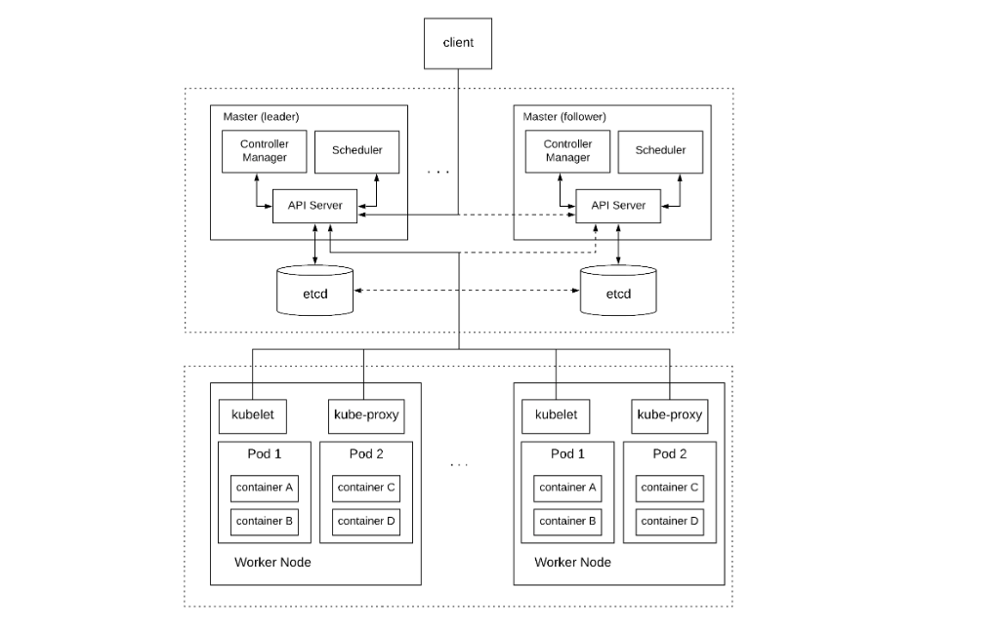

#### Kubernetes

1. Manages a cluster of nodes and other resources (e.g., disks), handling all the aspects of running software in the cluster, such as deployment, scaling, and discovery
2. worker nodes make a set of resources available to the cluster
   1. Kubelet - The kubelet is an agent that runs on each node in the cluster, receives a set of pod specifications, and makes sure the containers described in these specifications are running and are healthy.
   2. Proxy - The proxy is a network proxy that maintains network rules that allow network communication to the pods from sessions inside and outside the cluster.
   3. The worker nodes also contain software of the container runtime that is used.
3. master nodes allocates resources to the applications as specified by the user.
   1. Leader and follower master nodes for availability and durability
   2. Components
      1. kube-apiserver
         1. The API Server is the front-end of the Kubernetes cluster, allowing users to inspect the resources of the cluster and modify them or create new ones.
      2. kube-scheduler
         1. The Scheduler detects newly created pods that have no nodes assigned and selects a node for them to run.
         2. This selection of Scheduler is based on multiple criteria, such as user-specified constraints, affinity specifications, data locality, etc.
      3. kube-controller-manager
         1. The Controller Manager runs all the available controllers in the master node. A controller is a control loop that watches the state of the cluster through the API server making changes in order to move the current state towards the desired state
         2. Node Controller: responsible for noticing and responding to node failures
         3. Replication Controller: responsible for maintaining the correct number pods according to the replication specified by the user.
         4. Endpoints Controller: responsible for creating endpoints for services.
4. Application types: Long-running services and background jobs
5. Uses etcd
   1. For storing cluster data
   2. Leader election
   3. Deliver notifications to different parts of the cluster
6. The various objects of the cluster (e.g., nodes, services, jobs, etc.) are called resources, and they are represented in etcd as key-value entries under the right namespace.
7. One of the most central resources in Kubernetes is the pod.
   1. It represents the smallest deployable unit of computing.
   2. In practice, pod is a group of one or more containers with shared storage/network and a specification for how to run the containers.
   3. A container is a lightweight and portable executable image that contains software and all of its dependencies. Kubernetes supports multiple container runtimes, with Docker being the most popular
8. A persistent volume is a piece of storage in the cluster that has a lifecycle independent of any individual pod that uses it.
9. A job creates one or more pods and ensures that a specified number of them successfully terminate.
10. A service is an abstraction that defines a logical set of pods and a policy by which to access them.
11. Every resource is characterized by some desired state usually a desired number of replicas for a service. There are various components of Kubernetes that cooperate to ensure the cluster’s current state matches the desired state.
12. The desired state is provided by the user when creating a resource (Spec), while the current state is supplied and updated by Kubernetes (Status).
13. Kubernetes operates under eventual consistency, it recovers from potential failures and converges back to the desired state. Since multiple components read and update the current state of the cluster, there is a need for some concurrency control to prevent anomalies arising from reduced isolation.
    1. Kubernetes achieves this with the use of conditional updates. Every resource object has a resourceVersion field representing the version of the resource as stored in etcd. This version is used to perform a compare-and-swap (CAS) operation so that anomalies like lost updates are prevented.
14. 