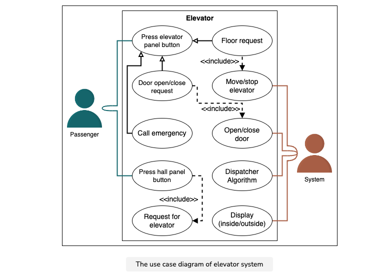
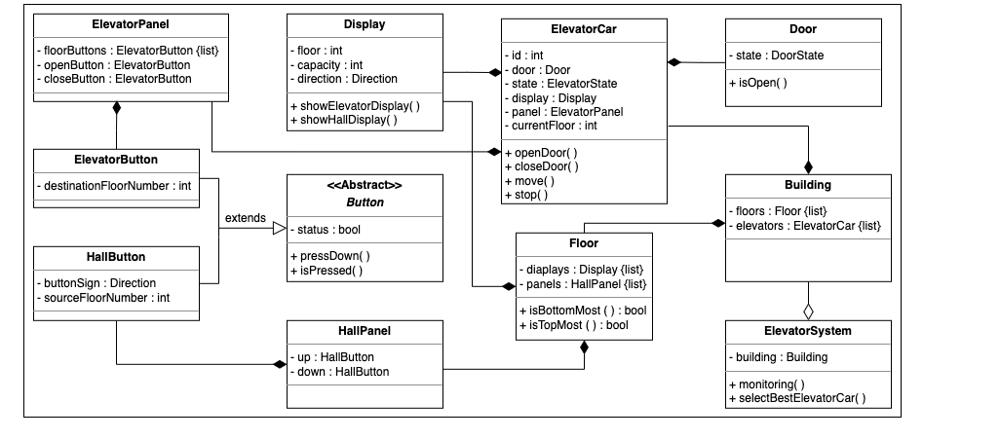

Note: I don't recommend reading this. Waste of time. Taken from OOAD book. One of the worst books I read in my life.

#### Object oriented design
1. Software is complex. Why? Complex problem domains, Difficulty of managing development process, Flexibility possible through software, Discrete system modeling a continuous system.
2. Attributes of good complex systems: 
   1. Hierarchic structure
      1. Composed to interrelated subsystems. Subsystems in turn are composed of other subsystems and so on. Base case depends on the observer of the system.
      2. Hierarchies. Different ways to decompose a complex system. Parts, Types and subtypes are two examples.
         1. 'is-a' hierarchy. Represents class hierarchy. Also called as class structure.
         2. 'part-of' hierarchy. Represents object and sub-objects its contains. Also called as object structure.
         3. Algorithmic decomposition for software systems.
   2. Relative primitives(primitive depends on observer)
      1. Choice of what components in a system are primitive is relatively arbitrary and is largely up to the discretion of the observer.
   3. Separation of concerns
      1. System is nearly decomposable(i.e divided into identifiable parts)
      2. Intra component linkages are stronger than the inter-component linkages.
   4. Common patterns
      1. Many complex systems are implemented with an economy of expression.
      2. Systems are composed of only a few different kinds of subsystems in various combinations and arrangements.
      3. May have common patterns. Patterns may involve reuse of small components.
   5. Stable intermediate forms
      1. Complex system that works is invariably found to have evolved from a single system that worked. A complex system designed from scratch never works and cannot be patched up to make it work.
3. [Fluff content!!] Managing complexity by humans
   1. Interesting research fact: Maximum number chunks of information that an individual can comprehend simultaneously is in the order of seven +- 2.
   2. Human beings use the following techniques to comprehend complex system. We automatically use following concepts to increase semantic content in input/chunks of information.
      1. Abstraction
         1. Human beings use abstraction to understand complex system and break cognitive barrier of understanding ~10 chunk of info at a time.
         2. Unable to master entirety of a complex object, we choose to ignore inessential details, dealing instead with generalized, idealized model of the object.
      2. Hierarchy
         1. We explicitly recognize class and object structures.
         2. Not easy to identify hierarchies. Requires discovery of patterns. Once exposed, it becomes easy to understand complex system.
4. [My understanding!!, terminology might be differing] Design contains blueprints/models. Model describes a system in a particular dimension. Think about UML diagrams, they represent different aspects/cross-section/decomposition of the system. Design technique is procedure to arrive at the design.
5. Object oriented programming. OO programming evolved over decades. OO design might have been inspired from OO programming.
   1. OOP --> method of implementation --> cooperative collection of objects --> object is an instance of class --> hierarchy of classes.
   2. Four elements of the model
      1. Abstraction
      2. Encapsulation
      3. Modularity
      4. Hierarchy
      5. Other
         1. Typing, concurrency, persistence
   3. Other forms
      1. Procedure oriented
      2. Logic oriented
      3. Rule oriented
      4. Constraint oriented
6. OO design. Object-oriented decomposition that depicts logical, physical, static and dynamic models of the system.
7. [I don't know what analysis is!!] OO analysis. Analysis that examines the requirements from the perspective of the classes and objects found in the vocabulary of the problem domain.
8. Concepts
   1. Abstraction
      1. Focuses on the essential characteristics of some object relative to the perspective of the viewer. Focuses on the outside view of the object and serves to separate essential behavior from implementation.
      2. Principle of the least commitment -- interface of object provides essential behavior and nothing more.
      3. Principle of the least astonishment -- abstraction captures entire behaviour of object, no more, no less, no side effects and surprises.
      4. Deciding on the right set of abstractions for a given domain is the central problem in OO design.
      5. Fluff!! Entity abstraction(abstracts domain entity), action abstraction(abstracts set of operations like +, -), virtual machine abstraction(abstraction which will be used by high level abstractions), coincidental abstraction(unrelated operations grouped together)
   2. Encapsulation
      1. Hide the details of the implementation of an object. No part of complex system should depend on internal details of any other part.
      2. Complimentary to abstraction
      3. Leads to separation of concerns
      4. Good separation of responsibilities make each individual abstraction more cohesive(degree to which the behaviours of the abstraction are related).
   3. Modularity
      1. Goal: Cost reduction due to independent design and evolution. Change to design/requirements should result in ease of implementation.
      2. Act of partitioning program into components can reduce complexity to some degree.
      3. Creates a number of well-defined, documented boundaries in a program.
      4. Packages abstractions into discrete units.
      5. Expose only those elements that the other modules must see.
      6. Arbitrary modularization is worse than no modularization.
      7. Place abstractions into module(s).
      8. Deciding on the right set of modules for given problem is almost as hard as problem as deciding on the right set of abstractions.
      9. The connections between the modules are the assumptions which the module makes about other modules.
      10. Modules interface should be as narrow as possible. Hide as much as you can. Incrementally shift to public from private as it's easier than the other way around.
      11. Should be able to change implementation of one module without knowledge of implementation of the other modules.
      12. Coupling and cohesion. Loosely coupled modules and high degree of relatedness inside the module.
   4. Hierarchy
      1. Single inheritance
      2. Multiple inheritance
   5. Object
      1. Has state, exhibits some well-defined behavior and hash unique identity.
      2. Objects play many-different roles during their lifetimes.
      3. Identity
      4. Object relationships. i.e relationship between two different objects. Note how this is almost same and different from class relationships. Object knows about other object. Just like human relationships. Relationship encompasses the assumption that objects make about each other like operations that can be issued.
         1. Links -- Peer to peer, client/server relationship.
         2. Aggregations -- Whole/part relationship. Ability to navigate from whole to its parts. May not denote a physical containment. Aggreation is a specialized link.
      5. Classes: Set of objects that share a common behaviour and a common structure.
         1. Relationships among classes
            1. Association
               1. General and semantically weak.
               2. Multiplicity
                  1. One to many
                  2. One to one
         2. Inheritance - single, multiple -- enables polymorphism(shows the behavior of the type it's assigned to). 
   6. Law of demeter
      1. Methods of class should not depend on the structure of any class except the immediate structure of own class. Should send messages to very limited set of classes only.

#### Design patterns gang of four book
1. Program to an interface not implementation
2. Favor object composition over inheritance
   1. Assemble existing components
   2. Rarely practiced since the set of available components is never quite rich.
   3. Reuse by inheritance is an easy-to-use technique.
   4. Depending on object composition makes the code more reusable.
3. Use pattern name in the application class name so that it'll be both appropriate for application and the pattern used.
4. Tight coupling leads to monolithic applications that are hard to change. System becomes a dense mass that becomes hard to port, change and maintain.
5. Loose coupling increases the probability of reuse.
6. 'Creational' patterns abstract the instantiation process.
   1. Class creational pattern uses inheritance. Ex: Factory method pattern
   2. Object creational pattern uses composition. Ex: Abstract factory
7. Structural patterns are concerned with how the classes and objects are composed to form larger structures.
8. Behavioral patterns are concerned with algorithms and the assignment of responsibilities between objects.
9. 

#### SOLID patterns
1. Liskov substitution principle
   1. if we substitute a superclass object reference with an object of its subclasses, the program should not break.
   2. An object (such as a class) may be replaced by a sub-object (such as a class that extends the first class) without breaking the program. It is a semantic rather than merely syntactic relation, because it intends to guarantee semantic interoperability of types in a hierarchy, object types in particular.
2. Interface segregation principle
   1. Clients should not be forced to depend upon interfaces that they do not use.

#### Design case studies
1. Strategy taken from grokking LLD book. Suppose that it's an elevator system design.
   1. Clarify requirements and discuss issues. Ex: Multiple elevators, display, optimization
   2. Discuss design patterns that you are going to use. Can discuss it in later stages???
   3. Use case diagrams. Diagrams in general: visual representation of complex systems or processes that can be easily understood by both technical and non-technical stakeholders.
      1. Identify actors, primary and secondary. For elevator, it's passenger and the system that moves elevator
      2. List actor to user cases. 
         1. Example actor: ```press elevator panel button```   ```Press hall butoon```. 
         2. Use cases might be specified multiple times across actors.
         3. Not Sure!!! Some uses cases not belongs to an actor Ex: ```Floor request```
      3. Fluff!! Relationships
         1. One use case is a generalization of another. Notation: Arrow with empty arrow head. Ex: ```press elevator panel button has generalization rel with floor request```
         2. Fluff!! Associations. 
            1. Relationship between actor and their use cases.
         3. Fluff! Includes. Notation dotted arrow and solid arrowhead.
            1. "Floor request" has includes relationship with "Move/stop elevator"
      
   4. Class diagrams
      1. Components of the system. i.e classes and enums.
      2. Relationship between classes
         1. Aggregation. Object of a class is not permanently part of another class object. Room aggregates furniture. Furniture can be moved to a different room. Notation: Line with empty diamond at one end.
         2. Composition. Object of a class is part of another class object. Elevator is part of building. Notation: Line with solid diamond at one end.
         3. Inheritance. Notation: Arrow with empty arrowhead.
      
   5. Sequence diagrams
   6. Activity diagram
      1. Visualize a certain use case at a more detailed level. Used to model business processes, use cases, and system workflows. Used to examine business processes in order to identify their flow and requirements.
      2. They are similar to a flowchart, but with more specific symbols and notations.
   7. Code for the system
2. Elevator system
   1. Algorithms. Most algorithms have something in common. When a lift is moving in the direction that the passenger wants to go or towards the passenger, there is a capacity and someone waiting on the floor on the path to go in the same direction, then just pick them up. For all other passengers, keep them in a list, pick one according to the algorithm and serve them in the next round.
      1. First come, first served
         1. Choose the next passenger based on the time at which they pressed the call button
      2. SCAN/Elevator and LOOK algorithms
         1. Go from one end of the building to the other end. Next person in the direction that lift is already moving is picked up. Note that this need not serve that customer by shortest path. The lift can continue going in the direction and change direction only at the end of the building.
      3. Closest passenger first
         1. Pick next passenger who is close to the current lift position.
3. Vending machine
   1. Use state pattern in the design
4. MVC pattern is rarely used. Most of the designs contained only objects. User actions on the system are attached to the user. Single level designs. Facebook design used business objects.

### Polymorphism
1. One interface, multiple implementations.
2. Object may take many forms. Can act as Parent class objects.
3. Single reference/same code behaves differently depending on the object it holds.
4. Types
   1. Compile time
      1. Method overloading or operator overloading
      2. Templates
   2. Runtime
      1. Overriding
5. Advantages
   1. Code re-usability